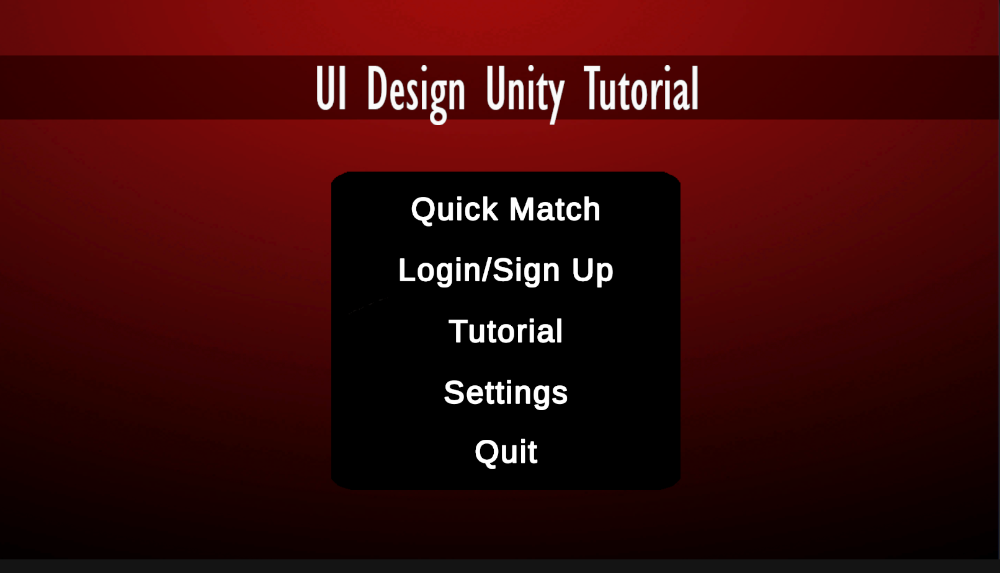
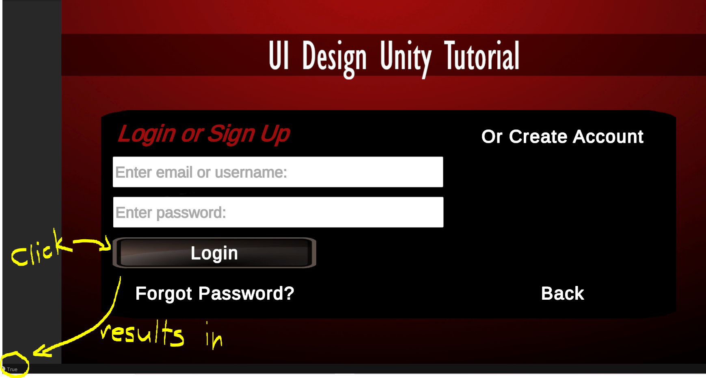
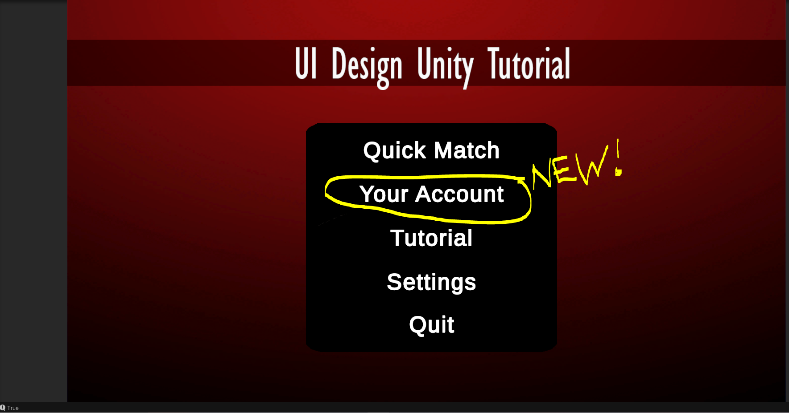
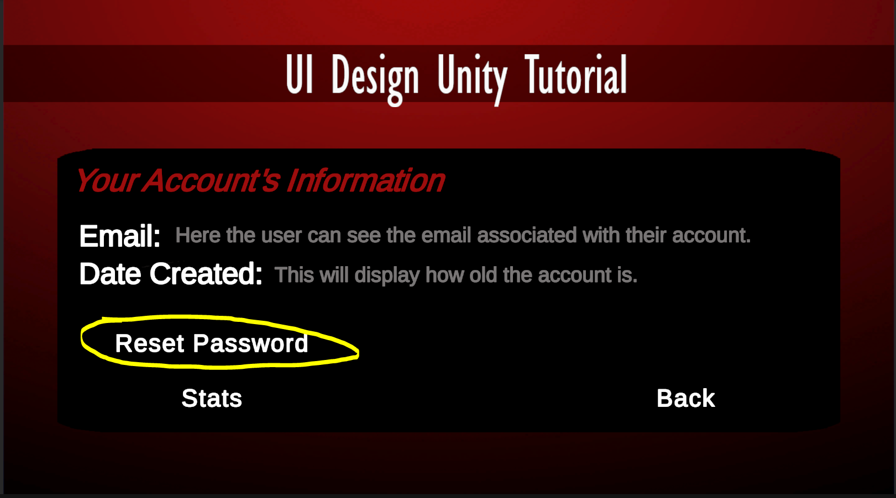
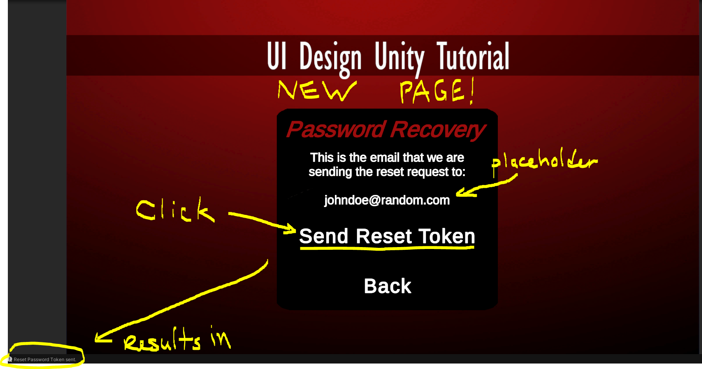

# So for Week 5 (Oct 1st to Oct 8th):
I spent about 4 hours trying to get the most up to date version of Unity running on my laptop. This reason it took so long, is because my laptop is quite old, and a mac, so trying to find software that is still supported on it can be quite the headache. Plus, each download attempt took a couple hours since my wifi was having issues. 

I ended up finally getting 2020.3.38f1 downloaded and installed properly. I then ran through the "Get started with the Unity Hub" Tutorial from Unity Learn. https://learn.unity.com/tutorial/get-started-with-the-unity-hub-1?uv=2019.4
#### Check my folder for the "Essentials 3D project" it asked to create.

I also started the 2D game development tutorial project and did the first 2 tutorials inside of it. (I was able to play the game in the play menu (which ran suprisingly smooth), change my player's speed, and in the second tutorial, I learned how to move the game's objects around (like the gems for example.)).  
#### Check my folder for "firstpractice".

### UnityID: Prelude14

### I've also watched the following video tutorials:
#### All of:
<ul>
<li>Easy multiplayer in Unity Setup - How to use PlayFab in Unity tutorial (#1) https://www.youtube.com/watch?v=DQWYMfZyMNU </li>
<li>Easy and free online leaderboard in Unity! - PlayFab in Unity tutorial (#2) https://www.youtube.com/watch?v=e2RXDso6fWU&t=7s </li>
<li>Send game data to the server for free - Playfab Player data in Unity tutorial (#3) https://www.youtube.com/watch?v=9-vW2z88xCs&t=297s </li>
<li>Easy login/register account system in Unity - Playfab tutorial (#6) https://www.youtube.com/watch?v=QS_sl7jNyVc&t=403s </li>
<li>Run SCRIPTS in the CLOUD for free! - Playfab Cloud Script tutorial (#7) https://www.youtube.com/watch?v=kxVbIG7irxk&t=33s </li>
<li>How to setup Global Matchmaking for Unity https://www.youtube.com/watch?v=fdkvm21Y0xE&t=398s </li>
<li>Login and register system in Unity (UI) - Unity UI tutorial https://www.youtube.com/watch?v=PIA-4BUJfo0 </li>
<li>How to: Unity Online Multiplayer https://www.youtube.com/watch?v=stJ4SESQwJQ&t=41s </li>
</ul>

#### Most of:
<ul>
<li>Make a LOGIN SYSTEM for your UNITY GAME | Full Stack Unity & ASP Tutorial https://www.youtube.com/watch?v=H_WDhi8oXpg&t=67s </li>
<li>How to Create a Multiplayer Card Game in Unity 01: Setting up card database https://www.youtube.com/watch?v=QiKSVpyXRKI&t=138s </li>
</ul>

# Week 6 (Oct. 8th to 15th): 
I wanted to get into some tutorials that are more on topic towards our mini presentation requirements, and Adrian is alread doing some of the card gameplay, so I wanted to do some on the user interface. 

I spent a bit of time hand crafting a moc up of a main menu in photoshop, using some publilcy avaliable assests (just the grey button png in this case), and then followed this tutorial to a tee more or less: 
#### https://www.youtube.com/watch?v=RsgiYqLID-U 
Now I have a main menu scene in unity with clickable buttons, as well as the ability to launch the 2D platformer tutorial from said main menu's start button. I even added some animations of the buttons, so that they change their look when they are hovered over. In order to launch the 2D platformer tutorial with the buttons, I had to do a small amount of scripting in order to get the game scene to change, which will be quite useful for the rest of the project.

#### I made a GIF of the menu in action: 

Note: Because I'm just running the game inside the Unity Editor, the Quit Button doesn't actually close the game, so I zoomed into the debug message to show that it works as intended.

# Week 7 (Oct. 15th to 22nd): 
So this was the week we didn't have any class, so I just took my UI from the previous design, and built the rest of the menu screens that our game needs for the presentations in two weeks. Some buttons and the Input Fields (for logging in) don't work yet, since I want to save that scripting for next week's exploration. 

I needed to get GitHub working with Unity projects as well, so I followed this tutorial to set up my own reposistory for now, just for my own exploration projects, but I hope to use something similar for our team's actual project.

GitHub and Unity Tutorial: 
#### https://www.youtube.com/watch?v=qpXxcvS-g3g 
My Exlporation Repository: 
#### https://github.com/Prelude14/499UnityGameT19

So now using the same main menu scene in unity with clickable buttons, as well as the ability to launch the 2D platformer tutorial from said main menu's "quick match" button. All the buttons have the same animation from before, but I added 2 variations of the main menu screen (one for guest and one for logged in users), a login screen (that has input fields for the user's email and password, plus a forgot password button (that doesn't do anything for now), a create account screen (thats not much different from the login, apart from the second "confirm password" input field), an account info screen (where users will be able to see the email associated with their account, the date their account was created, reset their password--using same system as the forgot password feature, or go to the stats page for their account), a user's statistics screen (where users will be able to see the amount of games they've played, their wins, their win to loss ratio, etc.), a tutorial screen (where players will able to either watch a video of our tutorial for our game, or read a transcription of the video), and finally an updated settings screen that has buttons for video and audio settings that the users will be able to change in the future. 

#### I made a GIF of the menu in action: 

Note: I haven't figured out the scripting for checking if a user is logged in or not yet (we don't even have a login system built yet), so the two different menus wont display in the GIF. I also will need to script how the back button works to take the userback to the proper main menu, since currently, they all just return to the default guest main menu.

# Week 8 (Oct. 22nd to Oct. 29th): 
So the UI I have built so far is quite close to what we need for the presentation this week, but it was missing some scripting here and there to help drive home exactly how the menus will work. To be specific, the log in buttons, reset password buttons, and the account's information all didn't actually do anything. Also, since the login buttons didn't have any effect, there was no way to display the "logged in user" version of the main menu at runtime unless I started it as the defualt active gameObject. So I aimed my exploration this week at solving these problems.

Unity Input field and active gameobject tutorials: 
#### https://www.youtube.com/watch?v=guelZvubWFY
#### https://www.youtube.com/watch?v=vZU51tbgMXk
#### https://www.youtube.com/watch?v=Ky-bzQFxV2U
My Exlporation Repository: 
#### https://github.com/Prelude14/499UnityGameT19

So now, through scripting, the game tracks if you have clicked any of the login buttons, and will switch to show the proper main menu everytime you go back to it from the other menus. I didn't need to implement the full login system for this presentation, so I just have the login buttons change a boolean variable that the other menus can see when its clicked. There is no check on if you entered valid usernames or passwords for this reason, but the game can track the user's input now. Also, I spent quite a bit of time trying to get the "Account" page to actually display the user's entered email (from the login page), but I could never get the scripts quite working. I think they need to share variables accross the scripts, and I haven't yet figured out the proper syntax. The "reset password" and "forgot password" buttons now take you to a new page which will display their email on file and have a button to send their email the password reset token (but for now it will just output "token sent").

#### There is no GIF of the menu in action, but there is some photos:

*Starting with just the default guest menu*

*Clicking the login button produces output shown in the bottm left, and leads to the next picture's contents.*

*Logged in user main menu. The difference is the ability to see your account's information and will have access to the "stats page" that guests do not have. Instead they have the option to login or create an account in its place.*

*Account information page. The difference is the ability to see your account's information and will have access to the "stats page" that guests do not have. Instead they have the option to login or create an account in its place.*

*NEW page for sending a password reset token to a user that has either forgotten their password (in the login menu), or want to change it (from the Account page).*

