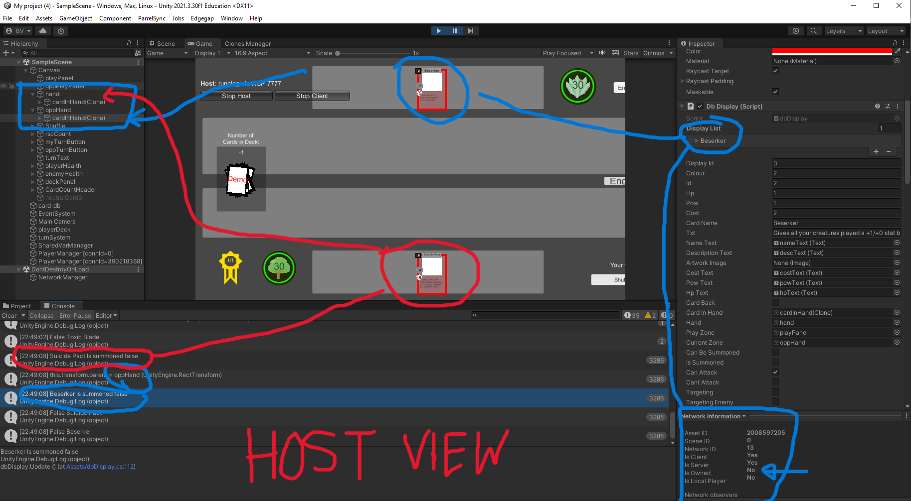
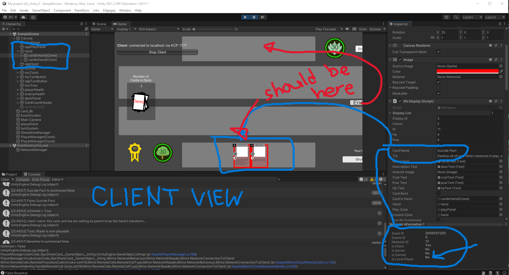

<!--====================================================================================================================               W4-->

# Date Range: 26-09-2023 to 1-10-2023

## Which features were yours in the project plan for this milestone?

Figuring out the Teck Stack, working on the Project Plan document, setting up Unity on my computer, and completing the weekly logs.

## Which tasks from the project board are associated with these features?

<ol>
  <li>"Figure out the Teck Stack"</li>
  <li>"Project Plan Document"</li>
  <li>"Set up Unity"</li>
  <li>"Team Log"</li>
  <li>"Individual Logs" </li>
</ol>

## Among these tasks, which have you completed/in progress in the last week?

### Completed:

Me and Adrian finalized our Teck Stack to the best of our abilities, which allowed us to complete the Project Plan Document.

### In Progress:

I have Unity running on my system, and I've started working through a tutorial, but since I dont have it interacting with our whole teck stack, I don't count this as completed.
The logs are still in progress, but they will be done as I write this.

#### Aditional Context:

This week was more about finializing our project plan and teck stack, so we didn't do much actual coding. Since we have to learn Unity, we are going to work through some tutorials using each of our packages from our Teck Stack each week, So should we make seperate branches for everyone's progress to show evidence of this work? Let me know.

<!--====================================================================================================================               W5-->

# Date Range: 01-10-2023 to 08-10-2023

## Which features were yours in the project plan for this milestone?

Exploration, getting unity working on my other computer and completeing the weekly logs.

## Which tasks from the project board are associated with these features?

<ol>
  <li>"Exploration: Brenner"</li>
  <li>"Set up Unity"</li>
  <li>"Team Log"</li>
  <li>"Individual Logs" </li>
</ol>

## Among these tasks, which have you completed/in progress in the last week?

### Completed:

I got a version of Unity working on my Laptop, so I could work on tutorials from anywhere. Last week I just got it running on my PC at home.

### In Progress:

I started working through some tutorials and watching videos on Unity, its not completed though, and technically won't ever be.
The logs are still in progress, but they will be done as I write this.

#### Aditional Context:

This week was about exploring Unity, so we didn't do much else. Check the Exploration Branch for our work.

<!--====================================================================================================================               W6-->

# Date Range: 8-10-2023 to 15-10-2023

## Which features were yours in the project plan for this milestone?

Exploration, Setting up Unity on my computer, and completing the weekly logs.

## Which tasks from the project board are associated with these features?

<ol>
  <li>"Exploration: Brenner"</li>
  <li>"Set up Unity"</li>
  <li>"W6 Team Log"</li>
  <li>"W6 Individual Logs"</li>
</ol>

## Among these tasks, which have you completed/in progress in the last week?

### Completed:

<ol>
  <li>"W6 Team Log"</li>
</ol>
  
### In Progress:
<ol>
  <li>"Exploration: I followed a tutorial to build a main menu that can actually launch and quit the game, but I plan to do more next week, hopefully having a menu that will resemble the one we will actually use for our project."</li>
  <li>"I Set up Unity on both of my computers, BUT we want to set up GitHub to work with our project as well, so its still in progress."</li>
  <li>"W6 Individual Logs: I'm finishing this as I write this out."</li>
</ol>

#### Aditional Context:

So we didn't have any asignments this week apart from the logs, and we all need to learn Unity, so our main focus this week (and probably next week) is to get our hands dirty with some more tutorials. The goal is to do tutorials that are more related to what we actually need for our presentation in 3 weeks. I aimed for main menu and UI design, while other members aimed at designing actual card objects that the game will use, and others on running our unity game in a web browser. I made a video and then GIF of the UI I built in action, which you can find on my Exploration's Readme. Also, I have Unity set up on both of my computers now, but we want to get GitHub working with it, so that the whole group will be able to work on the same project for our presentation. Thats the goal for next week. \*\*\*Also, this week and next week's peer evaluations got merged into one, so they will share the same screenshot.

<!--====================================================================================================================               W7-->

# Date Range: 15-10-2023 to 22-10-2023

## Which features were yours in the project plan for this milestone?

More Exploration, Setting up Unity with GitHub, and completing the weekly logs.

## Which tasks from the project board are associated with these features?

<ol>
  <li>"Exploration: Brenner"</li>
  <li>"Set up Unity"</li>
  <li>"W7 Team Log"</li>
  <li>"W7 Individual Logs"</li>
</ol>

## Among these tasks, which have you completed/in progress in the last week?

### Completed:

<ol>
  <li>"Set up Unity: I created a new repository that my group can upload our Unity projects to in order to share each others work. (See link below)"</li>
  <li>"W7 Team Log"</li>
</ol>
  
### In Progress:
<ol>
  <li>"Exploration: I took my main menu UI I built last week and improved upon on it, to make it function a lot like what we are actually going to use for our project."</li>
  <li>"W7 Individual Logs: I'm finishing this as I write this out."</li>
</ol>

#### Aditional Context:

So we still didn't have any asignments or class this week apart from the logs, so our main focus this week was to do some more tutorials and get GitHub working with our Unity projects. The goal was to do tutorials that are more related to what we actually need for our presentation in 2 weeks. I continued my work into UI design by improving on the Menu I built last week, and I set up a new repository that my group can upload our Unity projects to in order to share each others work. I also made a new video and then GIF of this UI in action, which you can find on my Exploration's Readme. We plan to use the main "year-long-project" repo for our actual project, but for the exploration projects, the new one is fine. Here is the link:

#### https://github.com/Prelude14/499UnityGameT19

\*\*\*Also, this week and next week's peer evaluations got merged into one, so they will share the same screenshot.

<!--====================================================================================================================               W8-->

# Date Range: 22-10-2023 to 29-10-2023

## Which features were yours in the project plan for this milestone?

Starting the Mini Presentation Slides, Figuring out what will be in the demo, More Exploration, and completing the weekly logs.

## Which tasks from the project board are associated with these features?

<ol>
  <li>"Website draft that hosts our game (for mini presentation)"</li>
  <li>"Main Menu draft (for mini presentation)"</li>
  <li>"Mini Presentation Demo"</li>
  <li>"Mini Presentation Slides"</li>
  <li>"Exploration: Brenner"</li>
  <li>"W8 Team Log"</li>
  <li>"W8 Individual Logs"</li>
</ol>

## Among these tasks, which have you completed/in progress in the last week?

### Completed:

<ol>
  <li>"W8 Team Log"</li>
</ol>
  
### In Progress:
<ol>
  <li>"Website draft that hosts our game (for mini presentation): It is technically working fine, but we are still making changes to it."</li>
  <li>"Main Menu draft (for mini presentation): Just making final touches."</li>
  <li>"Mini Presentation Demo: We are still fine tuning exactly what we want to include for the demo, but we have enough working parts to use what we have right now, just might still add some stuff before Thursday."</li>
  <li>"Mini Presentation Slides: We are still making changes to it."</li>
  <li>"Exploration: I further improved my UI main menu system, but it is not quite at the point I want it at for Thursday."</li>
  <li>"W8 Individual Logs: I'm finishing this as I write this out."</li>
</ol>

#### Aditional Context:

Our main focus this week was to start building our mini presentation thats in 4 days, and to do tutorials that are more related to what we actually need for our presentation. I got the slides started, and tried to nail down which features we need and don't need for the demo. For exploration, I continued my work into UI design by improving on the Menu I built previously. Here is the link to the repo where we have been storing our demo project:

#### https://github.com/Prelude14/499UnityGameT19

<!--====================================================================================================================               W9-->

# Date Range: 29-10-2023 to 05-11-2023

## Which features were yours in the project plan for this milestone?

Completing the Mini Presentation Slides, finalizing the demo, more Exploration, and completing the weekly logs.

## Which tasks from the project board are associated with these features?

<ol>
  <li>"Website draft that hosts our game (for mini presentation)"</li>
  <li>"Main Menu draft (for mini presentation)"</li>
  <li>"Mini Presentation Demo"</li>
  <li>"Mini Presentation Slides"</li>
  <li>"Exploration: Brenner"</li>
  <li>"W9 Team Log"</li>
  <li>"W9 Individual Logs"</li>
</ol>

## Among these tasks, which have you completed/in progress in the last week?

### Completed:

<ol>
  <li>"Website draft that hosts our game (for mini presentation)"</li>
  <li>"Main Menu draft (for mini presentation)"</li>
  <li>"Mini Presentation Demo"</li>
  <li>"Mini Presentation Slides"</li>
  <li>"W9 Team Log"</li>
</ol>
  
### In Progress:
<ol>
  <li>"Exploration: I'm still learning stuff, but didn't do alot this week."</li>
  <li>"W9 Individual Logs: I'm finishing this as I write this out."</li>
</ol>

#### Aditional Context:

Our main focus this week was finish and practice our presentation slides in time for Thursday Nov. 2nd. We also had to put together our final version of our demo for the slides, which we managed to do on this link to the repo where we have been storing our demo project:

#### https://github.com/Prelude14/499UnityGameT19/tree/a260bfb034df2fbbed7a8ab87866c737e8dc1352/My%20project%20(4)

Henry showed me and Adrian how to publish our Unity project as a WebGL package, but he was the one who built the website for our actual demo. I just helped with the choices he made (if we wanted to make a complete site ourselves or upload to another website, and what pages to include (the cards and rules page).

<!--====================================================================================================================               W10-->

# Date Range: 05-11-2023 to 12-11-2023

## Which features were yours in the project plan for this milestone?

Starting the login system, start the create account system, more Exploration, and completing the weekly logs.

## Which tasks from the project board are associated with these features?

<ol>
  <li>"Login System Draft"</li>
  <li>"Create Account System Draft"</li>
  <li>"Exploration: Brenner"</li>
  <li>"W10 Team Log"</li>
  <li>"W10 Individual Logs"</li>
</ol>

## Among these tasks, which have you completed/in progress in the last week?

### Completed:

<ol>
  <li>"W10 Team Log"</li>
</ol>
  
### In Progress:
<ol>
  <li>"Exploration: I'm still learning stuff, for example this week I learned how to get Unity to interact with MySQLphp using php."</li>
  <li>"Login System Draft: I have it currently set up to take a username and password, and check if the username exists in the database, and then if the password matches the username. Not a lot of tests yet, and I just hard coded an account into the database to check for now."</li>
  <li>"Create Account System Draft: Technically this system will use a lot of what the login system is made of, so technically its started at least, but nothing to crazy yet."</li>
  <li>"W10 Individual Logs: I'm finishing this as I write this out."</li>
</ol>

#### Aditional Context:

Since we started focussing on actual features instead of more exploration, there is a ton of new tasks opened and things to do, but I feel like I made solid progress into the login system for this week. Getting a local server running was a bit tricky since I'm a bit out of practice, and the week was very busy for me. We are planning to take advantage of the week off for reading break to really flush out some of the features further. I want to add lots of tests for my login system and maybe a password encryptor for when Unity checks the user's entered data with the php file. Also we still have that other repo open for the main game project found here:

#### https://github.com/Prelude14/499UnityGameT19/tree/a260bfb034df2fbbed7a8ab87866c737e8dc1352/My%20project%20(4)

but I didn't code anything on it this week, I just worked on my own code.

<!--====================================================================================================================               W11-->

# Date Range: 12-11-2023 to 19-11-2023

## Which features were yours in the project plan for this milestone?

Continue flushing out the login system, the create account system, more Exploration, figure out how to upload Unity project assets to this repo, and completing the weekly logs.

## Which tasks from the project board are associated with these features?

<ol>
  <li>"Login System Draft"</li>
  <li>"Create Account System Draft"</li>
  <li>"Password encryption"</li>
  <li>"Exploration: Brenner"</li>
  <li>"W11 Team Log"</li>
  <li>"W11 Individual Logs"</li>
</ol>

## Among these tasks, which have you completed/in progress in the last week?

### Completed:

<ol>
  <li>"Password encryption"</li>
  <li>"W11 Team Log"</li>
</ol>
  
### In Progress:
<ol>
  <li>"Login System Draft: It now properly checks if the user is logged in using the salt and hash password system I set up for the create account system. "</li>
  <li>"Create Account System Draft: I actually made a seperate php file for this and changed the database to now store a salt and hash for each user instead of a plain text password, to be more secure. It successfully creates a user account in our database, and the login system can log into the created account after without issue."</li>
  <li>"Exploration: I'm still learning stuff, for example this week I learned how to set up a simple salt and hash encryption system for the user's password in our database."</li>
  <li>"W11 Individual Logs: I'm finishing this as I write this out."</li>
</ol>

#### Aditional Context:

So this week was reading week, and I didn't end up making much commits to our branches during it, but I did actually write up the code and stuff during the week for the login and create account system on my other computer, I just didn't get around to uploading it to Github properly till W12. Also, we came up with a solution to show the commits to the game project on the main repo now, instead of only the other additional repo we were using before. Now for every feature we are working on, we are making a new branch, and then merging it to "development" and then from there to "master" when each milestone is due, and the game scripts and scenes are being uploaded to these branches as well now (before they were mostly on the other repo and they weren't always getting seen). Now we just need to figure out the conflict issues with the development branch (the merge issues were still busted as of W11). 
We still have that other repo open, just because its a way better way to collaborate on a Unity Project (You don't have to manually set up the scripts and scenes everytime theres a change), which is found here:

#### https://github.com/Prelude14/499UnityGameT19/tree/e136d8e4a04bdb892bc840779f9aed82d66f1f07/My%20project%20(4)

<!--====================================================================================================================               W12-->

# Date Range: 19-11-2023 to 26-11-2023

## Which features were yours in the project plan for this milestone?

Continue flushing out the login system, the create account system, set up the Account info system, more Exploration, figure out how the development branch merge conflict issues, and completing the weekly logs.

## Which tasks from the project board are associated with these features?

<ol>
  <li>"Login System Draft"</li>
  <li>"Create Account System Draft"</li>
  <li>"Account stats system"</li>
  <li>"Exploration: Brenner"</li>
  <li>"W12 Team Log"</li>
  <li>"W12 Individual Logs"</li>
</ol>

## Among these tasks, which have you completed/in progress in the last week?

### Completed:

<ol>
  <li>"W12 Team Log"</li>
</ol>
  
### In Progress:
<ol>
  <li>"Login System Draft: It now returns the user's information to a script that I can use to set up the Account info page as well as the user stats page. I also updated the UI a bit so that the user can't see their password as they type (its replaced by stars), and added a "tabBetween.cs" script so that users can now tab between the input fields. Still need to add a log out button, and for some reason the code I have written to take the user back to the main menu upon successfully isn't yet working right. Also looking at preventing SQL injection."</li>
  <li>"Create Account System Draft: I altered the database to store user info like the date it was created or the number of games they've played etc. They default to 0 and whatever date it was when the account is created upon the user successfully creating a new account. The php also sends said information to the same script that I will use to send the Account and stats page the user's stats. The same UI changes for the login apply here (hidden password and tab between script). The code to take the user back to the main menu upon successfully logging in is suppoed to work here as well, but its still not working yet."</li>
  <li>"Account Stats System: Now that the login and create account systems return a logged in user's information ("readInput.cs" takes info and sends it to new "DBMnager.cs" script), I was able to change the account info menu and stats menu to actually display the logged in user's information properly which is cool. Currently there is no system to actually change the values (because the card game isn't yet playable, but it should be easy enough to add as the game gets further developed."</li>
  <li>"Exploration: I'm still learning stuff, for example this week I learned how to get my php files to send its query contents to a Unity script and have Unity actually do things with that info. "</li>
  <li>"W12 Individual Logs: I'm finishing this as I write this out."</li>
</ol>

#### Aditional Context:

I uploaded my commits of the php files and new scripts on the "userAccountSystem" branch I created for the login, create and account info systems. Check the "app/sqlconnect" folder for php files, and the     "gameScripts" and "gameScripts/UI" for the Mainmenu.cs, ReadInput.cs, DBManager.cs, and tabBetween.cs files.

So this week is the last checkpoint before our design video and design document milestone is due, so I was focussing on flsuhing out enough features to meet our milestone requirements we set up for ourselves in the project plan back in October. I still need to work on the UI design for that milestone (the doc wants diagrams and stuff), but I'm pretty happy with where these features are now other than that. I am a litle worried about the tests for the account system overall, since I haven't written any automated tests yet, but we have a week to get some of these things done at least. Me and Henry ended up just "Rebasing" the development branch in order to solve the conflict issues, since there was nothing on the development branch that needed to be saved, and we hadn't really been pushing to it oftern till that point, and now it seems fixed. The plan is to use a new and different branch for each feature, and then push them all to development for each milestone, and then just do the one merge to master, so we will find out if it worked without issues by tonight. 
We still have that other repo open, just because its a way better way to collaborate on a Unity Project (You don't have to manually set up the scripts and scenes everytime theres a change), which is found here:

#### https://github.com/Prelude14/499UnityGameT19/tree/e136d8e4a04bdb892bc840779f9aed82d66f1f07/My%20project%20(4)
<!--====================================================================================================================               W13-->
# Date Range: 19-11-2023 to 26-11-2023

## Which features were yours in the project plan for this milestone?

Setting Up Automated Testing for the Login and Create Account Systems, update the main menu UI, work on the Design Documentation and Video, continue flushing out the login system, the create account system, set up the Account info system, more Exploration, completing the weekly logs.

## Which tasks from the project board are associated with these features?

<ol>
  <li>"Login format testing"</li>
  <li>"Create user Testing"</li>
  <li>"Update main menu UI for Design Milestone"</li>
  <li>"Design Documentation (November Milestone)"</li>
  <li>"Design Video (November Milestone)"</li>
  <li>"Login System Draft"</li>
  <li>"Create Account System Draft"</li>
  <li>"Account stats system"</li>
  <li>"Exploration: Brenner"</li>
  <li>"W13 Team Log"</li>
  <li>"W13 Individual Logs"</li>
</ol>

## Among these tasks, which have you completed/in progress in the last week?

### Completed:

<ol>
  <li>"Update main menu UI for Design Milestone"</li>
  <li>"W12 Team Log"</li>
</ol>
  
### In Progress:
<ol>
  <li>"Login format testing: I wrote "loginTests.cs", which is a Unity editMode test script that tests 7 different combos of valid and invalid usernames and passwords on the "readInput.cs" script that 
  my login system uses to log in to accounts using the login.php file. I made it before I finished the createTests.cs script, which is way more extensive than only 7 tests, so it should be relatively easy to implement similar tests from the createTests into this script and I think necessary. Doesn't test if username or password is long enough because the login.php is behind the create.php.</li>
  <li>"Create user Testing: I wrote "createTests.cs", which is a Unity editMode test script that tests different combos of 4 different usernames and 6 different combinations of 2 passwords on the "readInput.cs" script that my create account system uses to create and log in to accounts using the create.php file. I need to add support for one more variation of username and clean up the readablilty og the code (its 650+ lines of code long, but could probably be condensed to around 2-300 if I used method calls for similar password combos.</li>
  <li>"Design Documentation (November Milestone): Still filling it out, but its almost done."</li>
  <li>"Design Video (November Milestone): Just need to put each member's videos together."</li>
  <li>"Login System Draft: Its still a work in progress, and I changed a bit of its look when I redesigned the UI of the main menus. I added the logout function and it display the proper menus perfectly, but for some reason the code I have written to take the user back to the main menu upon successfully still isn't working right. Oh and I have't yet set up the ability to press enter and login, or to clear the input fields whenever the user leaves the page. Also added some logic to the login.php to help prevent SQL injection."</li>
  <li>"Create Account System Draft: Its still a work in progress, and I changed a bit of its look when I redesigned the UI of the main menus. I also added some more error codes in the create.php that check the username and password's length now. The code to take the user back to the main menu upon successfully logging in is supposed to work here as well, but its still not working yet."</li>
  <li>"Account Stats System: Its still a work in progress, and I changed a bit of its look when I redesigned the UI of the main menus."</li>
  <li>"Exploration: I'm still learning stuff, for example this week I learned how to actually implement automated testing into my code specifically. "</li>
  <li>"W13 Individual Logs: I'm finishing this as I write this out."</li>
</ol>

#### Aditional Context:

I uploaded my commits of the php files and new scripts on the "userAccountSystem" branch I created for the login, create and account info systems. Check the "app/sqlconnect" folder for php files, and the     "gameScripts" and "gameScripts/UI" for the Mainmenu.cs, ReadInput.cs, DBManager.cs, and tabBetween.cs files.

So this week our design video and design document milestone is due, so I was focussing on flushing out my useraccount system and implementing unit tests since Leo never got around to it in time, and I was also focused on our Design Doc and Video. I ended up resdesigning the theme of the main menu as well after we came up with a title and some ideas for the game's theming which was cool. 
We still have that other repo open, just because its a way better way to collaborate on a Unity Project (You don't have to manually set up the scripts and scenes everytime theres a change), but I made a new branch to show off the new theming and figure out some things. It can be found here:

#### https://github.com/Prelude14/499UnityGameT19/tree/07c1423884475e30bf0b521064815c14a5ade605/My%20project%20(4)
<!--====================================================================================================================               TERM 2 ************ W1-->
# TERM 2 - Date Range: 08-01-2024 to 14-01-2024 - W1

## Which features were yours in the project plan for this milestone?

Help Adrian with flushing out each card's effects in each deck, Exploration into how we are going to set up multiplayer, and completing the weekly logs. The login system can always be improved as well.

## Which tasks from the project board are associated with these features?

<ol>
  <li>"Finish Card Game Rules"</li>
  <li>"Exploration: Brenner"</li>
  <li>"T2 W1 Team Log"</li>
  <li>"T2 W1 Individual Logs"</li>
  <li>"Login System Draft"</li>
  <li>"Create Account System Draft"</li>
  <li>"Account stats system"</li>
</ol>

## Among these tasks, which have you completed/in progress in the last week?

### Completed:

<ol>
  <li>"T2 W1 Team Log"</li>
</ol>
  
### In Progress:
<ol>
  <li>"Finish Card Game Rules: We now have a complete set of four unique decks each with 20 cards, but we need to play test the crap out of them before we can say we are finished with them."</li>
  <li>"Exploration: Brenner: I followed a youtube tutorial on how to use netcode for game objects in Unity to understand how we are going to implement matchmaking into our game. It doesn't translate one to one with our game yet, since our card playing system isn't quite at the right stage and since the tutorial doesn't fit a card game perfectly, but the development environment and other tools from it are going to be very useful once our game begins shaping up in the next couple weeks. See the GIF below for details."</li>
  <li>"T2 W1 Individual Logs: I'm finishing this as I write this out."</li>
</ol>

#### Aditional Context:

This was the first week of the second semester, so we decided to try to prioritize work on the more important features we have left to implement into our MVP. For me this meant getting to work on understanding how we can begin to implement some form of matchmaking into our current game. Since none of us have used Unity before this class, and we haven't begun to set up hosting or servers for actually playing against an opponent yet, we needed to start with exploration into it as soon as possible. I ended up following along with this tutorial on youtube: "https://www.youtube.com/watch?v=stJ4SESQwJQ". While it doesn't translate perfectly to our game, it should prove to be instrumental in our implementation of networking into our game further down the line. It demonstrates examples of how to run two different games to test simultaneously, how to have two different games display the same objects, how to run each game as a client, host, or a server (and how each of these have different authority over who can change certain objects). Our game is technically going to look different for each player (each player should be able to see their opponenet's cards for example), but they will need to mirror certain cards/effects being played. I made a GIF below that shows what I mean.

#### I made a GIF of the menu in action: 

Since I mostly worked on exploration this week, I didn't change much on either repo. 
We still have another repo open from the design demo at the end of the first semester, and you can find it here:

#### https://github.com/Prelude14/499UnityGameT19/tree/07c1423884475e30bf0b521064815c14a5ade605/My%20project%20(4)
<!--====================================================================================================================               TERM 2 ************ W2-->
# TERM 2 - Date Range: 14-01-2024 to 21-01-2024 - W2

## Which features were yours in the project plan for this milestone?

Trying to figure out multiplayer (how to set up a server, do we want dedicated servers, how does that work with unity, etc.), and completing the weekly logs. 

## Which tasks from the project board are associated with these features?

<ol>
  <li>"matchmaking draft"</li>
  <li>"Exploration: Brenner"</li>
  <li>"T2 W2 Team Log"</li>
  <li>"T2 W2 Individual Logs"</li>
  <li>"Finish Card Game Rules"</li>
</ol>

## Among these tasks, which have you completed/in progress in the last week?

### Completed:

<ol>
  <li>"T2 W2 Team Log"</li>
</ol>
  
### In Progress:
<ol>
  <li>"Exploration: Brenner: I watched hours of different tutorials trying to figure out how best to implement a server for our game, but honeslty didn't yield great results. I think a server will have to host a individual "server build" of our game for every 2 players wishing to play, but I can't quite figure out the logistics of that yet. Every video just glosses over how the server actually works or tells you to read the documentation which is not helpful for me. We are going to talk to the professor and TA about it in our next meeting. For the forst peer testing milestone, we are just going to have each machine run both games on a local server simultaneously (which is fundamentally the same coding wise, apart from needing to do all the server infrastructure backend)."</li>
  <li>"matchmaking draft: I am going to be following along with a new tutorial to convert our game's card objects into network objects that netcode can use to display different things between the client and server sides of our game this week. The link to the playlist of videos can be found here: https://youtube.com/playlist?list=PLCbP9KGntfcFTL19eDZsWSkVMfXANF7-U&si=I_NVzdA6X_DBcT4V"</li>
  <li>"T2 W2 Individual Logs: I'm finishing this as I write this out."</li>
  <li>"Finish Card Game Rules: We still need to play test the crap out of the cards before we can say we are finished with them."</li>
</ol>

#### Aditional Context:

So as the peer testing #1 milestone looms closer, I really tried to get into how to set up the back end infastructure of a multiplayer system for our game. Problem is, I've never done anything quite like it before, and despite watching at least 8 hours of different tutorials and videos this week, I still don't know exactly what to do. Most videos/guides completely gloss over how exactly to set up a server and just focus on how to develop the game with the client and sever in mind, which is helpful for what we are going to be doing, but not at actually telling me what I am looking for. I think for the first deliverable, it should be fine to just run 2 builds locally having one act as a host and the other a client, since that should still illustrate exactly how the game will work in the field if we actually deploy dedicated servers, while cutting out actually setting up a game server, since that feels honeslty like its outside the scope of the course. We are going to talk to the TA and the professor about it next class though. This week I'm going to shift my focus to turning our current game's objects and system into a new version that will work with the client and server builds of the game following along to this playlist's videos (https://youtube.com/playlist?list=PLCbP9KGntfcFTL19eDZsWSkVMfXANF7-U&si=I_NVzdA6X_DBcT4V), so that we will have the two different versions of the game ot test for the milestone date. 

<!--====================================================================================================================               TERM 2 ************ W3-->
# TERM 2 - Date Range: 21-01-2024 to 28-01-2024 - W3

## Which features were yours in the project plan for this milestone?

Trying to figure out multiplayer (how to set up a server, do we want dedicated servers, how does that work with unity, etc.), implementing server and client logic to control the game, and completing the weekly logs. 

## Which tasks from the project board are associated with these features?

<ol>
  <li>"matchmaking draft"</li>
  <li>"Game Mirroring"</li>
  <li>"Implement Card Decks"</li>
  <li>"Exploration: Brenner"</li>
  <li>"T2 W3 Team Log"</li>
  <li>"T2 W3 Individual Logs"</li>
</ol>

## Among these tasks, which have you completed/in progress in the last week?

### Completed:

<ol>
  <li>"T2 W3 Team Log"</li>
  <li>"Implement Card Decks: mostly completed, but not quite. All the cards from the google doc are now in a script, including their names, stats and colours, but since the server and client logic isn't quite done yet, the cards aren't fully implmented since the way the logic works is going to have to change. "</li>
</ol>
  
### In Progress:
<ol>
  <li>"matchmaking draft: So I started following along with the tutorial from last week to convert our game's card dealing system to work over a server. The link to the playlist of videos can be found here: https://youtube.com/playlist?list=PLCbP9KGntfcFTL19eDZsWSkVMfXANF7-U&si=I_NVzdA6X_DBcT4V I got pretty far in after hours of work, but I ran into lots of issues with GitHub and Unity Packages, so it isn't working the way I want it to currently. I almost have the server dealing the cards out to each client at the start of the game, but Mirror broke, and I can't run a host and client in parallel to test anymore. This is a top of the agenda issue for the next few days."</li>
  <li>"Exploration: Brenner: I am still trying to figure out all the aspects of how multiplayer is going to work. I ended up switching our project from using netcode for game objects to using a package called mirror in order to follow a tutorial better, and I learned a lot about writing client commands and server rpcs, but mirror ended up breaking and I've had to do a ton of research while troubleshooting."</li>
  <li>"T2 W3 Individual Logs: I'm finishing this as I write this out."</li>
</ol>

#### Aditional Context:

So the peer testing milestone is in 4 days, and the only thing we need still is some form of a multiplayer implementation--not to mention the list of tasks and stuff we want people to test, but we're going to fill it out at our meeting on Tuesday). The multiplayer has proven to be a massive time-sink for me, and while it has been absolutely brutal, I think I should be able to have the server deal cards to the players by Thursday. Once I figure out how to have the server not break after a client joins, the rest of the features should be easy (the problem is getting the clients to communicate what colour deck they chose to server when they join, and have the server begin the game when it receives the info from two clients). It felt like I was right on the cusp of figuring out how to re-word the client side logic when Mirror seemingly broke for no reason, so if I can successfully revert the project to a working version and slowly introduce some of my changes, the fix might just be a couple lines of code away. All of my work and commits were pushed to the other repo we use to actually work on our project, since this repo isn't made for Unity projects, so I'll link it here, and add an image of the commit history so you can see I made progress. I honestly spent about 40 hours on this project this week, and wrapping my head around client commands, rpcs, unity packages and networking documentation has not been easy, in fact it's driven me a little bit insane.

Project (4) in repo (newest branch I'm working on): https://github.com/Prelude14/499UnityGameT19/tree/0a775dfd5538db865c24c984cf52e7c550704472/My%20project%20(4)

<!--====================================================================================================================               TERM 2 ************ W4-->
# TERM 2 - Date Range: 28-01-2024 to 04-02-2024 - W4

## Which features were yours in the project plan for this milestone?

Figure out the multiplayer issues from last week (logic is figured out, but Mirror wasn't working last week), setting up our Peer Testing #1 tasks (and getting a working version of the game in order to complete the tasks), and completing the weekly logs. 

## Which tasks from the project board are associated with these features?

<ol>
  <li>"matchmaking draft"</li>
  <li>"Game Mirroring"</li>
  <li>"Exploration: Brenner"</li>
  <li>"Peer Testing #1 Heuristic Eval Doc"</li>
  <li>"T2 W4 Team Log"</li>
  <li>"T2 W4 Individual Logs"</li>
</ol>

## Among these tasks, which have you completed/in progress in the last week?

### Completed:

<ol>
  <li>"T2 W4 Team Log"</li>
  <li>"Peer Testing #1 Heuristic Eval Doc: The Team and I figured this doc out by our Thursday class. I did spend quite a bit of time getting the right build of the game ready for this and fixing new issues I encountered when we tried to deploy it for testing however, and if I hadn't, our machines might not have been ready to run the game properly for testing (ex. When we test the login system, we use a locally hosted database, and it works completely fine in the Untiy editor, but when we went to use it when the game is actually running in a web browser, it couldn't connect to the same server at all. We didn't find this issue until late Wednesday when we finalized the build, but I was able to figure out a fix on my machine that night. Problem was that when we went to apply the same fix to the two machines that we were going to be testing with in class, it didn't fix it, and both machines actually ended up with completely different issues, that I also ended up fixing right before class. The final version of our game shouldn't use a local host server however, so this shouldn't be a problem by then hopefully."</li>
</ol>
  
### In Progress:
<ol>
  <li>"matchmaking draft: So last week I was really struggling with Mirror and getting the sever to deal the cards to the players. It was especially tough because the way it was breaking wasn't very debuggable (it seemed like I didn't change anything to cause it, and since it froze immediately every time, I could never get any error messages to print to the debug log). Good news is that I now have it sort of fixed to where I can see the messages and its no longer freezing, but the bad news is that I don't know how to fix the actual problem that I was trying to fix the whole time. I need the client to tell the server what colour deck the player chose at the beginning of the game, and then once the server recieves 2 colours, it is supposed to build the game deck and deal the cards out (I  do this through a Sync Var String that the server adds the colours to when it recieves the Command from the clients). Through debugging, I know that both clients send their colour successfully, and the server recieves both fine, but when the 2nd client sends their colour, when the server goes to add that client's colour to the shared string, it thinks the shared string is empty again instead of what it's supposed to be (It should have the first client's string inside, and I know this because the I have a RPC method that tells the clients what the updated string is after a client has added their colour, but instead the 2nd client always overwrites the string resulting in a invalid combo of colours, which will never start the game despite their being two valid players with valid colours choosen. So something is wrong with how I understand Sync Vars or Server variables (it seems like the server's version of the shared string isn't updating properly), but I have yet to figure out what. I have talked to the team, and while we had to drop fixing it in time for the peer testing, we are all going to be focussing on this for the next couple weeks since its such an important feature. I did work on it all the way through until wednesday mind you though. You can see my commits thoughout the week in the image at the bottom (They are on the other repo). I'm also going to be talking to the T.A. in this week's meeting to see if they can help, since the Team and I are kind of at a loss right now."</li>
  <li>"Exploration: Brenner: I still had to do a ton of research while troubleshooting Mirror and the errors with the client to server communication."</li>
  <li>"T2 W4 Individual Logs: I'm finishing this as I write this out."</li>
</ol>

#### Aditional Context:

So the peer testing milestone was this week, and we were feeling pretty ready for it, except for getting the multiplayer system working before the test. I grinded really hard until Wednesday trying to get it working (another ~15 or so hours since Sunday), and I involved the team as well, but unfortunately it just wasn't meant to be done in time for the peer testing, so we had to shift focus and get our build ready for testing. Luckily, we had enough features implemented without multiplayer to fufill the heuristic evaluations requirements. It was a little stressful getting everyone's parts together, but we got it set up well enough that testing went pretty smoothly. I know that we were supposed to have a certain amount of features done by this milestone, and multiplayer was one of them, but we--or at least I--definitely under estimated just how time consuming and complex setting it up for our game was going to be. I take comfort in knowing that I'm really trying to get it working, and that once we solve the logic issue I'm having with starting the game, the rest of the game communications between the sever and client should be relatively easier, since they should work a bit differently and won't need to be as complicated. You can see the new repo branch I used to fix the multiplayer at the link below, and you can see all of my commits on the repo in the image (the red circles) below that. The build that we used for testing is found on the designVideoDemo branch of the same repo.

Project (4) in repo (newest branch I'm working on): https://github.com/Prelude14/499UnityGameT19/tree/multiplayertroubleshooting

Network graph of repo:

<!--====================================================================================================================               TERM 2 ************ W5-->
# TERM 2 - Date Range: 04-02-2024 to 11-02-2024 - W5

## Which features were yours in the project plan for this milestone?

Figure out the multiplayer issues from last week (logic is figured out, but Mirror wasn't working last week), and completing the weekly logs. 

## Which tasks from the project board are associated with these features?

<ol>
  <li>"matchmaking draft"</li>
  <li>"Game Mirroring"</li>
  <li>"Exploration: Brenner"</li>
  <li>"T2 W5 Team Log"</li>
  <li>"T2 W5 Individual Logs"</li>
</ol>

## Among these tasks, which have you completed/in progress in the last week?

### Completed:

<ol>
  <li>"T2 W5 Team Log"</li>
</ol>
  
### In Progress:
<ol>
  <li>"matchmaking draft: So this week I talked to the TA in order to see about getting some help with the multiplayer stuff, since I wasn't getting anywhere since the peer testing issues. I didn't hear back from them yet, but I didn't want to have nothing to show for this week, so I ended up getting back into attempting a fix. AND IT FINALLY GAVE!!!!!!!!!!!! Clients now can connect to the server without issue, and can successfully send their chosen colour to the server properly! The issue was that I was using a sync variable in the playermanager script thinking it would be synchronized across all the instances of that variable in the project, but in reality, because the network manager spawns a unique instance of the playermanager object for each client, the clients would only ever see one colour in the string. Now, both clients update a sync var list of strings that is part of a different game object called SharedVarManager, and that game object actually creates the game's deck of cards and is supposed to deal them out as well. I added a gif of this functioning somewhat below, the deck is made fine, but the cards aren't yet dealt perfectly. Still, the hardest part is done now, and I'm soooooo glad I finally figured it out. "</li>
  <li>"Exploration: Brenner: I still had to do a bit of research while troubleshooting Mirror and the errors with the client to server communication."</li>
  <li>"T2 W5 Individual Logs: I'm finishing this as I write this out."</li>
</ol>

#### Aditional Context:

So I was still quite stuck all week trying to fix the multiplayer issue, but I was also quite sick during the actual week, so I wasn't able to get much done until the weekend after telling the TA all about the issue I was having in class Thrusday. Luckily, I ended up having a major breakthrough on Sunday with the multiplayer, but it still took a lot of effort, and isn't exactly perfect yet. I cannot express just how relieving it is to have it semi working now though, and it has got me excited for the future of the project again. You can see the repo branch I used to fix the multiplayer at the link below, and the build that we used for testing is found on the designVideoDemo branch of the same repo.

Project (4) in repo (newest branch I've been working on): https://github.com/Prelude14/499UnityGameT19/tree/b010c44db88ae12dd2bb38ca7d6b8cde3be8bd76/My%20project%20(4)

#### I made a GIF of the server starting the game in action: 

<!--====================================================================================================================               TERM 2 ************ W6-->
# TERM 2 - Date Range: 11-02-2024 to 18-02-2024 - W6

## Which features were yours in the project plan for this milestone?

Get the multiplayer to deal cards properly (the deck create feature worked lasy week, but the deal wasn't working yet), and completing the weekly logs. 

## Which tasks from the project board are associated with these features?

<ol>
  <li>"matchmaking draft"</li>
  <li>"Game Mirroring"</li>
  <li>"Exploration: Brenner"</li>
  <li>"T2 W6 Team Log"</li>
  <li>"T2 W6 Individual Logs"</li>
</ol>

## Among these tasks, which have you completed/in progress in the last week?

### Completed:

<ol>
  <li>"T2 W6 Team Log"</li>
</ol>
  
### In Progress:
<ol>
  <li>"matchmaking draft: So I needed to get the draw command, which is what actually deals each player their cards, working properly over the server and client this week. I made solid progress, but it was
    surprsingly difficult to get functioning, due to how complex the amount of scripts and game objects has become. Currently the host will deal the cards to the right places properly, and the client will spawn the correct matching cards on its end, but the client isn't spawning the cards in the right places quite yet. Something is up with the authority of each card, but I haven't been able to figure it out yet (its weird since the host's client uses the exact same logic and works fine, while the other client's inspector knows which cards it has ownership over, yet still the logic seems to fail anyways. Should be able to get into it in the next few days with help from the team, especially since I've narrowed it down a bit. I added Images to show each build's view to the bottom of the page."</li>
  <li>"Exploration: Brenner: I still had to do a bit of research while troubleshooting the client to server communication and authority."</li>
  <li>"T2 W6 Individual Logs: I'm finishing this as I write this out."</li>
</ol>

#### Aditional Context:

So this was the week before reading break, and life got a bit busy since my other classes had a couple of deadlines to get in before the break. I also went home early (as in travelled back home to Trail) on Friday, because of a family emergency, so I wasn't able to get much done on the weekend. That being said I was still able to clock in around 15 hours trying to understand what I needed to do in order to get the deal feature working right (~5 during the week, ~10 on Sunday). I think I should be able to get it fully functioning sometime in the next couple days, and I don't want to be working on it anytime past Wednesday, since the rest of the group really needs it to be done before reading break is over. 

You can see the repo branch I used to fix the multiplayer at the link below, and the build that we used for the peer testing is found on the designVideoDemo branch of the same repo.

Project (4) in repo (newest branch I've been working on): https://github.com/Prelude14/499UnityGameT19/tree/b010c44db88ae12dd2bb38ca7d6b8cde3be8bd76/My%20project%20(4)

#### Here is the screenshots of the server dealing the cards in action (Host View is on the top, Client after ***Only deals 1 card to make debugging easier): 

<!--====================================================================================================================               TERM 2 ************ W8-->
# TERM 2 - Date Range: 18-02-2024 to 03-03-2024 - W6 to W8

## Which features were yours in the project plan for this milestone?

Resolve the card deal displaying issue, get ready for peer test #2, and completing the weekly logs. 

## Which tasks from the project board are associated with these features?

<ol>
  <li>"matchmaking draft"</li>
  <li>"Game Mirroring"</li>
  <li>"Exploration: Brenner"</li>
  <li>"T2 W7&8 Team Log"</li>
  <li>"T2 W7&8 Individual Logs"</li>
  <li>"PeerTest #2 Heuristic Eval Doc"</li>
</ol>

## Among these tasks, which have you completed/in progress in the last week?

### Completed:

<ol>
  <li>"PeerTest #2 Heuristic Eval Doc: (It is quite similar to the last eval, since we have somethings to test that we changed as a result of the first eval)"</li>
  <li>"T2 W7&8 Team Log"</li>
</ol>
  
### In Progress:
<ol>
  <li>"matchmaking draft: So the cards finally deal properly on both player's version of the game!!!!! The opponent's hand will even show the back of the cards instead of the front. Adrian helped me finally figure out what was causing the issue from last log, and this means we can finally start putting the rest of the game's features together for the final product. I got my branch (which is linked below) up to date with the rest of the repo as best as I could, and this meant the cards change colour when they can be played or attack the opponent properly, and the guide messages show up as well which is great. I then started figuring solving a bunch of smaller fixes for the peer testing build of the game (I changed some images as well as created a script to handle muting an audio source, which was cool). "</li>
  <li>"Game Mirroring: We just need to get the play and attack features to work over the network now, and the game will be more or less fully functional over a multiplayer connection!"</li>
  <li>"Exploration: Brenner: I had to do a bit of research while troubleshooting the audiosource muting feature since Leo set it up before the last peer testing and I hadn't gotten around to understanding how it worked yet."</li>
  <li>"T2 W7&8 Individual Logs: I'm finishing this as I write this out."</li>
</ol>

#### Aditional Context:
So since I was still having issues with the multiplayer, we decided to focus on trying to get our build that's going to be tested this week done, and my branch took a bit of a back seat this week because of that. That being said however, I did do a bunch of admin stuff trying to get the multiplayertroubleshooting branch up to date with the current game branch, and it was quite the task. Because the multiplayer features required a bunch of script changes (and a bit of experimentation), I didn't want to merge anything until I was sure what we were doing, so the branch has been quite separate for a couple weeks now, and it was not super straight forward to merge by this point as a result. The scripts came easy, but because the scenes on each branch had so many different changes I wasn't able to get it working after trying to just resolve each conflict in vs code, I had to basically rebuild the features using the scripts inside the Unity editor from scratch. That's why in the gif below you'll see the game isn't quite scaling properly in the display, but now that the branch is up (and functional), it should be fixed pretty soon (probably just after peer testing week).

You can see the repo branch I used to fix the multiplayer at the link below, and the build that we are going to use for the peer testing is found on the designVideoDemo branch of the same repo.

Project (4) in repo (most up to date multiplayer): https://github.com/Prelude14/499UnityGameT19/tree/c59802f0a0f35516ff2e184c441da4565c7c7e53/My%20project%20(4)

#### I made a GIF of the current version of the multiplayer in action: 

<!--====================================================================================================================               TERM 2 ************ W9-->
# TERM 2 - Date Range: 03-03-2024 to 10-03-2024 - W9

## Which features were yours in the project plan for this milestone?

Get final build ready for peer test #2, continue getting the multiplayer branch up to date, and completing the weekly logs. 

## Which tasks from the project board are associated with these features?

<ol>
  <li>"PeerTest #2 Heuristic Eval Doc"</li>
  <li>"matchmaking draft"</li>
  <li>"Game Mirroring"</li>
  <li>"T2 W9 Team Log"</li>
  <li>"T2 W9 Individual Logs"</li>
</ol>

## Among these tasks, which have you completed/in progress in the last week?

### Completed:

<ol>
  <li>"PeerTest #2 Heuristic Eval Doc: (Peer testing #2 was on Thursday the 7th, and we finalized the doc by Wednesday night)"</li>
  <li>"T2 W9 Team Log"</li>
</ol>
  
### In Progress:
<ol>
  <li>"matchmaking draft: So I haven't really had the chance to get back to this since last week, because getting the final build ready for peer testing ended up taking all my time. So the branch is still in the same position as last week, but bringing it up to date with the peer test build version shouldn't be that bad since I believe there should be less merge conflicts between that build and this branch compared to last week's merge between the older build and the older version of this branch. "</li>
  <li>"Game Mirroring: We still need to get the play and attack features to work over the network."</li>
  <li>"T2 W9 Individual Logs: I'm finishing this as I write this out."</li>
</ol>

#### Aditional Context:
So this week started not so busy, since we felt like we were on a good track to have our build ready for the peer testing on time, but by Tuesday night, things got pretty stressful. We met earlier that day to finalize our tasks that we wanted to test and get all the final features together, and everything was coming together! The website was ready to go, Leo finished the reset password feature and commited it 
to our branch, and I commited the sound feature and a couple other small bug fixes to the branch as well. The only thing we were waiting on when we left the meeting, was for Adrian to finalize and commit the 
card zoom on hover feature that Aditya helped him with, and it was all supposed to be together and built by like 5 or 6 for testing (giving us all of Wednesday to fix any issues like last peer testing). Problem was, when Leo merged his code at the meeting, we didn't notice that they were working in a different Unity version than the rest of us, and it ended up completely breaking the branch (you can scale projects up a Unity version, but downgrading them is not supported). I didn't see the group chat message about the error until around 6 that night, and nobody in the group replied or did anything about it for some reason. I quickly realized it was the version error, and told Adrian to revert back to the newest commit they could to rebuild their features from there, and told Leo to fix their version and do the same, but nothing happened until the next morning. Adrian had their features done early, but Leo couldn't get it working at all on their system (somehow they couldn't download the correct editor version despite us using the exact same one since October). I ended up having to step in and rebuild Leo's features by recreating the scene's game objects and piecing them together using the scripts (with Leo explaining what did what over Discord), and combining that work with Adrian's newer and fixed branch. It took essentially all of my day Wednesday in order to get it done (I missed that day's career fair and was late for class), and for some reason no one else seemed to care that it wasn't working (complete radio silence from everyone but Leo until around 8, when I managed to get everything working, built, and uploaded to simmer.io so that it could be linked in our website). I was super stressed and a bit annoyed to be honest, but once it was working I felt better. Then again, when Aditya started testing it around 9, they were running into a bunch of issues that were seemingly happening for no reason, and I again, was forced to step in and try to figure what it was, since no one else was replying. We eventually figured it out, and we also got it working on Leo's machine after that as well though, so we ended up ready for the test class by the end of the night. It was super stressful to be sort of freaking out over issues that I couldn't necessarily do anything about (Leo and Adrian's features were easier to fix if it was Leo or Adrian doing the fixing, so until Leo definitely couldn't fix theirs, I just had to wait and hope it was getting done). Additionally, it was also pretty stressful to be freaking out a bit, and have the rest of the group not freaking out or not showing a lot of urgency. It felt like I was going crazy, and that no-one noticed or cared. So once the peer testing #2 ended, I figured I should take a bit of break until next week to avoid burnout. That's why the multiplayer branch hasn't changed much since last week. 

You can see the repo branch I used to fix the multiplayer at the link below, and the final build that we used for peer testing is below that.

Project (4) in repo (most up to date multiplayer): https://github.com/Prelude14/499UnityGameT19/tree/c59802f0a0f35516ff2e184c441da4565c7c7e53/My%20project%20(4)

Project (4) in repo (peer testing #2 final build): https://github.com/Prelude14/499UnityGameT19/tree/4697f5a310b4f56139af3e6886992a320ba7e786/My%20project%20(4)

<!--====================================================================================================================               TERM 2 ************ W10-->
# TERM 2 - Date Range: 10-03-2024 to 17-03-2024 - W10

## Which features were yours in the project plan for this milestone?

Continue getting the multiplayer branch up to date, work on Play card feature, and completing the weekly logs. 

## Which tasks from the project board are associated with these features?

<ol>
  <li>"matchmaking draft"</li>
  <li>"T2 W10 Team Log"</li>
  <li>"T2 W10 Individual Logs"</li>
</ol>

## Among these tasks, which have you completed/in progress in the last week?

### Completed:

<ol>
  <li>"T2 W10 Team Log"</li>
</ol>
  
### In Progress:
<ol>
  <li>"matchmaking draft: So the current version of the branch is essentially up to date with the peer testing branch minus some of Adrian's newest features that weren't able to be brought into it perfectly quite yet. I had to fix a couple bugs in the card deal system which took a bit, and stopped me from getting the card play done. Aiming to spend the first couple days of this week to get back on schedule before next class. "</li>
  <li>"T2 W10 Individual Logs: I'm finishing this as I write this out."</li>
</ol>

#### Aditional Context:
So I ended up surprisingly quite busy with life this week, and apart from doing a coupole hours worth of bug fixing/troubleshooting, I wasn't able to get as much work done as I had hoped for this week. I do plan to hunker down quite a bit in the next couple days to try to get back on track before we meet next however, so here's hoping that goes well.

You can see the repo branch I used to fix the multiplayer at the link below;

Project (4) in repo (most up to date multiplayer): https://github.com/Prelude14/499UnityGameT19/tree/b65e27f65f08cd84d28aadf7c9f294591a03c16d/My%20project%20(4)

<!--====================================================================================================================               TERM 2 ************ W11-->
# TERM 2 - Date Range: 17-03-2024 to 24-03-2024 - W11

## Which features were yours in the project plan for this milestone?

Finish multiplayer play card feature, start the multiplayer turn system, start outlining system features for final report doc, and completing the weekly logs. 

## Which tasks from the project board are associated with these features?

<ol>
  <li>"matchmaking draft: (Specifically for playing a card)"</li>
  <li>"Turn system over multiplayer"</li>
  <li>"T2 W11 Team Log"</li>
  <li>"T2 W11 Individual Logs"</li>
</ol>

## Among these tasks, which have you completed/in progress in the last week?

### Completed:

<ol>
  <li>"matchmaking draft: (Specifically for playing a card): So if a card in their hand is playable, players can now successfully play it by placing it in their "playPanel", and the server will communicate that the card was played to the other player's game, moving it from their opponent's hand to their opponent's "playPanel" and facing the right way as well (the opponent's cards show their backs while in their hand). Players cannot play their opponent's cards even if they can afford to, and they cannot move cards once they are played. I had to add an RPC call in sharedVarManager that gets triggered whenever a card is done being dragged into the client's playPanel, which is controlled by the dragScript. The CmdDraw command in the sharedVarManager uses the same RPC to control where the cards are dealt to on each client, but the dragScript treats the cards as "played" instead of dealt, so they show up in the playPanels instead of the hands."</li>
  <li>"Turn system over multiplayer: So this was a bit tricky to get figured out at first, because I needed someway for the server to assign each client as a specific player, and keep track of the turns. At first I tried using a new method in sharedVarManager, that the server would trigger when the first colour was added to the list in the CmdGetPlayerColour (the one that starts the game once two players connect and send valid colours). This didn't work however, because that command is run on the server, so the method was always running on the Host's build despite not being a command or RPC. I was finding the network identity inside that method before assigning the playermanager with that id to be player one or two, so since the server was always the one running it, it would always use the host's network id, overwriting who was player one and two. Eventually I figured out that the clients can actually send their network identity as a variable, and that made all the difference. So now when clients send their colour to the server to begin the game, they also send their ID. The first player to send their colour becomes first player (the server assign's that id's playermanager as first player), and the second player gets assigned to be player 2. SharedVarManager also has a couple new sync vars to control who's turn it is (always starting with one when game begins), what turn it is, as well as each players mana count. I then changed Turnscript and the dragscript to use each client's assigned player number in combination with the server's turn variables to control how clients can change/end turns, as well as how they can play cards. The proper client will get to go first, and the other will know it isn't their turn, because of turn display text. Players will not be able to drag their cards if it isn't their turn, or if it isn't their card. They also can't end the opponent's turn using the end turn button (but the old end opponent's turn still might work and is there for testing purposes). Ther server seems to track the turns without issue (it flips whosTurn every time the correct player ends their turn), and it tracks each players mana properly as well (In same cmd as the whosTurn flip, it adds to each player's mana accordingly). Just need to get the attack feature to also work over the server now, and the game should be fully playable."</li>
  <li>"T2 W11 Team Log"</li>
</ol>
  
### In Progress:
<ol>
  <li>"T2 W11 Individual Logs: I'm finishing this as I write this out."</li>
</ol>

#### Aditional Context:
So I ended up getting the play card over multiplayer working before last week's team meeting like I planned, and then I managed to get the turn system up and working pretty well on the weekend. We also started outling our system features in preparation for the final report thats due in 2 weeks as well, which overall felt pretty good. This week I'm focussed on getting the attack feature to work over the server, and then any last minute bugs or small features I have time for, since we only have two weeks before the final thing is due. I have been making all of my changes on our other repo since I started the multiplayer, but this week I pushed a couple of the main scripts to this repo as well to show the works thats been done. 

You can see the repo branch with the turn system below:

Project (4) in repo (most up to date multiplayer): https://github.com/Prelude14/499UnityGameT19/tree/8ea5d05434230822c97e35ce41c085fe5823e896/My%20project%20(4)

<!--====================================================================================================================               TERM 2 ************ W12-->
# TERM 2 - Date Range: 24-03-2024 to 31-03-2024 - W12

## Which features were yours in the project plan for this milestone?

Finish multiplayer turn system, start the multiplayer attack system, continue outlining system features for final report doc, and completing the weekly logs. 

## Which tasks from the project board are associated with these features?

<ol>
  <li>"Turn system over multiplayer"</li>
  <li>"matchmaking draft: (Specifically for attacking with a card and updating player health accordingly)"</li>
  <li>"Final Deliverable Documentation"</li>
  <li>"T2 W12 Team Log"</li>
  <li>"T2 W12 Individual Logs"</li>
</ol>

## Among these tasks, which have you completed/in progress in the last week?

### Completed:

<ol>
  <li>"Turn system over multiplayer: So it was mostly finished last week, but I ended up needing to add some logic to get the game to deal a new card out to the player when they end their turn. Adrian had added just a call to the Draw Cmd inside Playermanager that we use to deal the first cards out at the begining of the game, but it was a massive exploit because of where they addded it. It was put inside the TurnScript right after the updateturnInfo function call that gets the server to figure out whos turn it is and act accordingly if the right player ended their turn. The problem was that all the checks for the if it is the player's turn happen inside the server's cmds, not inside turnScript itself, so turnScript has no actual check to see if its the player's turn or not before executing the code. This meant that a player could repeatedly spam the end turn button during the opponent's turn or their own and get a new card each time the clicked it, which is definietly game breaking. I fixed by adding a checkTurn method inside turnScript that checks if it is the player who is clicking the button's turn before doing anything to the turn information, even before calling the updateTurnInfo call from before. This means there is two checks for the players turn before the server actually updates the turn info. Seems to work good and after manually testing again, seems fully fixed.  "</li>
  <li>"matchmaking draft: (Specifically for attacking with a card and updating player health accordingly): So now that card deal works, playing a card works, and turns work, we now need to get attacking and the player's health to work with them as well. I set up the sharedVarManager (the server) to now track each player's health and mana using a very similar method to how it tracks the turn info of each player. Then I just had to change turnScript, playerHealth and opponentsHealth to use those same values, similar to how I did it with turnScript or dragScript. Overall seems to work great, players can only attack when a card is played and its in their playPanel, and attacking updates both clients to display the proper health and mana after the attack or when a card is played. attacking isn't very flashy (theres now message or animation or anything), so we might add something to make it more obvious that your were attacked, but I don't know if we have time. "</li>
  <li>"T2 W12 Team Log"</li>
</ol>
  
### In Progress:
<ol>
  <li>"Final Deliverable Documentation: We have our list of system features started and partially filled out, but we have some details to iron out still this week."</li>
  <li>"T2 W12 Individual Logs: I'm finishing this as I write this out."</li>
</ol>

#### Aditional Context:
The game is really coming together now and we are shifting focus to last minute changes and then paperwork for the final submission. Still actually commiting to the other repo, but I updated this repo's scripts in GameDev/MultiplayerVersions/ again to show commits in this repo.

You can see the repo branch with the turn system below:

Project (4) in repo (most up to date multiplayer): https://github.com/Prelude14/499UnityGameT19/tree/89c4d3054d87aed223dd3944be04ddca99fd25cf/My%20project%20(4)

<!--====================================================================================================================               TERM 2 ************ W13-->
# TERM 2 - Date Range: 31-03-2024 to 31-03-2024 - W12

## Which features were yours in the project plan for this milestone?

Finish final report doc, and completing the weekly logs. 

## Which tasks from the project board are associated with these features?

<ol>
  <li>"Tutorial"</li>
  <li>"Final Deliverable Documentation"</li>
  <li>"T2 W13 Team Log"</li>
  <li>"T2 W13 Individual Logs"</li>
</ol>

## Among these tasks, which have you completed/in progress in the last week?

### Completed:

<ol>
  <li>"Tutorial: Had to completely rebuild the tutorial scene and change all of the old scripts into copies for the tutorial to use. It was completely unplayable on the most up to date version of the multiplayer branch up until Wednesday when I got it working for Aditya by doing what I mentioned previously. Aditya still did all the animations and the tutorial sequences themselves, but it took me at least 10 hours to rework his work from an older branch and being intergrated into the regular game scene, into a whole separate scene, scripts and prefabs like we envisioned originally."</li>
  <li>"Final Deliverable Documentation: We finished our shared list of system features and the README, and I submitted my report along with my video link."</li>
  <li>"T2 W13 Team Log"</li>
</ol>
  
### In Progress:
<ol>
  <li>"T2 W13 Individual Logs: I'm finishing this as I write this out."</li>
</ol>

#### Aditional Context:
This week was brutal, there was just so much to do between these logs (which I didn't know we weree doing), the system features list, the README, the report itself, and the video, while also squahing any remaining bugs or finishing other people's features. Got most of it done in a way that I'm proud of however, but i also had to submit my video late (my report itself was in before 12am, just missing the video link), as well as these logs unfortunately. 

You can see the repo branch with the complete project below:

Project (4) in repo (now main branch project 4): https://github.com/Prelude14/499UnityGameT19/tree/e4fbdb3adbae1bd93975854ed217951215662b8d/My%20project%20(4)

