# Date Range: 26-09-2023 to 1-10-2023

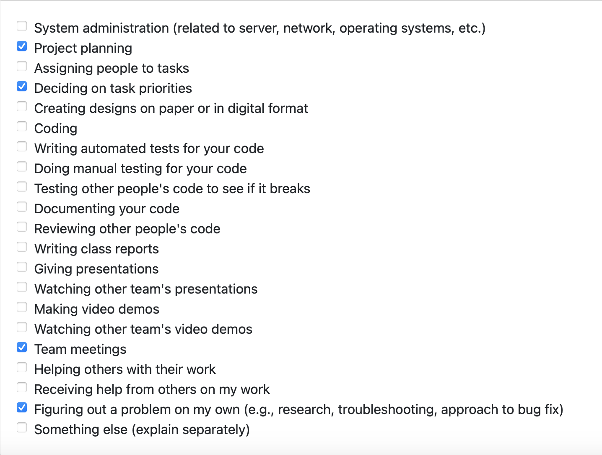

## Which features were yours in the project plan for this milestone?

Worked on the Project Plan document, setting up Unity, learn unity tutorial and completeing the weekly logs.

## Which tasks from the project board are associated with these features?

<ol>
  <li>"Project Plan Document"</li>
  <li>"Set up Unity"</li>
  <li>"Individual Logs" </li>
</ol>

## Among these tasks, which have you completed/in progress in the last week?

### Completed: 
  I have successfully install unity and learn the tutorial regarding the unity also contribute to the project plan documentation

-----
-----

# Date Range: 2-10-2023 to 7-10-2023

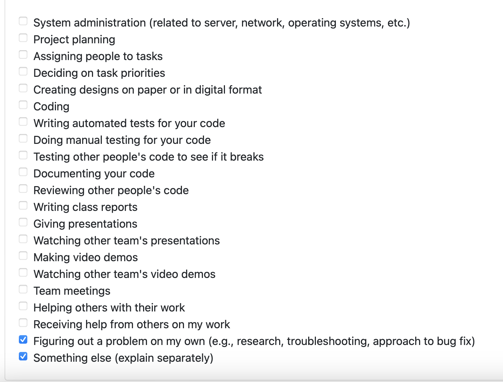

## Which features were yours in the project plan for this milestone?

  Create simple "flappy bird" game in unity and troubleshoot the problem with vscode regarding auto completion code.

## Which tasks from the project board are associated with these features?

<ol>
  <li>"Exploration"</li>
  <li>"Individual Logs" </li>
</ol>

### Completed: 
  I have successfully created simple flappy bird game with auto spawner script and also response to the keyboard button being pressed and figure out how to fix the vscode auto completion problem.

-----
-----

# Date Range: 8-10-2023 to 22-10-2023

## Which features were yours in the project plan for this milestone?

 Exploration, Website Draft, and completing the weekly logs.

## Which tasks from the project board are associated with these features?

<ol>
  <li>"Exploration"</li>
  <li>"Individual Logs" </li>
</ol>

### Completed: 
  1. Successfully implemented a drag-and-drop feature using Unity 
  2. Deployed the Unity project to WebGL.
  3. Embedded the WebGL game into the website.

### In Progress:
  1. Update the UI on the website draft.
  2. Figure out the technical stack for the website. (still not sure if I should use regular HTML or React.js because the website should be dynamic and interactive).

# Date Range: 23-10-2023 to 29-10-2023

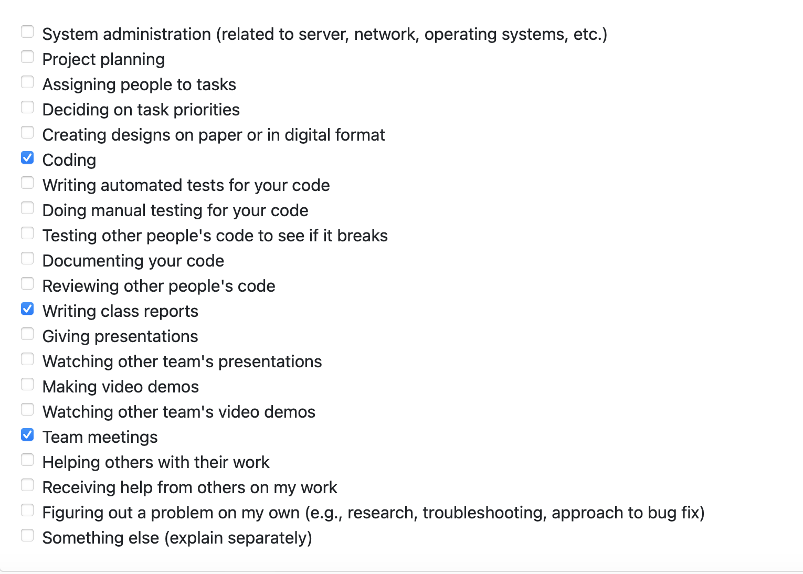

## Which features were yours in the project plan for this milestone?

 Website Draft, and completing the weekly logs.

## Which tasks from the project board are associated with these features?

<ol>
  <li>"Individual Logs" </li>
  <li>"Website Draft"</li>
  <li>"mini presentation slides"</li>
</ol>

### Completed: 
  1. make presentation slides"
  2. Restyling the web for mini presentation.

-----
-----
# Date Range: 29-10-2023 to 5-11-2023

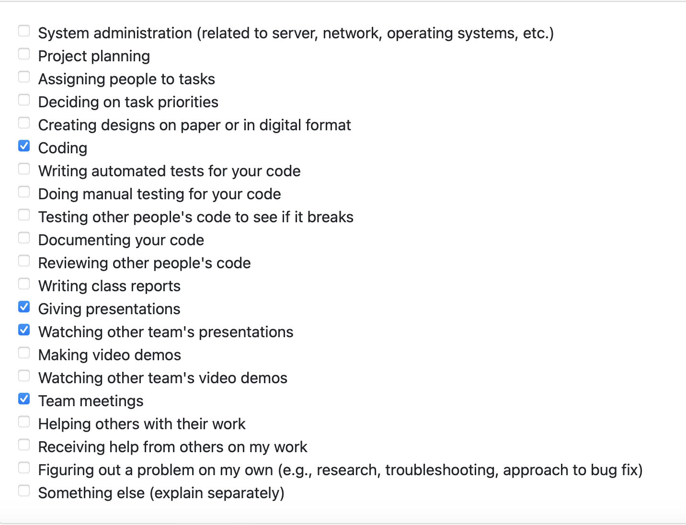

## Which features were yours in the project plan for this milestone?

 Website Draft, and completing the weekly logs.

## Which tasks from the project board are associated with these features?

<ol>
  <li>"Individual Logs" </li>
  <li>"Website Draft"</li>
  <li>"mini presentation slides"</li>
</ol>

### Completed: 
  1. Present the mini presentation.
  2. Finished the website draft.
  3. Deploy the website to Vercel.

# Date Range: 6-11-2023 to 12-11-2023

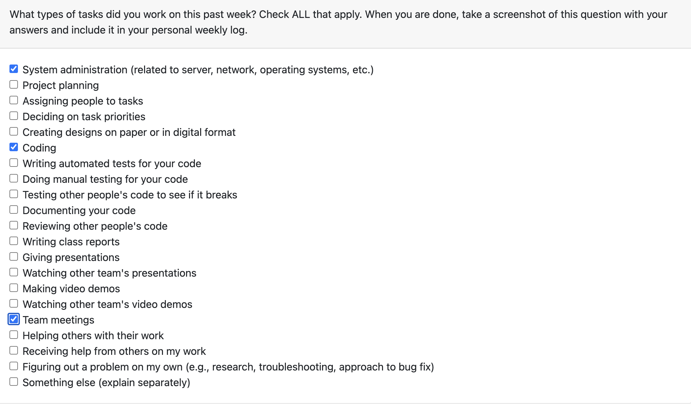

## Which features were yours in the project plan for this milestone?

 Admin system website, setup mongodb.

## Which tasks from the project board are associated with these features?

<ol>
  <li>"Individual Logs" </li>
  <li>"Admin System Website"</li>
  <li>"Setup MongoDB"</li>
</ol>

### Completed: 
  1. Created mock REST API for to ensure that it connects to mongoDB
  2. Setup NodeJs server (router and db connection)
  3. Deploy ndoejs server to vercel.

Next week, I will still be focusing on the nodeJs for admin sys web.

# Date Range: 13-11-2023 to 26-11-2023

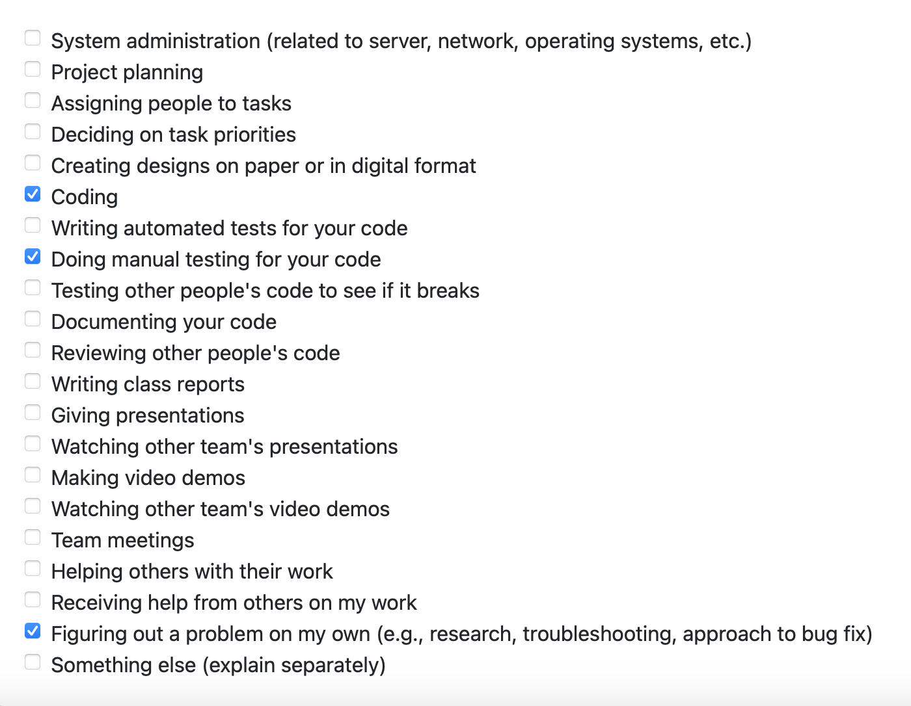

## Which tasks from the project board are associated with these features?

<ol>
  <li>"Individual Logs" </li>
  <li>"Website Draft"</li>
  <li>"Setup MongoDB for admin web"</li>
  <li>"Admin sys for Web"</li>
</ol>

### Completed
1. Migrate web draft from HTML to React.js
2. Created APIs for admin use
    - Show rules
    - Add rules
    - Edit rules
    - Delete rules
    - Admin login
    - Show cards
    - Add cards
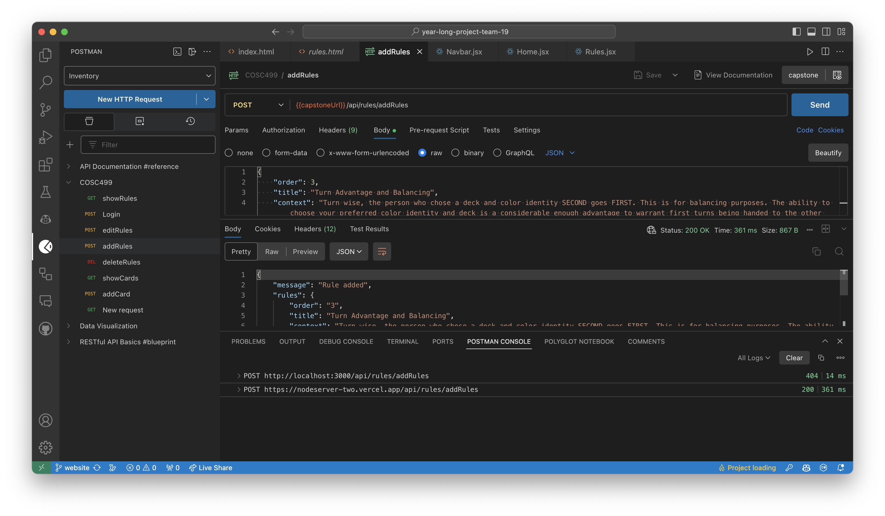
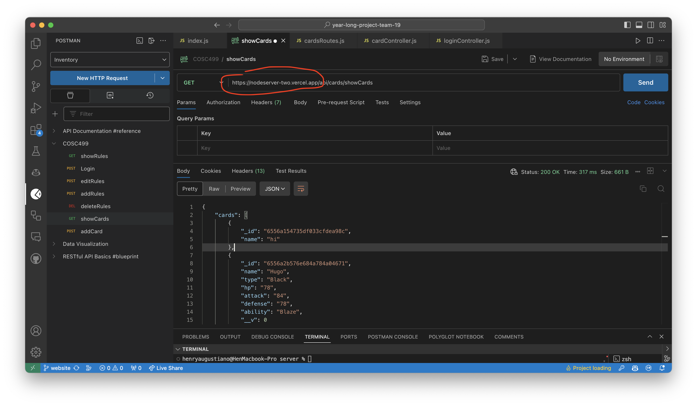
3. Created admin login page
4. Implemented add card features for admin
5. Added react hook for card page
6. Stored auth cookie after successful admin login

### To do
1. Implement the rest of the features in the admin system
2. add API for edit and delet cards
3. UI testing
4. unit testing for backend

# Date Range: 27-11-2023 to 3-12-2023

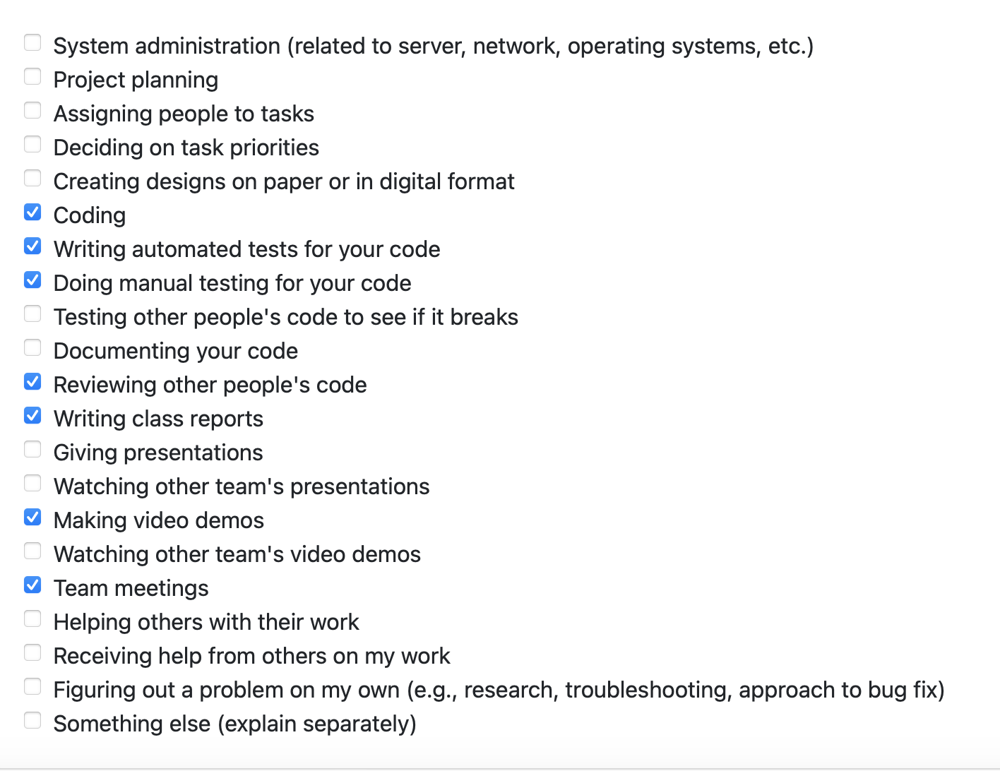

## Which tasks from the project board are associated with these features?

<ol>
  <li>"Individual Logs" </li>
  <li>"Unit Testing - rules"</li>
  <li>"Admin Website"</li>
</ol>

### Completed
1. Created and tested unit test for show rules API endpoint
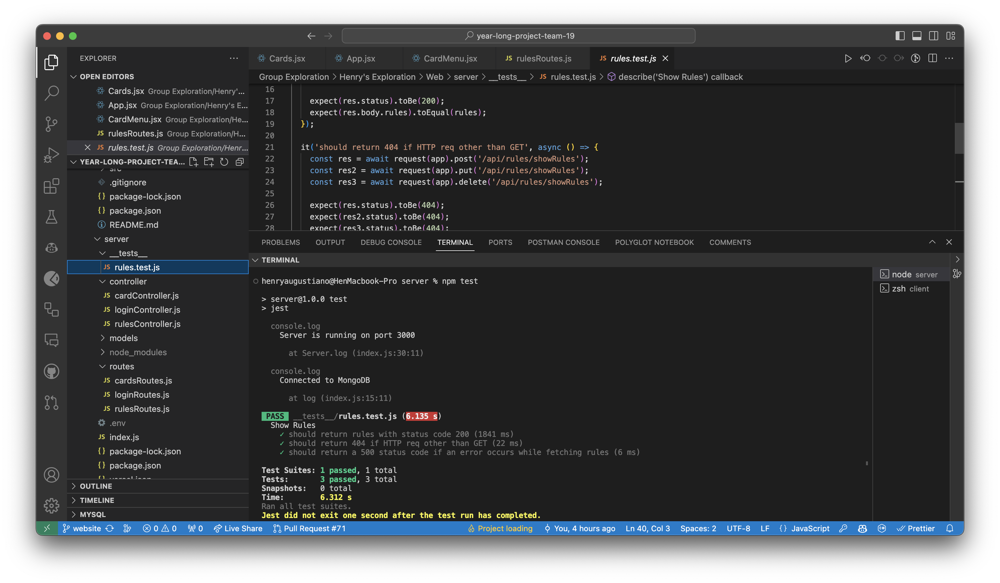
2. Implemented Card Menu Page to filter cards by type/color

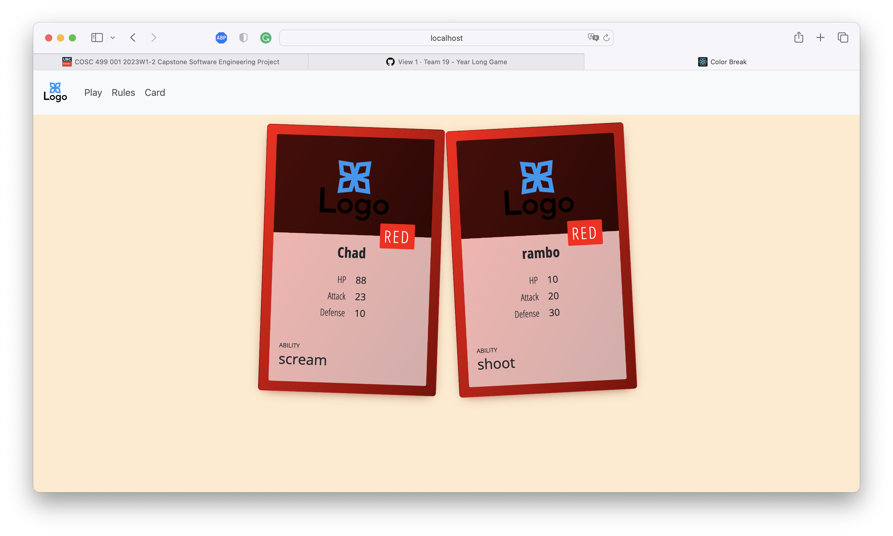
3. Class report for design document
4. Video demo for design document

### In progress
1. unit testing for edit, delete, and add rules API endpoint.
2. implement edit and delete card features in admin system..

# Date Range: 08-01-2024 to 14-01-2024

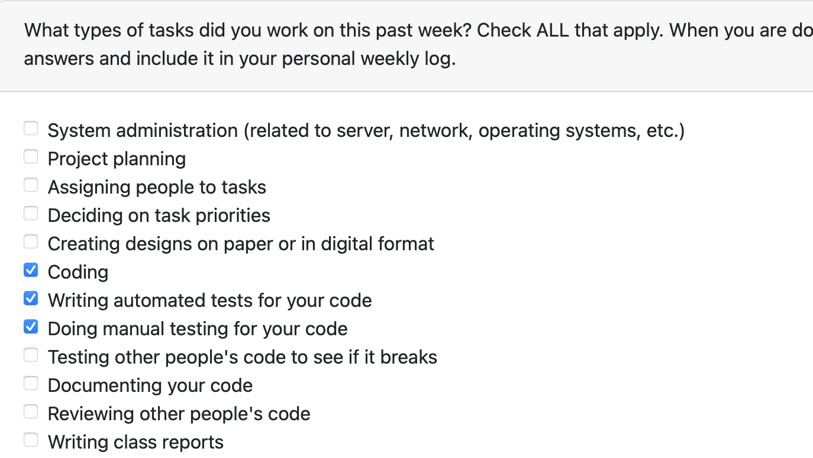

## Which tasks from the project board are associated with these features?

<ol>
  <li>"Individual Logs" </li>
  <li>"Unit Testing - rules"</li>
</ol>

### Completed
1. Created and tested unit test for edit rules API endpoint
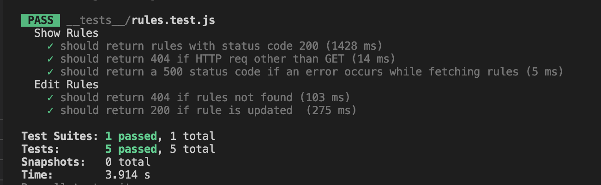

### In progress
1. unit testing for delete, and add rules API endpoint.
2. implement edit and delete card features in admin system.

# Date Range: 14-01-2024 to 21-01-2024

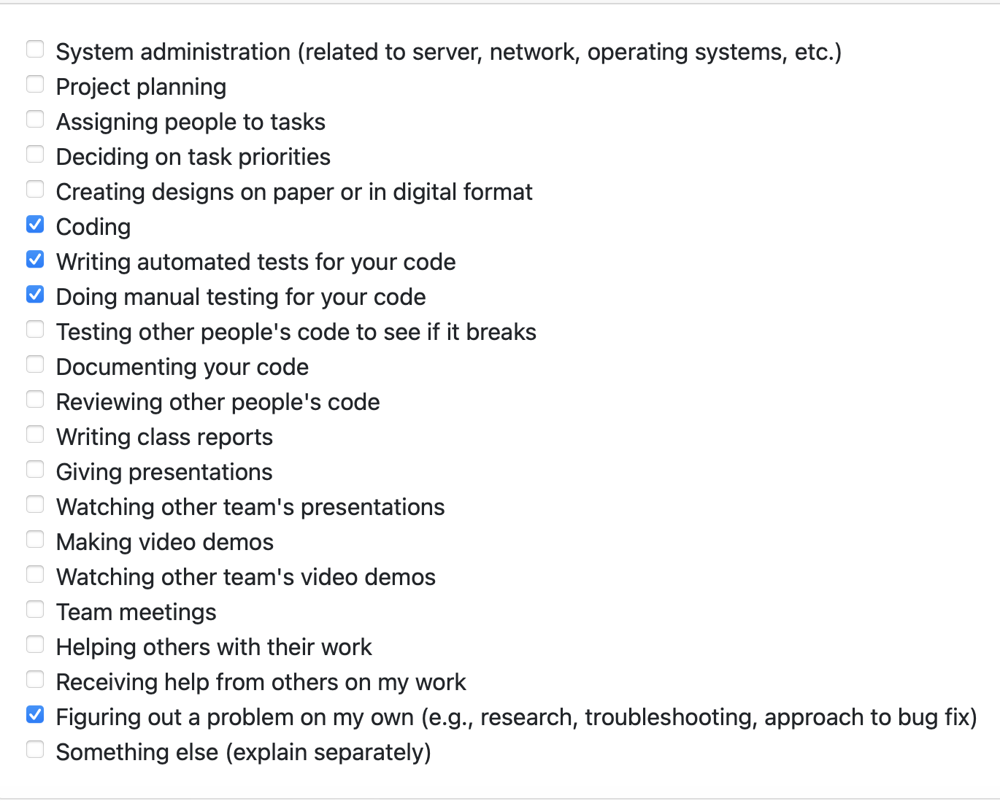

## Which tasks from the project board are associated with these features?

<ol>
  <li>"Individual Logs" </li>
  <li>"Unit Testing - card"</li>
  <li>"Admin system website"</li>
</ol>

### Completed
1. Created and tested unit test for show cards API endpoint
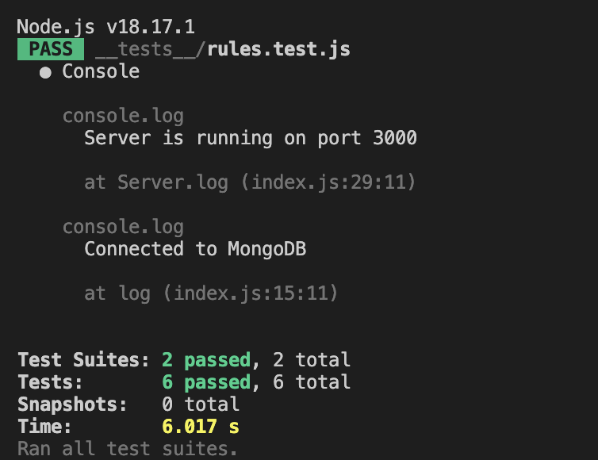
2. Implemented delete card features in admin system
3. Implemented UI for edit card features in admin system (need to implement the axios request the later)

-----
This week, a significant amount of time was taken to implement the unit tests. I encountered a challenge with running two test suites simultaneously. Initially, the test lead to errors as both suites attempted to start the server on the same port. To resolve this issue, I need to do some research and code refatoring, which involved exporting the Express app and server creation logic from the index.js file. This modification enabled the test suites to run simultaneously and avoiding port conflict.

# Date Range: 22-01-2024 to 28-01-2024

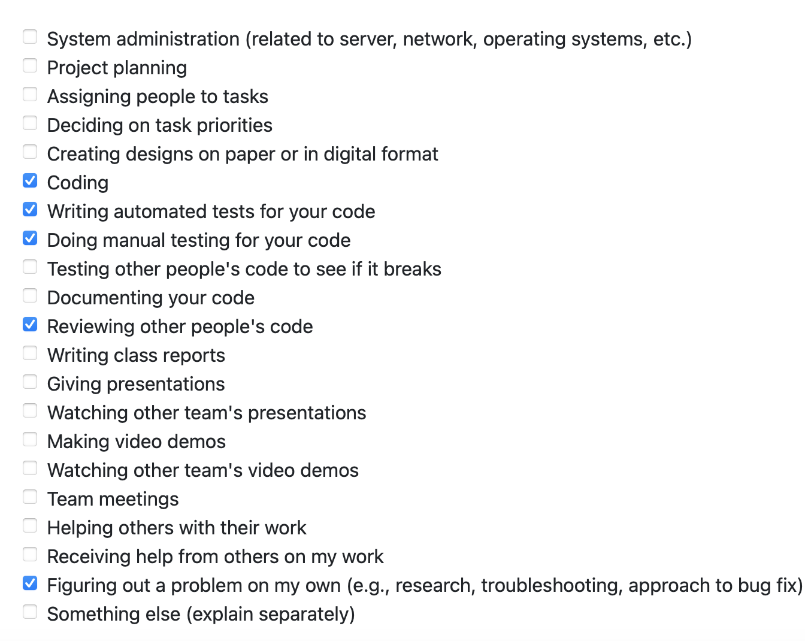

## Which tasks from the project board are associated with these features?

<ol>
  <li>"Individual Logs" </li>
  <li>"Unit Testing - card"</li>
  <li>"Admin system website"</li>
</ol>

### Completed
1. Created and tested unit test for edit cards API endpoint

2. Implemented axios request for edit card.
3. Fix validation bug in edit card modal.
4. Made changes in the UI for edit card modal, the modal will now reset the input field after the user click the submit or close button.

-----
This week, I have successfully implemented the edit card feature in the admin system. I have also found and fixed a bug in the edit card modal, where the validation will not submit the form if the user does not change the input field. It appears that there's a validation logic preventing the form from being submitted. To fix this, I maade some improvement on the checks which now allows the form to be submitted even when users don't make changes to the input field by using dot notation instead of index.

# Date Range: 28-01-2024 to 04-02-2024

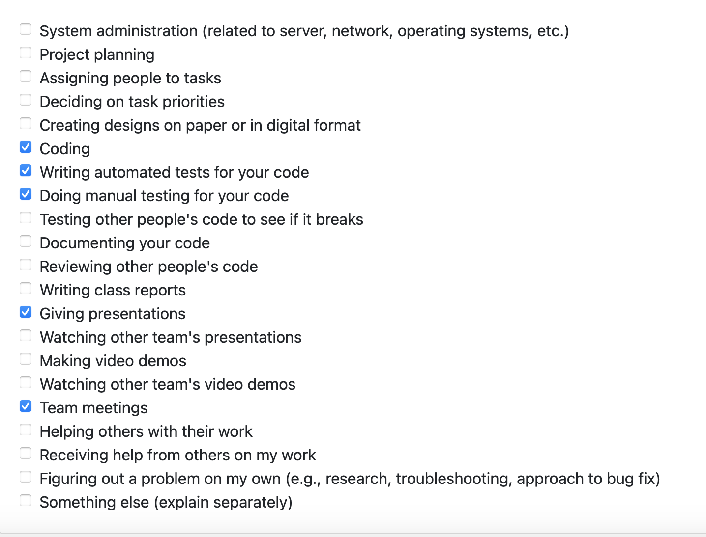

## Which tasks from the project board are associated with these features?

<ol>
  <li>"Individual Logs" </li>
  <li>"Admin system website"</li>
  <li>"peer testing"</li>
</ol>

### Completed
1. rerun the unit test for the admin system due to the changes in the main code.
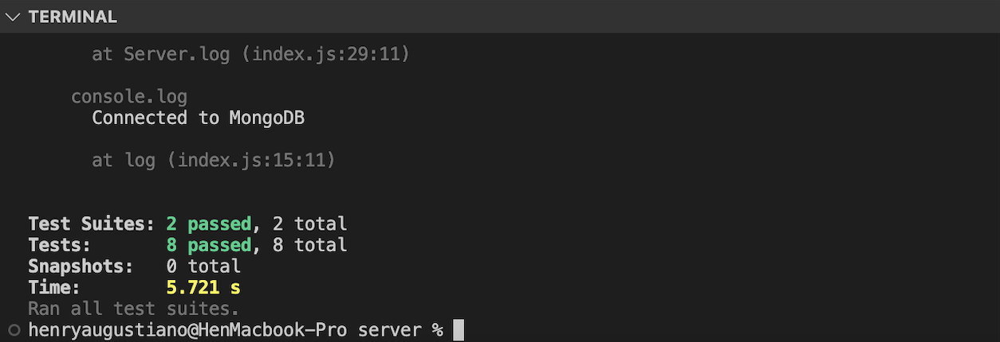
2. Reworked the UI for website (background, css, and layout)
3. Add dropdown feature in add & edit card modal to minimize user error.
4. Refactored some of the code to match variable name in the Unity project.
5. Fix the bug in admin website where user can't edit the card name.

-----

This week, I mostly worked on improving the UI and fix logic error in the website for the peer review that was held on this week. I also rerun the unit test for the admin system due to the changes in the main code. I also do project demo for peer testing. 

# Date Range: 04-02-2024 to 11-02-2024

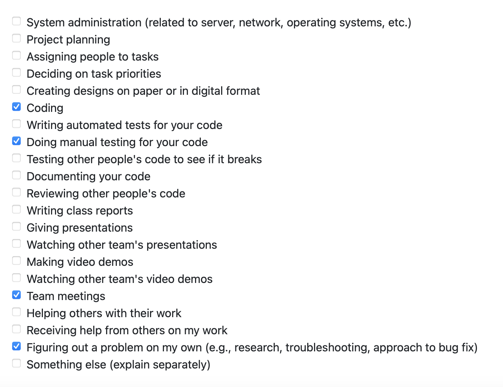

## Which tasks from the project board are associated with these features?

<ol>
  <li>"Individual Logs" </li>
  <li>"Peer Testing 1's Admin LOGIN BUG"</li>
  <li>"unit testing - cards (add,delete,show,edit)"</li>
</ol>

### Completed
1. created the unit test for card API endpoint (add, delete, show, edit)
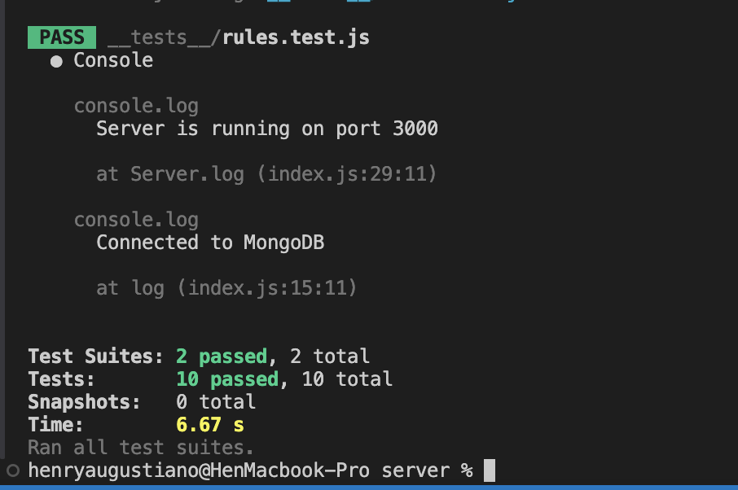
2. fix the bug in the admin login page where success display message shows even when the user input wrong credentials.

-----

This week, I only managed to complete the unit test for the card API endpoint. I also fix the bug in the admin login page where success display message shows even when the user input wrong credentials due to midterms in other courses.

# Date Range: 26-02-2024 to 03-03-2024

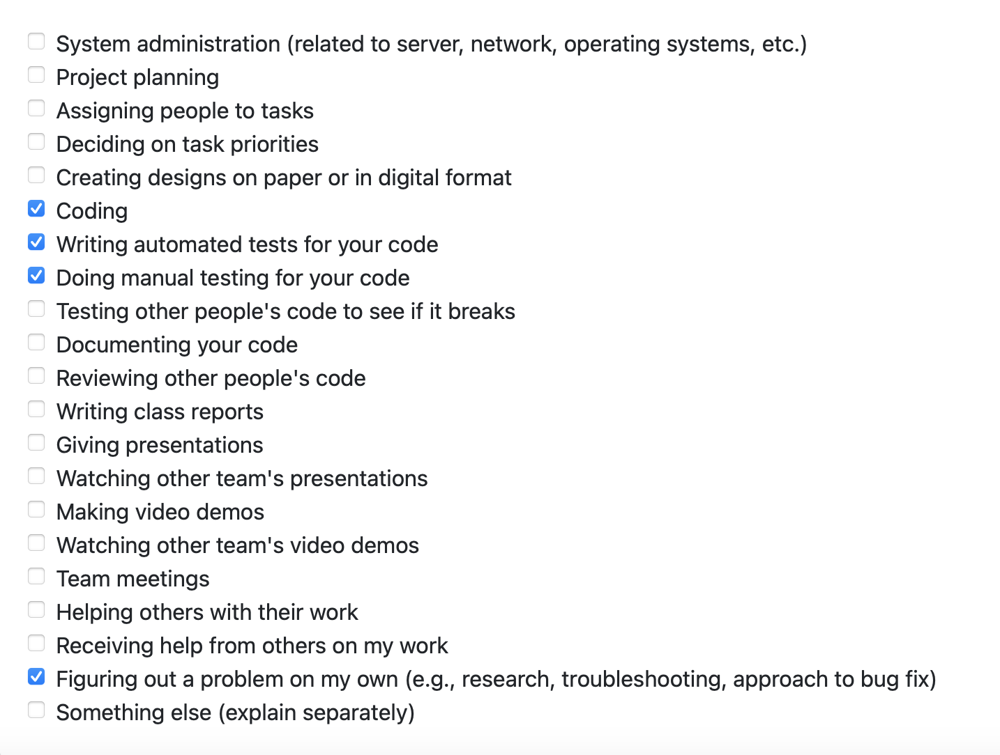

### Completed
1. created the unit test for Rule API endpoint (add Rule)
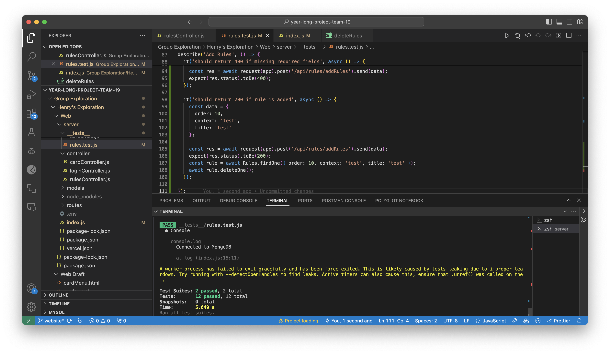
2. Implemented UI for edit Rule
3. Implemented API call for edit Rule when changing/saving
4. Implemented React hook after successful API call on edit rule
5. Pass original data to the edit modal when clicking edit button

-----
I only have a couple of features left to work on which is input validation for edit rule modal, delete rule implementation, and couple of test. I think I can finish it all before the peer testing (excluding tests)

# Date Range: 03-03-2024 to 10-03-2024 (fixed date)

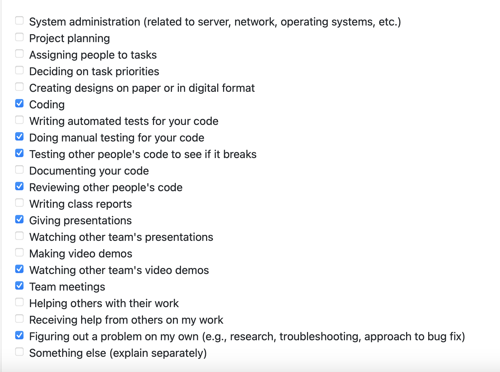

### Completed
1. Implemented UI for delete Rule
2. Implemented API call for delete Rule when pressing delete button
3. Implemented React hook after successful API call on edit rule
4. Fix Logic in edit rule for 'rule order'.
5. peer testing #2
-----

All the features and tests are completed, only bug fixing from the peer testing left to do.

# Date Range: 10-03-2024 to 17-03-2024

### Completed
1. Fix bug known in the last peer testing (delete rule logic; the rule order is not updated after deleting a rule)
2. Did some research about mySQL hosting for our Unity game db.

-----

This week I got nothing much to do, just some bug fixing from the peer testing and some research about mySQL hosting for our Unity game db.
I did some research about mySQL hosting for our unity db but I can't find any free hosting for mySQL, so I think we should use UBC server for the db (just some idea). Other than that, all my work for website are done unless there's a new bug found.

# Date Range: 10-03-2024 to 17-03-2024

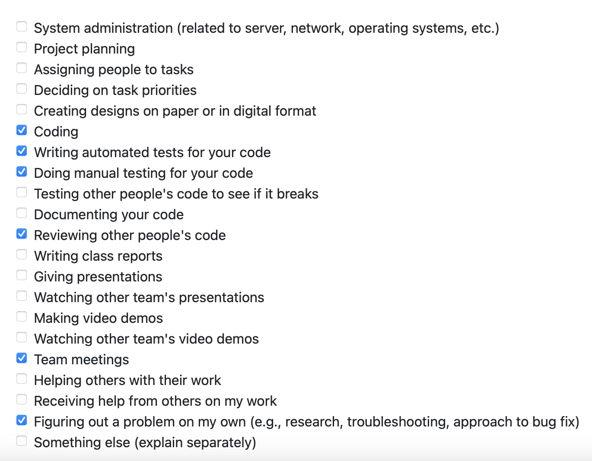

### Completed
1. Figure out how to use Selenium for UI testing
2. Created tests for admin login UI, delete card, add card.

-----

The Selenium testing is a bit tricky to set up, since each test runs on a different browser session, each test have to include the "admin login" part to store admin credentials in the broswer session in order for the selenium to run the "admin features" such as add,delete card.

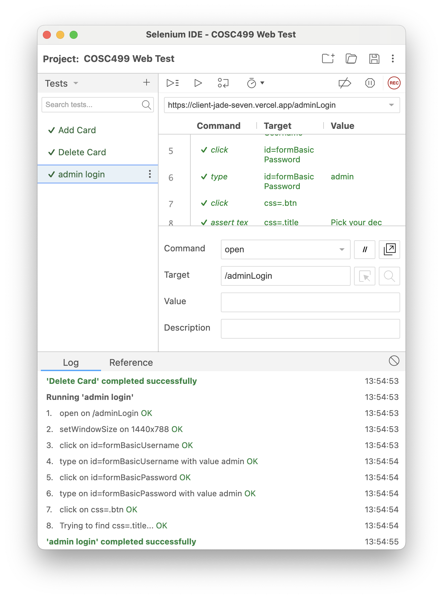

