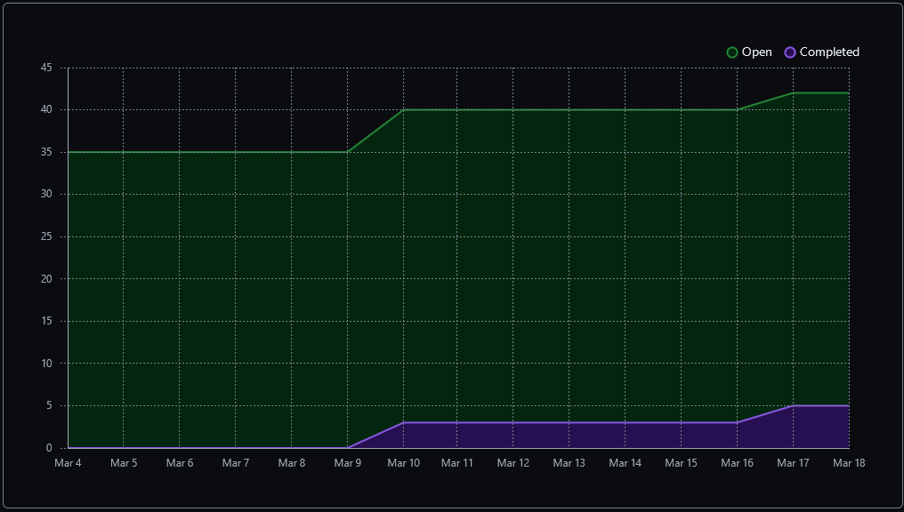
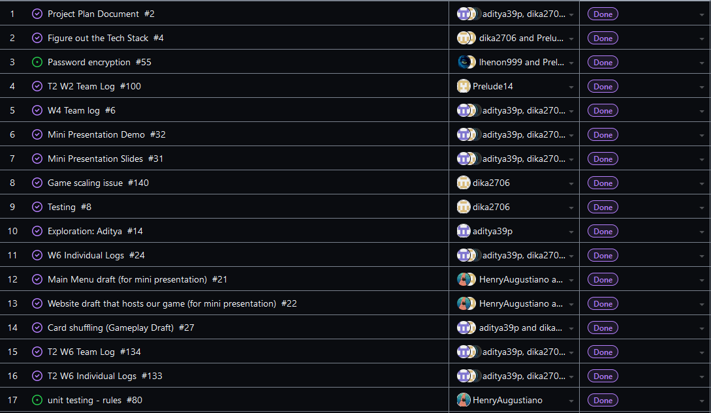
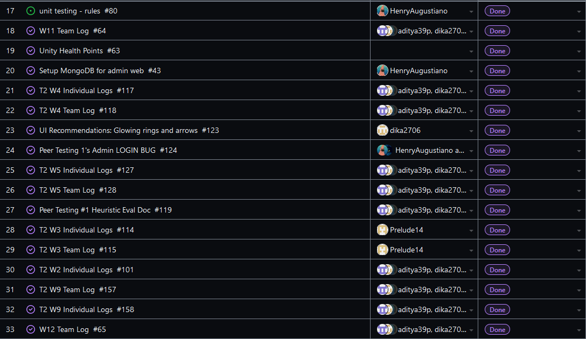
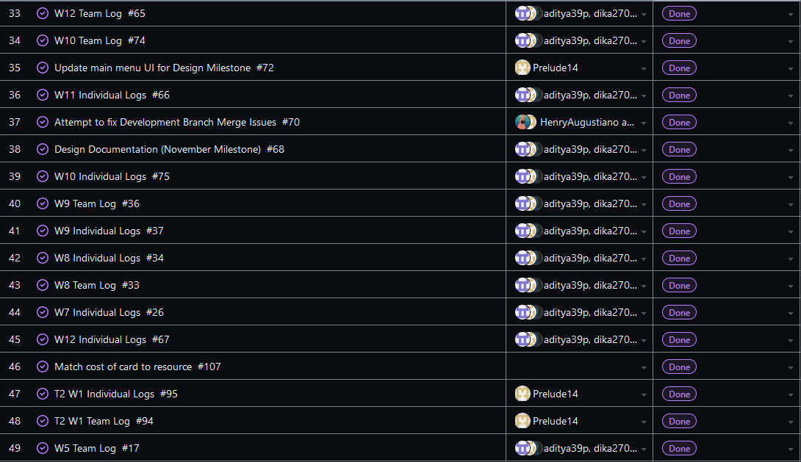
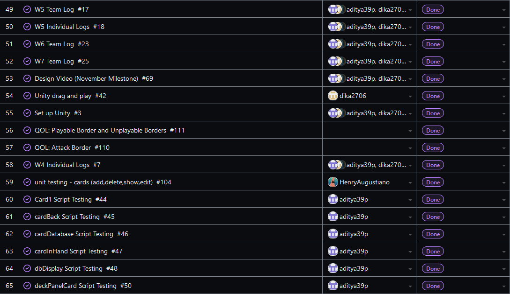
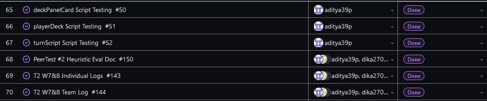
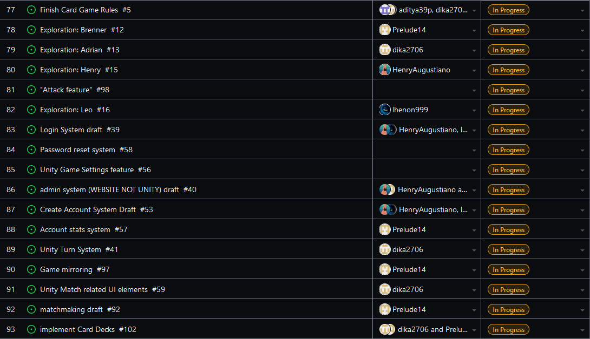
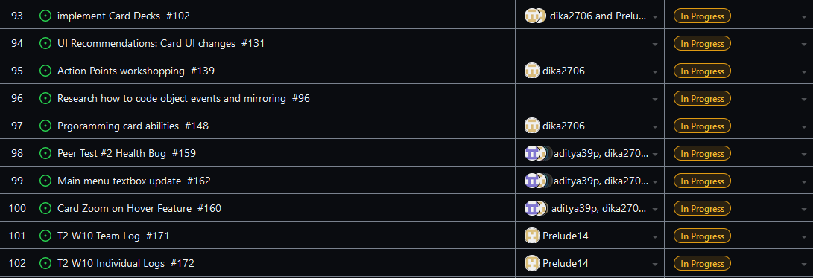
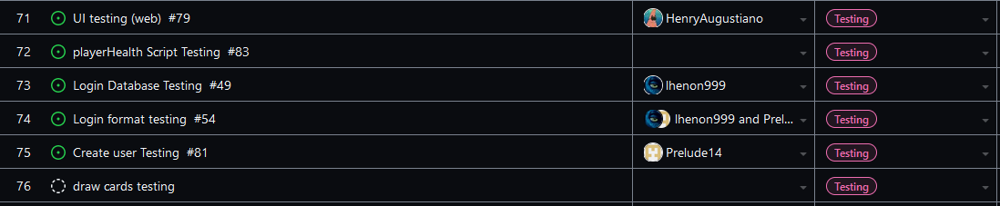

Team 19

Term 2:
Work Period: March 10th to March 17th
<ul>
<li>Github Usernames:</li>
<li>Prelude14 --> Brenner De Vos</li>
<li>dika2706 --> Adrian Ardika Kusuma</li>
<li>lhenon999 --> Leo Henon</li>
<li>HenryAugustiano --> Henry Augustianno</li>
<li>aditya39p --> Aditya Tripathi</li>
</ul>

Milestone Goal Recap: 

Which features were in the project plan for this milestone?
<ul>
<li>Get multiplayer version of the game up to date so we can all start building off of one build again</li>
<li>Continue Flushing out the card game system in game</li>
<li>Testing for Card system</li>
<li>Host User Account DB somehow (stop using Xampp)</li>
<li>Work on the Card Game Rules</li>
<li>Continue flushing out UI across all elements</li>
<li>Team and Individual Logs</li>
</ul>

Which tasks from the project board are associated with these features?
<ul>
<li>"Card Zoom on Hover Feature (Get on multiplayer branch)"</li>
<li>"UI Recommendations: Card Ui changes (Get on multiplayer branch)"</li>
<li>"matchmaking draft (had to get it working on  everyone's machines and a couple different branches to merge with it before that)"</li>  
<li>"Programming card abilities"</li>
<li>"Look at Testing portion of the project board (theres a lot to mention)"</li>
<li>"Unity Match related UI elements"</li>
<li>"Finish the Card Game Rules"</li>
<li>"T2 W10 Team log"</li>
<li>"T2 W10 Individual logs"</li>
</ul>

 Burnup Chart:  

 Table View of completed tasks on project board  

 Table View of in progress tasks on project board  

 Table View of in progress TESTING tasks on project board  

OPTIONAL: Any context to explain why the log looks the way it does.
 
 This week we were focused on getting back to one solid build of our game that we could all start working off again in order to 
turn the remaining gameplay features into muliplayer functional versions of themeselves. this involved some crazy merges, some small bugs, and some troubleshooting to get the right 
multiplayer packages working on everyone's machines. Hentry started trying to get our user account sql database off of xampp, and actually hosted somewhere. Adrian continued with integrating the card 
abilities and zoom features into the multiplayer branches. Brenner worked on merge conflicts, bug fixes for the card deal system, and helped troubleshoot multiplayer to run on Leo and Aditya's machines. Leo 
got the reset pass features from the peer test build to work on the multiplayer branch, and then added a new create account confirmation email feature as well as worked on some ideas for the UI for the card 
game itself (animated arrow when dragging a card toi attack and info button for guide reminders instead of constantly there at start of match). Aditya is working on creating a tutorial either by recording a 
short video walkthrough, or by cloning the current game scene and tweaking it to create a tutorial version of the game that players will be able to play/watch from the main menu. Our other Repo that contains 
the Unity project itself is below; (It is the most up to date multiplayer branch)

#### https://github.com/Prelude14/499UnityGameT19/tree/b65e27f65f08cd84d28aadf7c9f294591a03c16d/My%20project%20(4)
