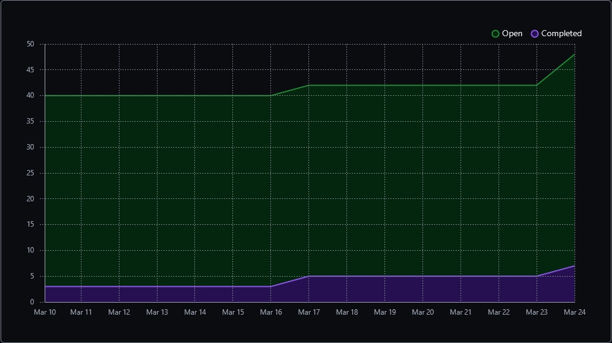
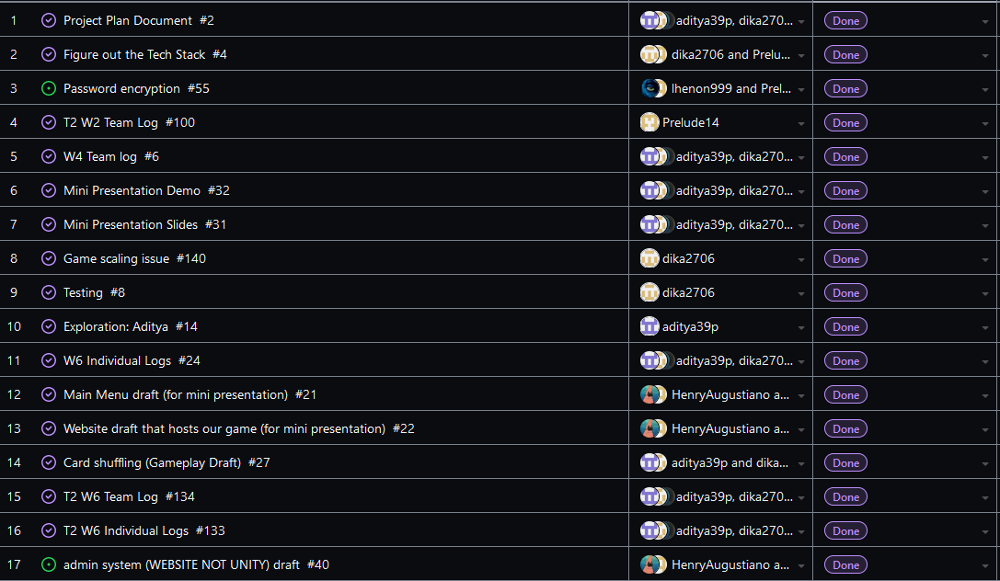
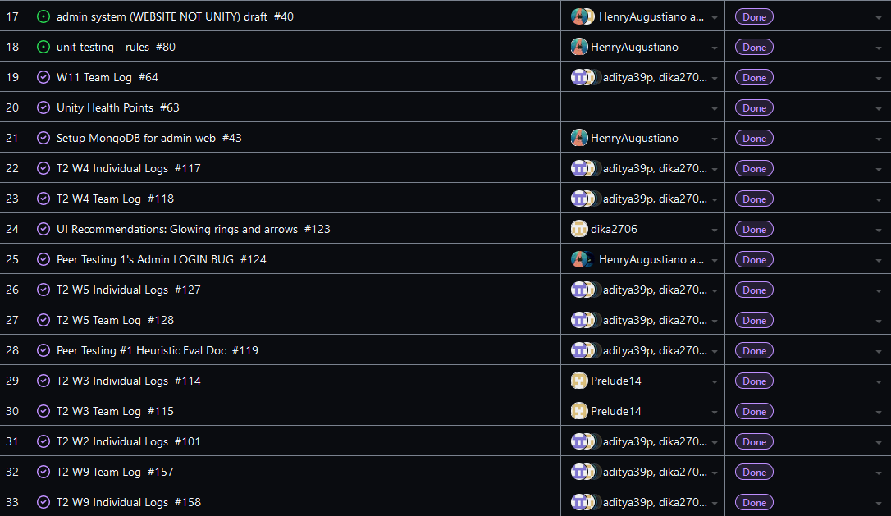
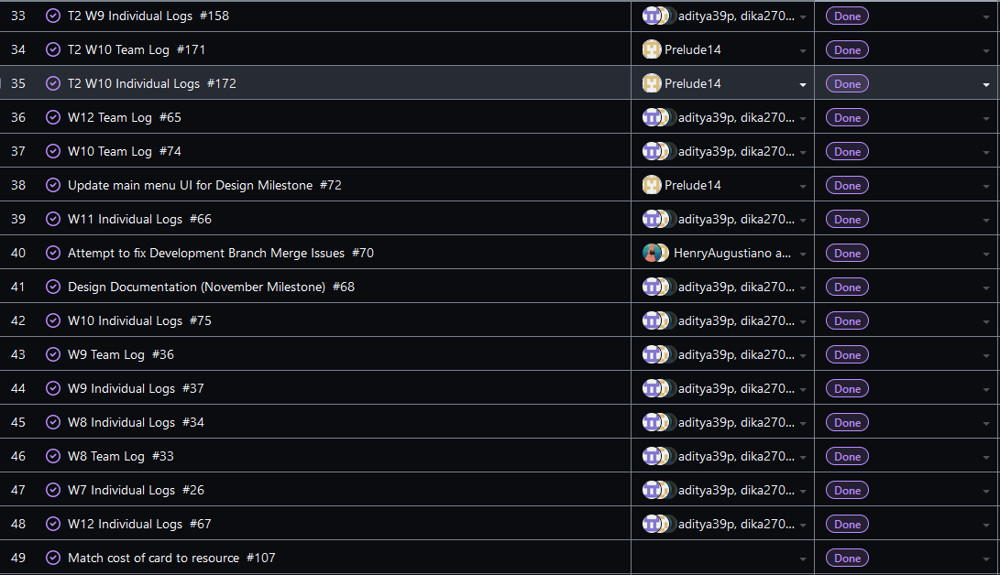
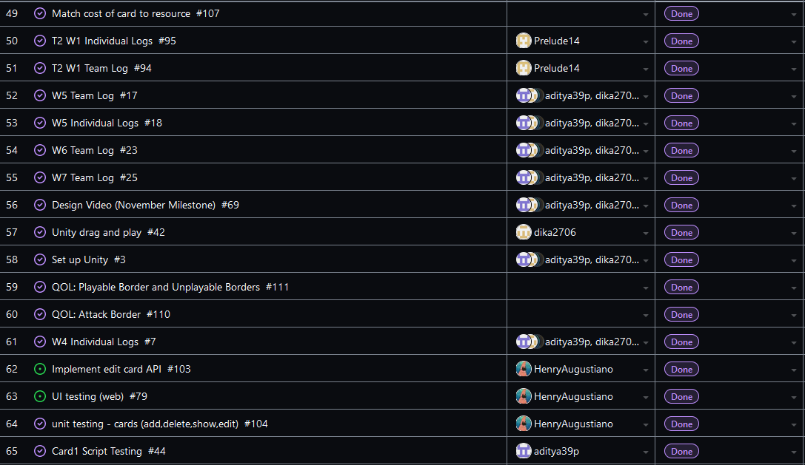
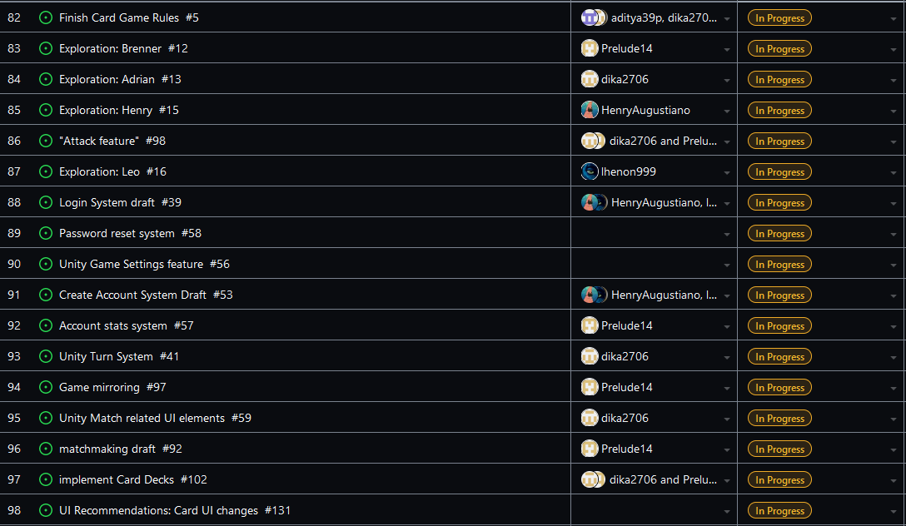
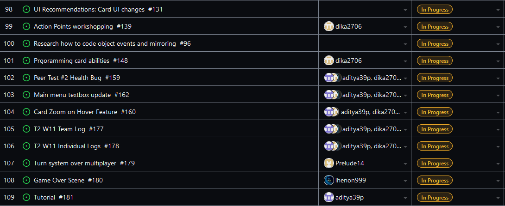
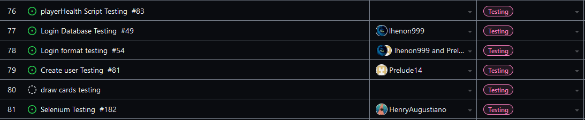

Team 19

Term 2:
Work Period: March 17th to March 24th
<ul>
<li>Github Usernames:</li>
<li>Prelude14 --> Brenner De Vos</li>
<li>dika2706 --> Adrian Ardika Kusuma</li>
<li>lhenon999 --> Leo Henon</li>
<li>HenryAugustiano --> Henry Augustianno</li>
<li>aditya39p --> Aditya Tripathi</li>
</ul>

Milestone Goal Recap: 

Which features were in the project plan for this milestone?
<ul>
<li>Get playing cards and the run system working over multiplayer (and fix any bugs in the multiplayer branch)</li>
<li>Get a Tutorial going</li>
<li>Get a Game over scene built</li>
<li>Continue Flushing out the card game system in game</li>
<li>Selenium Testing for Website</li>
<li>Testing for Card system</li>
<li>Work on the Card Game Rules</li>
<li>Continue flushing out UI across all elements</li>
<li>Team and Individual Logs</li>
</ul>

Which tasks from the project board are associated with these features?
<ul>
<li>"Card Zoom on Hover Feature (Workout bug on multiplayer branch)"</li>
<li>"UI Recommendations: Card Ui changes (Get on multiplayer branch)"</li>
<li>"matchmaking draft (play card over multiplayer specifically)"</li>  
<li>"Turn system over multiplayer"</li>
<li>"Programming card abilities"</li>
<li>"Game Over Scene"</li>
<li>"Tutorial"</li>
<li>"Selenium Testing"</li>
<li>"Look at Testing portion of the project board (theres a lot to mention)"</li>
<li>"Unity Match related UI elements"</li>
<li>"Finish the Card Game Rules"</li>
<li>"T2 W11 Team log"</li>
<li>"T2 W11 Individual logs"</li>
</ul>

 Burnup Chart:  

 Table View of completed tasks on project board  

 Table View of in progress tasks on project board  

 Table View of in progress TESTING tasks on project board  

OPTIONAL: Any context to explain why the log looks the way it does.
 
 This week we were focused on continuing to get the multiplayer more functional as well as figuring out what needs to be done before the final report is due in two weeks. Henry started setting up tests
for the website using Selenium. Brenner got the play card feature to work over multiplayer, and got the server to handle the turn system as well, so now two clients can actually play a proper game with turns
and playable cards. Only thing left is the health and attack system, so that when one player attacks, the other actually knows it happened and responds accordingly. Should be done this week based on how the 
turn system went. Adrian continued work on implementing different card abilities, as well as ironing out some bugs with the game's UI on the multiplayer branch (card zoom and missing elements). Leo started a
new "game over" scene that will eventually be triggered once the health system works over multiplayer. They also continued working on some of their ideas with the game's UI from last week. Aditya is working on
our tutorial scene for the game, that will be a dummy version of the main game scene, just to get new players aquainted with the game's rules and features.
Our other Repo that contains the Unity project itself is below; (It is the most up to date multiplayer branch)

#### https://github.com/Prelude14/499UnityGameT19/tree/8ea5d05434230822c97e35ce41c085fe5823e896/My%20project%20(4)
