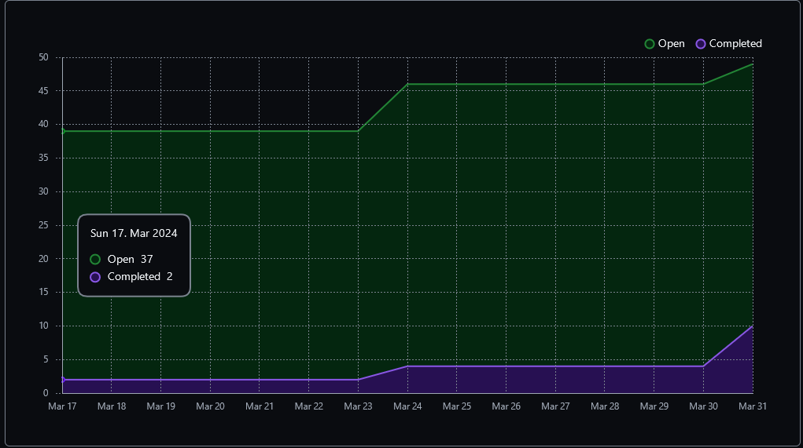
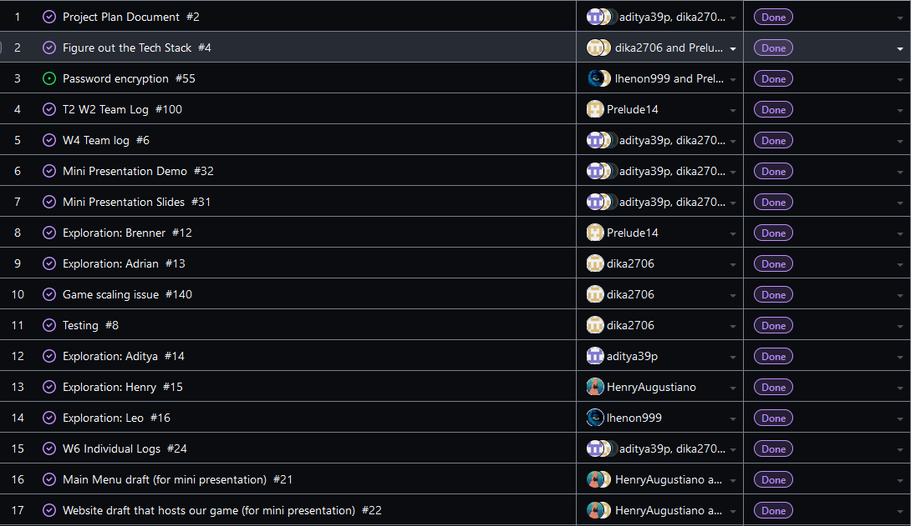
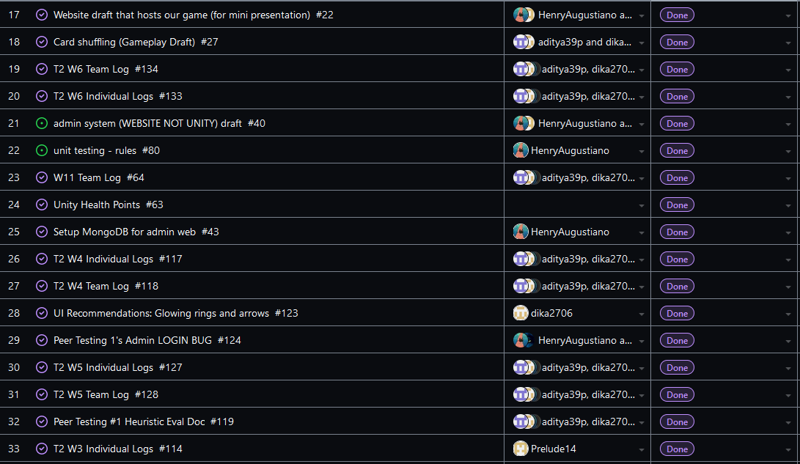
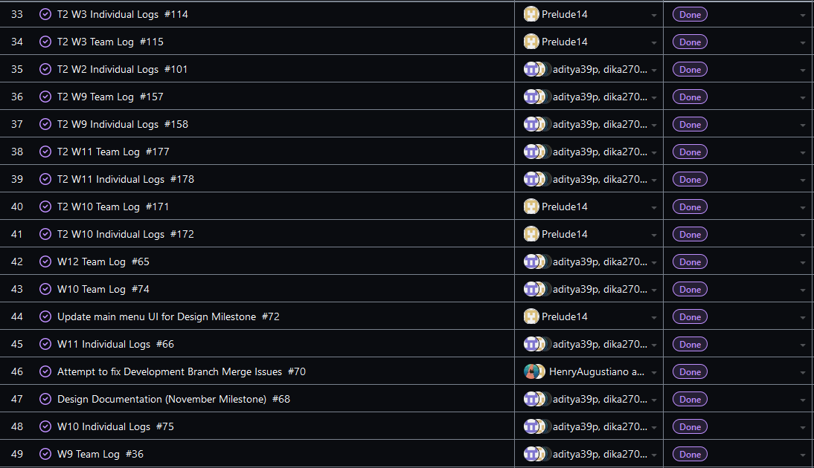
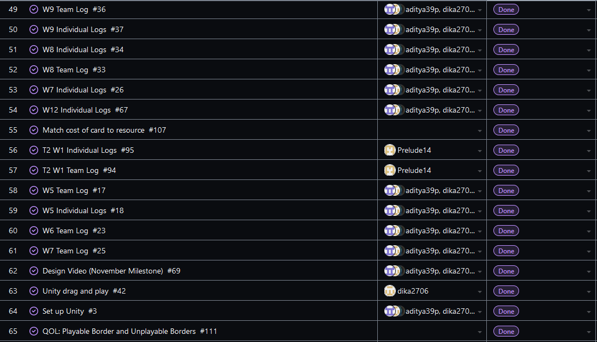
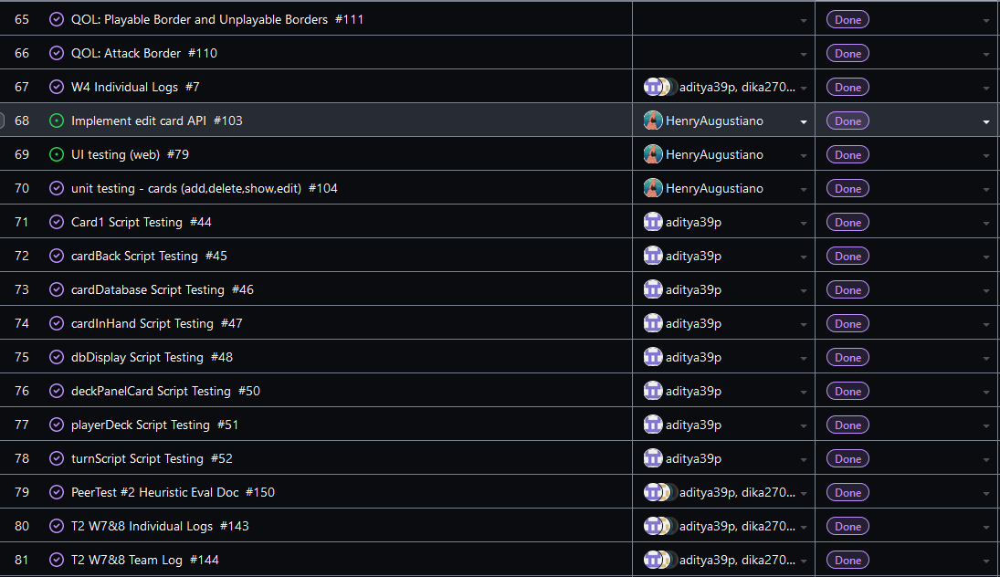
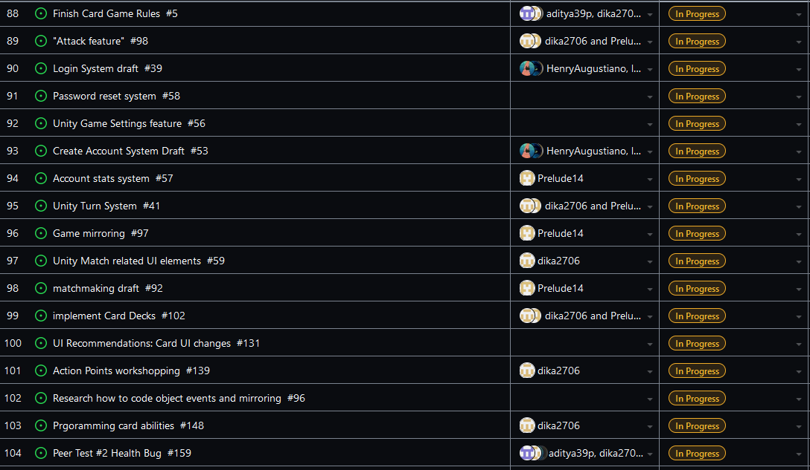
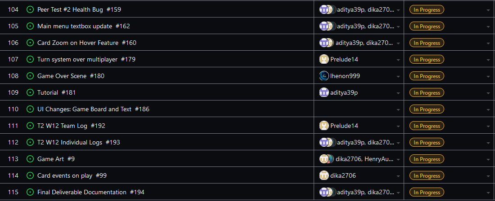
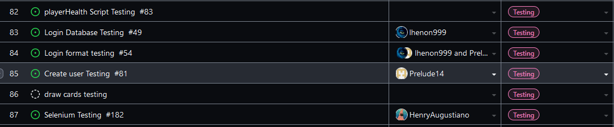

Team 19

Term 2:
Work Period: March 24th to March 31st
<ul>
<li>Github Usernames:</li>
<li>Prelude14 --> Brenner De Vos</li>
<li>dika2706 --> Adrian Ardika Kusuma</li>
<li>lhenon999 --> Leo Henon</li>
<li>HenryAugustiano --> Henry Augustianno</li>
<li>aditya39p --> Aditya Tripathi</li>
</ul>

Milestone Goal Recap: 

Which features were in the project plan for this milestone?
<ul>
<li>Get attacking with cards and the turn system working over multiplayer (and fix any bugs in the multiplayer branch)</li>
<li>Get a Tutorial finished</li>
<li>Get a Game over scene built</li>
<li>Finish Selenium Testing for Website</li>
<li>Get Final Submission system features list ironed out</li>
<li>Continue flushing out UI across all elements</li>
<li>Continue Flushing out the card game system in game</li>
<li>Testing for Card system</li>
<li>Work on the Card Game Rules</li>
<li>Team and Individual Logs</li>
</ul>

Which tasks from the project board are associated with these features?
<ul>
<li>"matchmaking draft (attacking with cards and updating player health + mana specifically)"</li>  
<li>"Turn system over multiplayer"</li>
<li>"Card Zoom on Hover Feature (Workout bug on multiplayer branch)"</li>
<li>"UI Recommendations: Card Ui changes (Get on multiplayer branch)"</li>
<li>"Programming card abilities"</li>
<li>"Tutorial"</li>
<li>"Game Over Scene"</li>
<li>"Selenium Testing"</li>
<li>"Final Deliverable Documentation"</li>
<li>"Look at Testing portion of the project board (theres a lot to mention)"</li>
<li>"Unity Match related UI elements"</li>
<li>"Finish the Card Game Rules"</li>
<li>"T2 W12 Team log"</li>
<li>"T2 W12 Individual logs"</li>
</ul>

 Burnup Chart:  

 Table View of completed tasks on project board  

 Table View of in progress tasks on project board  

 Table View of in progress TESTING tasks on project board  

OPTIONAL: Any context to explain why the log looks the way it does.
 
 This week we were focused on finishing up the last features and any small bugs/last minute changes, as well as figuring out what needs to be done before the final report is due in one week. Henry 
continued setting up tests for the website using Selenium, and generated card art for each card in the game (but its only on the website right now, not in game yet). Brenner got the attack feature to work 
over multiplayer, and got the server to handle the the player's health and mana values as well, so now two clients can actually attack each other and pay for the cost of playing cards. they also fixed a bug
where players could click the end turn button and deal themselves a new card every single time regardless of if it was their turn or not, now they are only dealt the card when they end their own turn properly.
Adrian continued work on implementing different card abilities, and is almost completely finished now. They also ironed out some bugs with the game's UI on the multiplayer branch (card zoom and missing 
elements). Leo created our "game over" scene that will be triggered once a player's health equals 0. It still needs to update the user's stats if they are logged in when they play. Aditya is almost finished 
the tutorial game scene, and it looks very solid so far. Since its the last week before our final submission now, our focus is going to be on that final report and video this week.

Our other Repo that contains the Unity project itself is below; (It is the most up to date multiplayer branch)

#### https://github.com/Prelude14/499UnityGameT19/tree/8ea5d05434230822c97e35ce41c085fe5823e896/My%20project%20(4)
