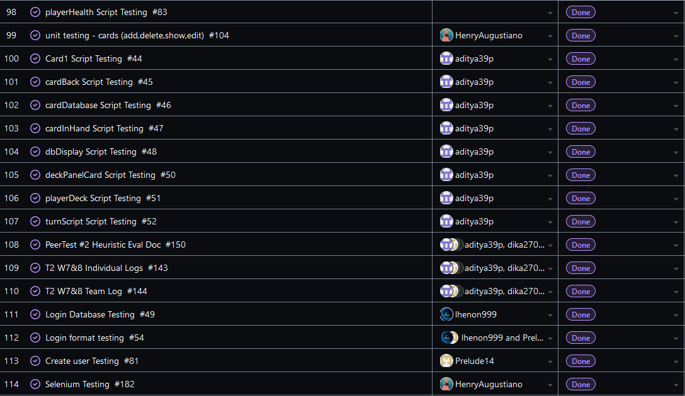

Team 19

Term 2:
Work Period: March 31st to April 7th
<ul>
<li>Github Usernames:</li>
<li>Prelude14 --> Brenner De Vos</li>
<li>dika2706 --> Adrian Ardika Kusuma</li>
<li>lhenon999 --> Leo Henon</li>
<li>HenryAugustiano --> Henry Augustianno</li>
<li>aditya39p --> Aditya Tripathi</li>
</ul>

Milestone Goal Recap: 

Which features were in the project plan for this milestone?
<ul>
<li>Get Final Submission system features list ironed out</li>
<li>Get a Tutorial finished</li>
<li>Get a Game over scene functional and finished (update user stats)</li>
<li>Get attacking with cards and the turn system working over multiplayer (and fix any bugs in the multiplayer branch)</li>
<li>Finish Selenium Testing for Website</li>
<li>Continue flushing out UI across all elements</li>
<li>Continue Flushing out the card game system in game</li>
<li>Testing for Card system</li>
<li>Work on the Card Game Rules</li>
<li>Team and Individual Logs</li>
</ul>

Which tasks from the project board are associated with these features?
<ul>
<li>"Final Deliverable Documentation"</li>
<li>"Tutorial"</li>
<li>"Game Over Scene"</li>
<li>"matchmaking draft (attacking with cards and updating player health + mana specifically)"</li>  
<li>"Turn system over multiplayer"</li>
<li>"Card Zoom on Hover Feature (Workout bug on multiplayer branch)"</li>
<li>"UI Recommendations: Card Ui changes (Get on multiplayer branch)"</li>
<li>"Programming card abilities"</li>
<li>"Selenium Testing"</li>
<li>"Look at Testing portion of the project board (theres a lot to mention)"</li>
<li>"Unity Match related UI elements"</li>
<li>"Finish the Card Game Rules"</li>
<li>"T2 W13 Team log"</li>
<li>"T2 W13 Individual logs"</li>
</ul>

 Burnup Chart:  

 Table View of completed tasks on project board  

 Table View of in progress tasks on project board  

 Table View of in progress TESTING tasks on project board  
* Empty, no new tests, closed testing tasks

OPTIONAL: Any context to explain why the log looks the way it does.
 
 So we were focused on finishing up the last of the features we need to have done for the final report submission this week, as well as the shared list of system features and finishing up our 
README for said final submission report and video. Not a lot of time for anything else. Got the Tutorial and game over scenes working last minute and maybe a couple of tweaks to the card abilities, as well
as card art for most of the cards on the website.

Our other Repo that contains the Unity project itself is below;

#### https://github.com/Prelude14/499UnityGameT19/tree/e4fbdb3adbae1bd93975854ed217951215662b8d/My%20project%20(4)
