Team 19

Term 2:
Work Period: January 15th to January 21st
<ul>
<li>Github Usernames:</li>
<li>Prelude14 --> Brenner De Vos</li>
<li>dika2706 --> Adrian Ardika Kusuma</li>
<li>lhenon999 --> Leo Henon</li>
<li>HenryAugustiano --> Henry Augustianno</li>
<li>aditya39p --> Aditya Tripathi</li>
</ul>

Milestone Goal Recap: 

Which features were in the project plan for this milestone?
<ul>
<li>Work on the Card Game Rules</li>
<li>More Exploration</li>
<li>Work on implementing Mulitplayer</li>
<li>Continue Flushing out the Login System</li>
<li>Website admin system draft</li>
<li>Continue Flushing out the card game system in game</li>
<li>Testing for Card system system</li>
<li>Continue flushing out UI across all elements</li>
<li>Team and Individual Logs</li>
</ul>

Which tasks from the project board are associated with these features?
<ul>
<li>"Finish the Card Game Rules"</li>
<li>"Exploration: Brenner"</li>
<li>"Exploration: Adrian"</li>
<li>"Exploration: Aditya"</li>
<li>"Exploration: Henry"</li>
<li>"Exploration: Leo"</li>
<li>"matchmaking draft"</li>  
<li>"Login System Draft"</li>
<li>"Create Account System Draft"</li>
<li>"Account stats system"</li>
<li>"admin system (WEBSITE NOT UNITY) draft"</li>
<li>"Look at Testing portion of the project board(theres a lot to mention)"</li>
<li>"Unity Match related UI elements"</li>
<li>"T2 W1 Team log"</li>
<li>"T2 W1 Individual logs"</li>
</ul>

 Burnup Chart:  
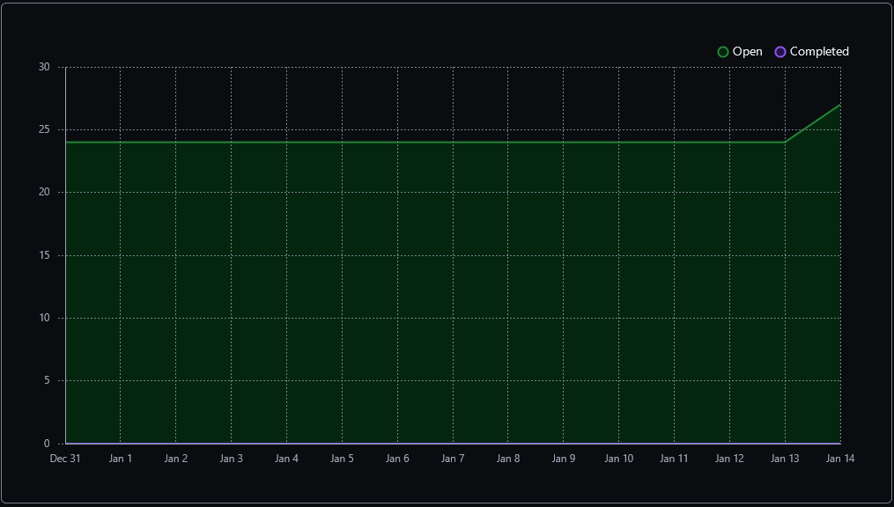

 Table View of completed tasks on project board  
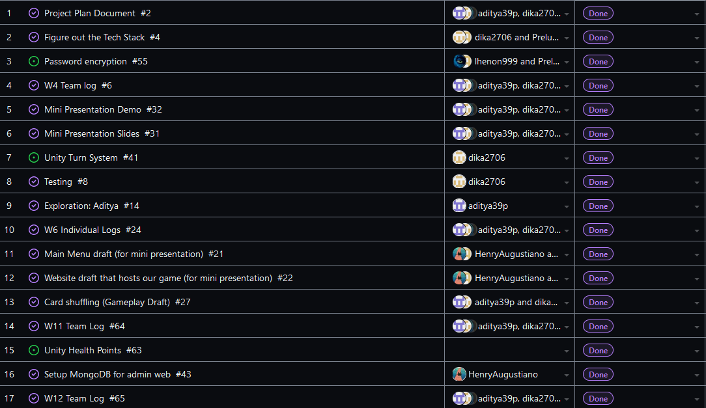
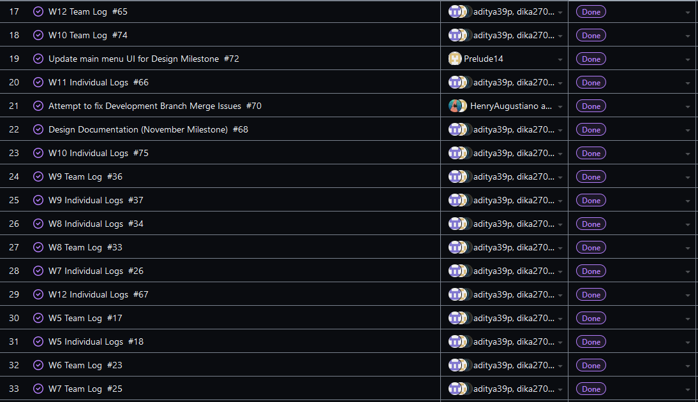
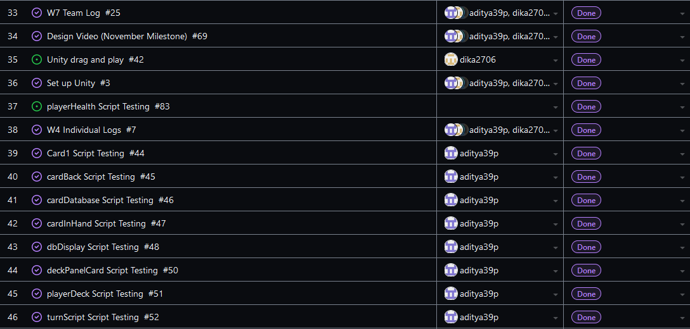

 Table View of in progress tasks on project board  
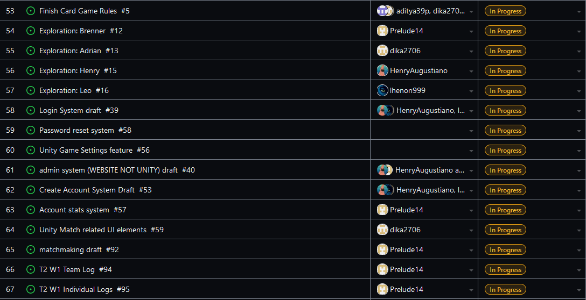

 Table View of in progress TESTING tasks on project board  
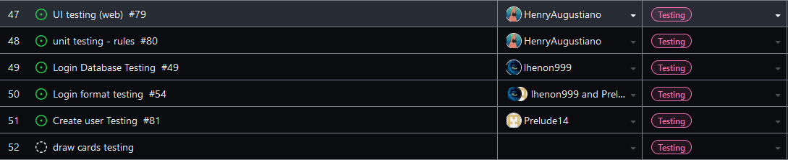

 Screenshot of Card Shuffling Test Report. Left over from W9: 
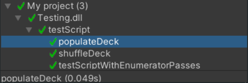

 Screenshot of the card game test runner results. Left over from W10: 
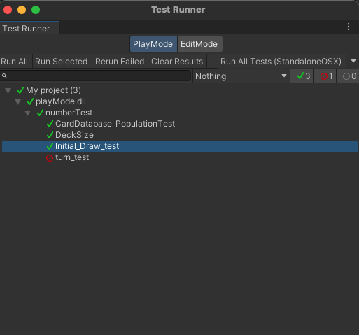

 Screenshot of the game's user create and login systems. Left over from W13: 
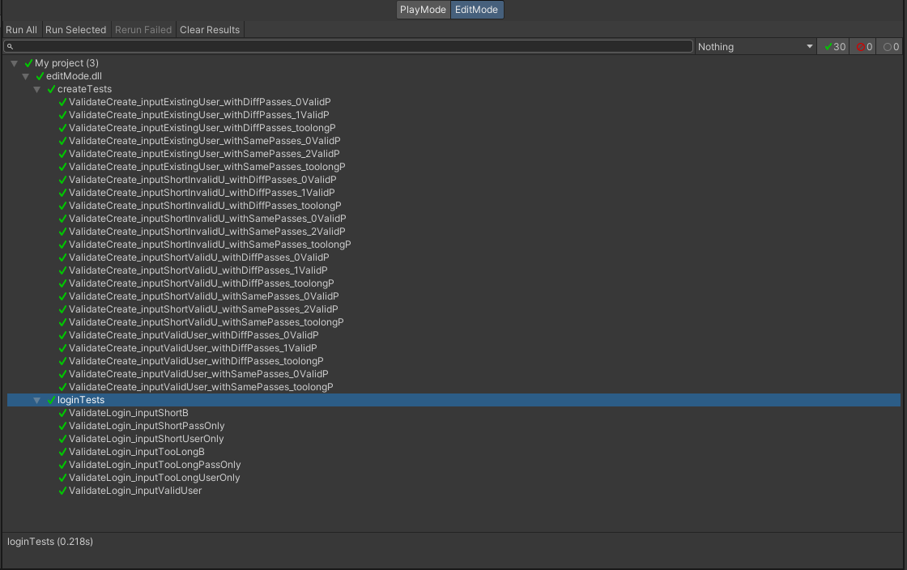

 Screenshot of the card game tests for the health bar. Left over from W13: 
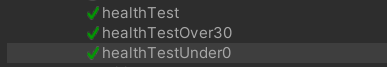

 Screenshot of the website's API testing for show rules. Left over from W13: 
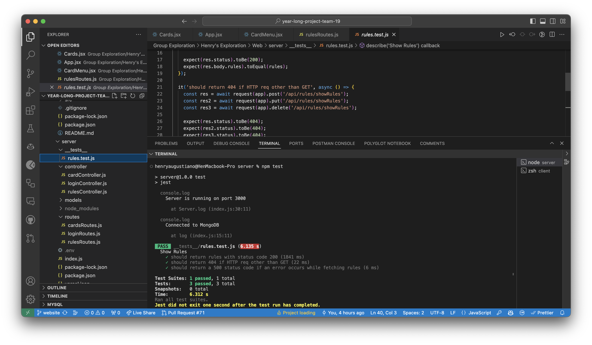

OPTIONAL: Any context to explain why the log looks the way it does.
 
This was the first week of the second semester, so we decided to try to prioritize work on the more important features we have left to implement into our MVP. This meant continuing work on the each card's 
effects and rules, further developing the theme, exploration into setting up multiplayer, and finally, further polishing the design demo versions of the game's features. We decided to work more individually due 
to the nature of the work left. Additionally, there wasn't much to add for testing this week since the card rules aren't implemented into Unity yet, and the multiplayer exploration is separate to our project. 
We still have that other repo open, which is just the design demo milestone version of the game (although the card system might be updated), and it can be found here:

#### https://github.com/Prelude14/499UnityGameT19/tree/07c1423884475e30bf0b521064815c14a5ade605/My%20project%20(4)
