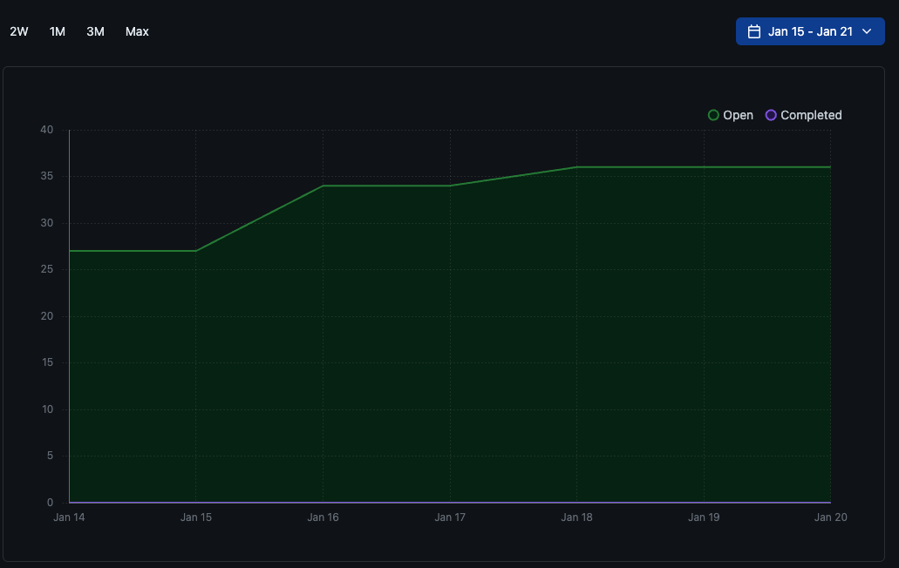
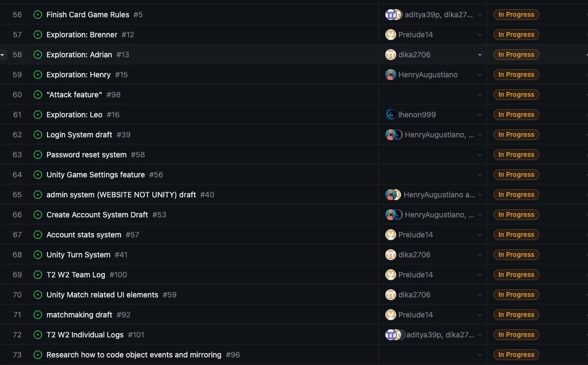
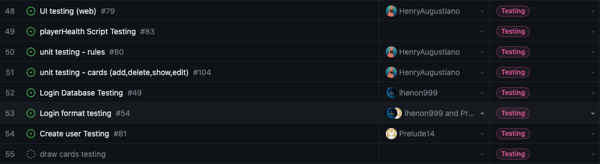

Team 19

Term 2:
Work Period: January 15th to January 21st
<ul>
<li>Github Usernames:</li>
<li>Prelude14 --> Brenner De Vos</li>
<li>dika2706 --> Adrian Ardika Kusuma</li>
<li>lhenon999 --> Leo Henon</li>
<li>HenryAugustiano --> Henry Augustianno</li>
<li>aditya39p --> Aditya Tripathi</li>
</ul>

Milestone Goal Recap: 

Which features were in the project plan for this milestone?
<ul>
<li>Work on the Card Game Rules</li>
<li>More Exploration</li>
<li>Work on implementing Mulitplayer</li>
<li>Continue Flushing out the Login System</li>
<li>Website admin system draft</li>
<li>Continue Flushing out the card game system in game</li>
<li>Testing for Card system system</li>
<li>Continue flushing out UI across all elements</li>
<li>Team and Individual Logs</li>
</ul>

Which tasks from the project board are associated with these features?
<ul>
<li>"Finish the Card Game Rules"</li>
<li>"Exploration: Brenner"</li>
<li>"Exploration: Adrian"</li>
<li>"Exploration: Aditya"</li>
<li>"Exploration: Henry"</li>
<li>"Exploration: Leo"</li>
<li>"matchmaking draft"</li>  
<li>"Login System Draft"</li>
<li>"Create Account System Draft"</li>
<li>"Account stats system"</li>
<li>"admin system (WEBSITE NOT UNITY) draft"</li>
<li>"Look at Testing portion of the project board(theres a lot to mention)"</li>
<li>"Unity Match related UI elements"</li>
<li>"Attack Feature"</li>
<li>"Match cost of card to resource"</li>
<li>"T2 W2 Team log"</li>
<li>"T2 W2 Individual logs"</li>
</ul>

 Burnup Chart:  

 Table View of completed tasks on project board  

 Table View of in progress tasks on project board  

 Table View of in progress TESTING tasks on project board  

OPTIONAL: Any context to explain why the log looks the way it does.
 
Second week of semester 2 we started to make the game playable and finish up the components needed for the "base" of the game. We're currently figuring out how to turn the game into a multiplayer game now that the base components of the game are done. With all the systems functional we can actually play a very bare bones version of the game where players can draw cards and play them. They can also attack with the cards. The next big step to take is figuring out how we're going to implement the matchmaking between players and mirroring actions. Furthermore, we are also looking into getting the games assets updated to match a predecided aesthetic. We're also looking into putting the colour picking system before the match and adding a win/lose feature in the near future.

We still have that other repo open, which is just the design demo milestone version of the game (although the card system might be updated), and it can be found here:

#### https://github.com/Prelude14/499UnityGameT19/tree/07c1423884475e30bf0b521064815c14a5ade605/My%20project%20(4)
