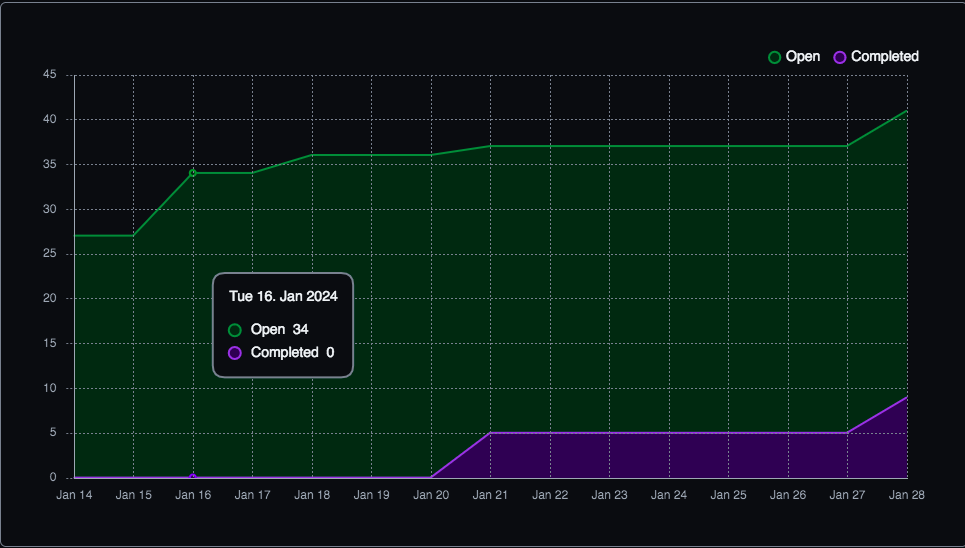
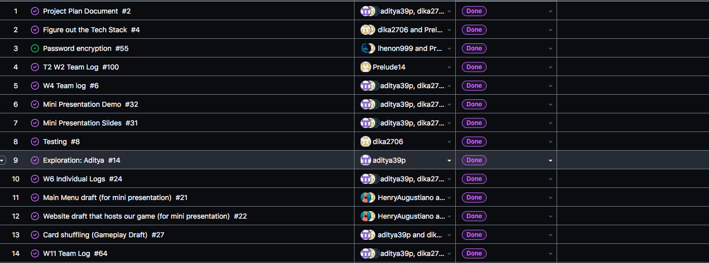
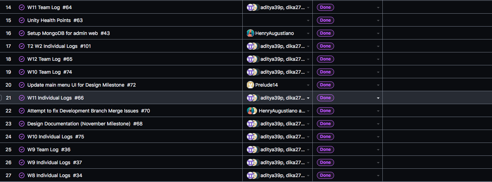
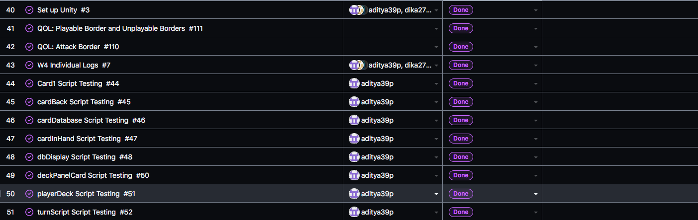
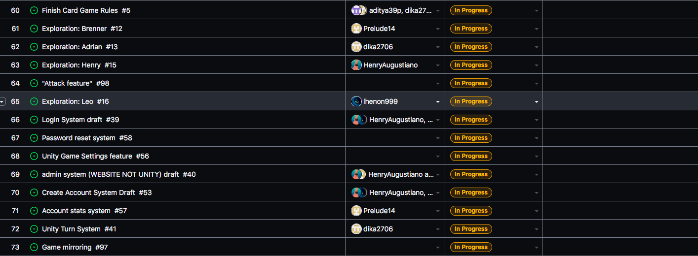
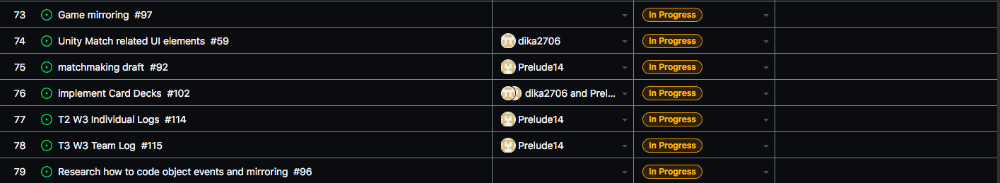

Team 19

Term 2:
Work Period: January 21st to January 28th
<ul>
<li>Github Usernames:</li>
<li>Prelude14 --> Brenner De Vos</li>
<li>dika2706 --> Adrian Ardika Kusuma</li>
<li>lhenon999 --> Leo Henon</li>
<li>HenryAugustiano --> Henry Augustianno</li>
<li>aditya39p --> Aditya Tripathi</li>
</ul>

Milestone Goal Recap: 

Which features were in the project plan for this milestone?
<ul>
<li>Work on implementing Mulitplayer</li>
<li>Continue Flushing out the card game system in game</li>
<li>Testing for Card system system</li>
<li>More Exploration</li>
<li>Website admin system draft</li>
<li>Work on the Card Game Rules</li>
<li>Continue Flushing out the Login System</li>
<li>Continue flushing out UI across all elements</li>
<li>Team and Individual Logs</li>
</ul>

Which tasks from the project board are associated with these features?
<ul>
<li>"matchmaking draft"</li>  
<li>"Game Mirroring"</li>
<li>"Implement Card Decks"</li>
<li>"Exploration: Brenner"</li>
<li>"Attack Feature"</li>
<li>"Match cost of card to resource"</li>
<li>"QOL Attack Border, QOL: Playable and Unplayable Borders"</li>
<li>"admin system (WEBSITE NOT UNITY) draft"</li>
<li>"Login System Draft"</li>
<li>"Create Account System Draft"</li>
<li>"Account stats system"</li>
<li>"Look at Testing portion of the project board(theres a lot to mention)"</li>
<li>"Unity Match related UI elements"</li>
<li>"Finish the Card Game Rules"</li>
<li>"T2 W3 Team log"</li>
<li>"T2 W3 Individual logs"</li>
<li>"Exploration: Adrian"</li>
<li>"Exploration: Aditya"</li>
<li>"Exploration: Henry"</li>
<li>"Exploration: Leo"</li>
</ul>

 Burnup Chart:  

 Table View of completed tasks on project board  

 Table View of in progress tasks on project board  

 Table View of in progress TESTING tasks on project board  

OPTIONAL: Any context to explain why the log looks the way it does.
 
While we had some break throughs with some game features (health and resource system, attacking etc.), and the website has 
come along nicely, implementing multiplayer has been quite the process for us. Just getting the right packages set up on everyone's
machines has been abnoxious, and we have had to change packages as well in the process, which just further adds to the headache. Then, 
trying to get the right packages and work uploaded to GitHub so that the other members of the group can use it as well is just as annoying,
so it is taking forever to get it done. We are meeting Tuesday to set up what is going to be tested in class for the milestone, and its not 
the absolute end of the world if the multiplayer isn't somewhat functioning by then, but it would be great if it was.

We still have that other repo open, and the branch that we have linked is the most done version of the card game, and it can be found here:

#### https://github.com/Prelude14/499UnityGameT19/tree/963c9c89c8726b88428bc5cedf2e4f6d790450f9/My%20project%20(4)
