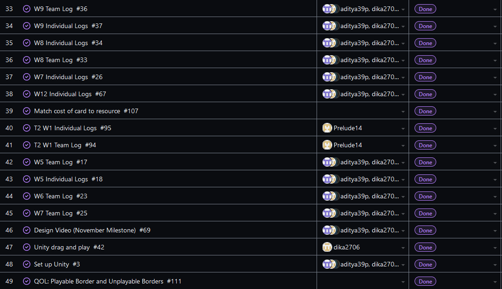

Team 19

Term 2:
Work Period: February 4th to February 11th
<ul>
<li>Github Usernames:</li>
<li>Prelude14 --> Brenner De Vos</li>
<li>dika2706 --> Adrian Ardika Kusuma</li>
<li>lhenon999 --> Leo Henon</li>
<li>HenryAugustiano --> Henry Augustianno</li>
<li>aditya39p --> Aditya Tripathi</li>
</ul>

Milestone Goal Recap: 

Which features were in the project plan for this milestone?
<ul>
<li>Fix bug from peer testing in the admin system, and polish it further (log in and edit cards)</li>
<li>Experiment with UI for the Attack feature (based on results of peer testing)</li>
<li>Work on issues from implementing Mulitplayer</li>
<li>Continue Flushing out the card game system in game</li>
<li>Testing for Card system system</li>
<li>More Exploration</li>
<li>Work on the Card Game Rules</li>
<li>Continue Flushing out the Login System (get ready for testing)</li>
<li>Continue flushing out UI across all elements</li>
<li>Team and Individual Logs</li>
</ul>

Which tasks from the project board are associated with these features?
<ul>
<li>"Peer Testing 1's Admin LOGIN BUG"</li>
<li>"UI Recommendations: Glowing rings and arrows"</li>
<li>"matchmaking draft"</li>  
<li>"Game Mirroring"</li>
<li>"Implement Card Decks"</li>
<li>"Exploration: Brenner"</li>
<li>"Attack Feature"</li>
<li>"admin system (WEBSITE NOT UNITY) draft"</li>
<li>"Login System Draft"</li>
<li>"Create Account System Draft"</li>
<li>"Account stats system"</li>
<li>"Look at Testing portion of the project board(theres a lot to mention)"</li>
<li>"Unity Match related UI elements"</li>
<li>"Finish the Card Game Rules"</li>
<li>"T2 W5 Team log"</li>
<li>"T2 W5 Individual logs"</li>
<li>"Exploration: Adrian"</li>
<li>"Exploration: Aditya"</li>
<li>"Exploration: Henry"</li>
<li>"Exploration: Leo"</li>
</ul>

 Burnup Chart:  

 Table View of completed tasks on project board  

 Table View of in progress tasks on project board  

 Table View of in progress TESTING tasks on project board  

OPTIONAL: Any context to explain why the log looks the way it does.
 
This week brenner did get the multiplayer communication between client and seerver running. Both the players choose their colored deck and the server receives the input and combines the decks creating 40 cards and that's what we have working so far. The goal of this week is to make it fully functional so that an actual game can be started between the host and the client. Adrian changed the ui icons to make the cards readable and we have done other small bug fixes.

#### https://github.com/Prelude14/499UnityGameT19/tree/963c9c89c8726b88428bc5cedf2e4f6d790450f9/My%20project%20(4)
