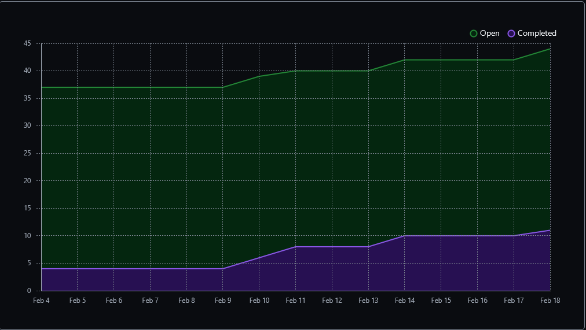
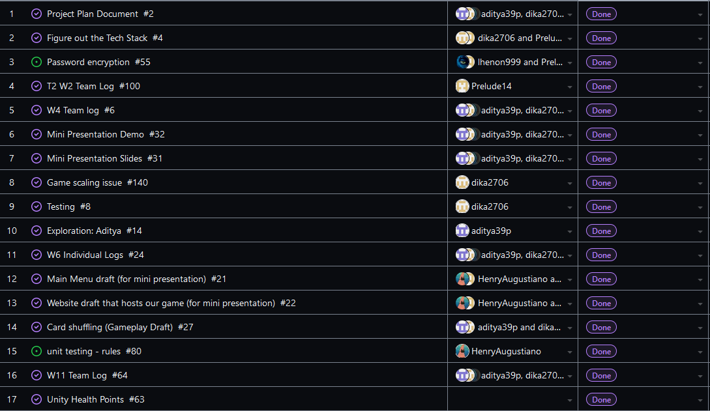
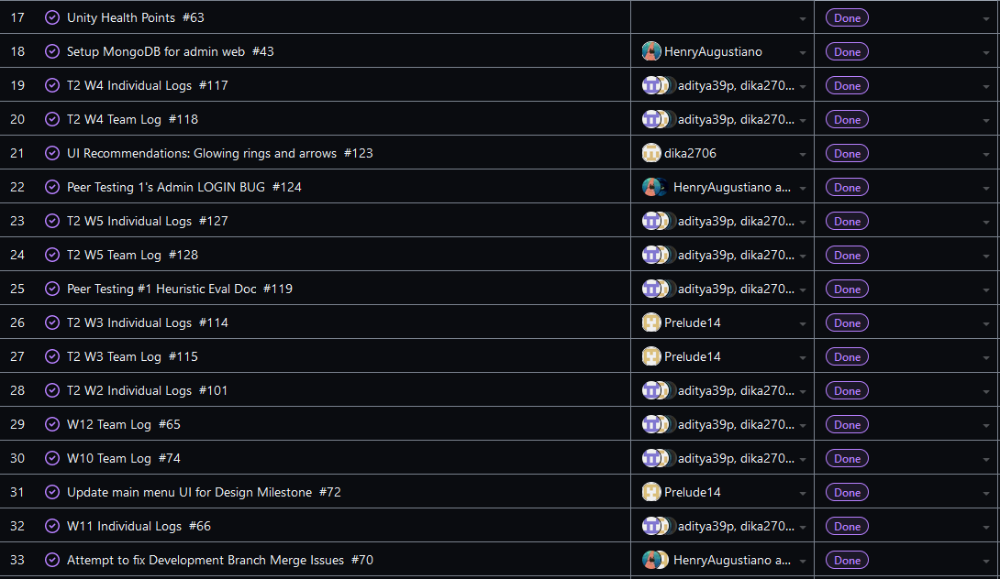
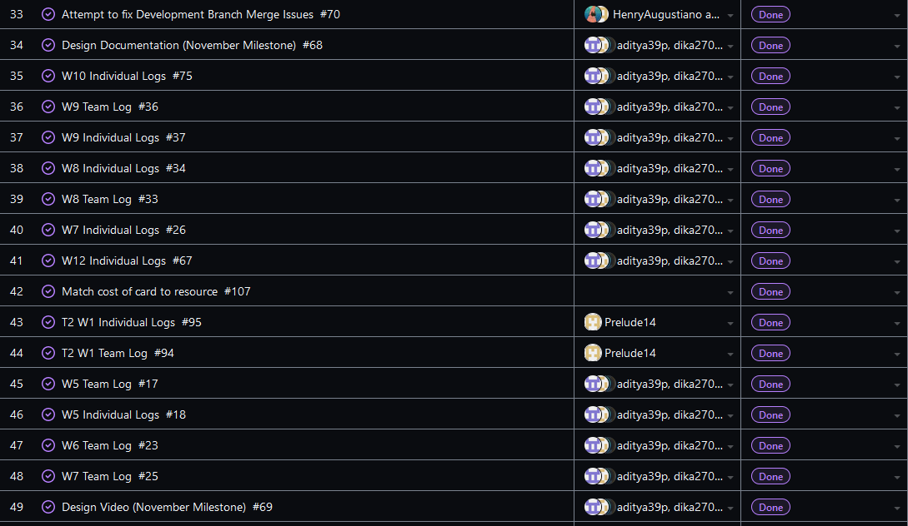
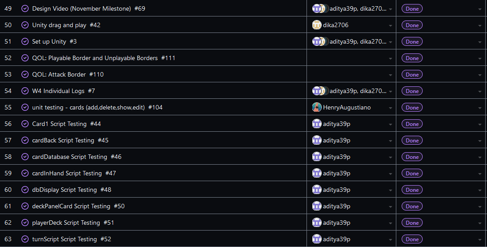
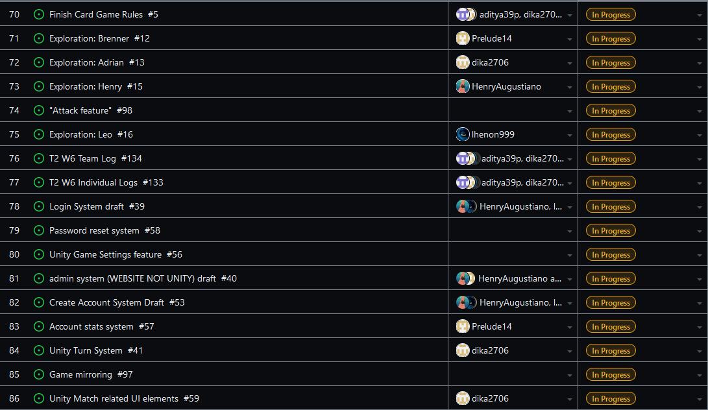
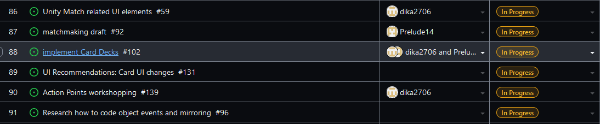
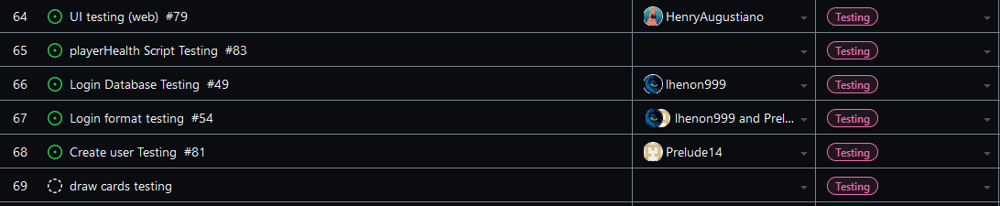

Team 19

Term 2:
Work Period: February 11th to February 18th
<ul>
<li>Github Usernames:</li>
<li>Prelude14 --> Brenner De Vos</li>
<li>dika2706 --> Adrian Ardika Kusuma</li>
<li>lhenon999 --> Leo Henon</li>
<li>HenryAugustiano --> Henry Augustianno</li>
<li>aditya39p --> Aditya Tripathi</li>
</ul>

Milestone Goal Recap: 

Which features were in the project plan for this milestone?
<ul>
<li>Fix bug in the admin system (500 error message), and polish it further (add and edit rule features)</li>
<li>Experiment with UI for the Attack feature (based on results of peer testing)</li>
<li>Work on multiplayer card deal feature</li>
<li>Continue Flushing out the card game system in game</li>
<li>Testing for Card system system</li>
<li>More Exploration</li>
<li>Work on the Card Game Rules</li>
<li>Continue Flushing out the Login System (create menu error message and pass reset feature)</li>
<li>Continue flushing out UI across all elements</li>
<li>Team and Individual Logs</li>
</ul>

Which tasks from the project board are associated with these features?
<ul>
<li>"admin system (WEBSITE NOT UNITY) draft"</li>
<li>"UI Recommendations: Card Ui changes"</li>
<li>"matchmaking draft"</li>  
<li>"Game Mirroring"</li>
<li>"Implement Card Decks"</li>
<li>"Exploration: Brenner"</li>
<li>"Attack Feature"</li>
<li>"Login System Draft"</li>
<li>"Create Account System Draft"</li>
<li>"Look at Testing portion of the project board (theres a lot to mention)"</li>
<li>"Unity Match related UI elements"</li>
<li>"Finish the Card Game Rules"</li>
<li>"T2 W6 Team log"</li>
<li>"T2 W6 Individual logs"</li>
<li>"Exploration: Adrian"</li>
<li>"Exploration: Aditya"</li>
<li>"Exploration: Henry"</li>
<li>"Exploration: Leo"</li>
</ul>

 Burnup Chart:  

 Table View of completed tasks on project board  

 Table View of in progress tasks on project board  

 Table View of in progress TESTING tasks on project board  

OPTIONAL: Any context to explain why the log looks the way it does.
 
This week Henry fixed the bug he found during the week, and worked on adding a "add rule" and "edit rule" to the admin site. Brenner had to get the server to deal the correct cards from the gameDeck to
each player working properly, and it proved to be a bit more complex than expected. Right now one of the players (the host) will see the correct cards in the right places on their screen while the other will 
see the correct cards still, they just aren't in the right place yet. Aditya started work on a zoom in function to hopefully make the cards a bit easier to read if the player hovers over them. Adrian 
experimented with changing the UI of the cards to make the cards more readable, as well as changing some of the abilities of the cards and the attack system to try some different balancing. Leo continued work
on the reset password feature and continued polishing the login & create account features. there is a link to our other repo below that contains the full project (the version we used from peer testing #1 is
the branch we linked below)

#### https://github.com/Prelude14/499UnityGameT19/tree/963c9c89c8726b88428bc5cedf2e4f6d790450f9/My%20project%20(4)
