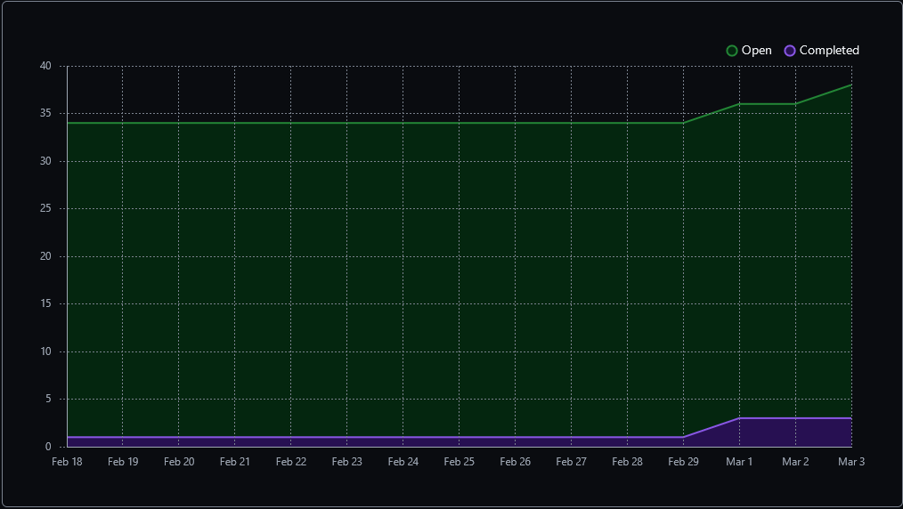
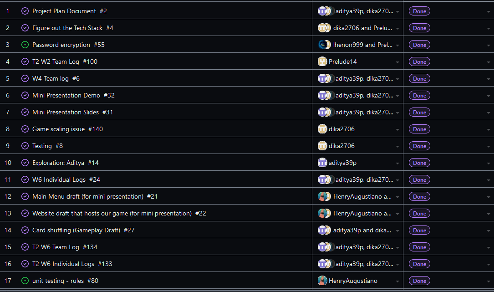
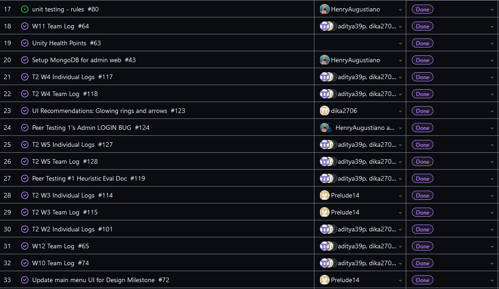
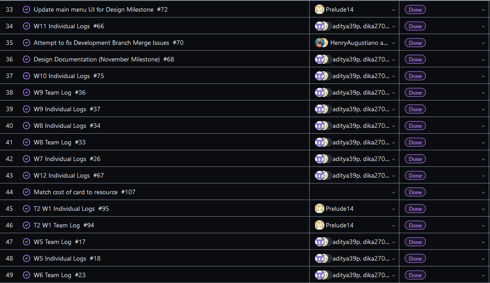
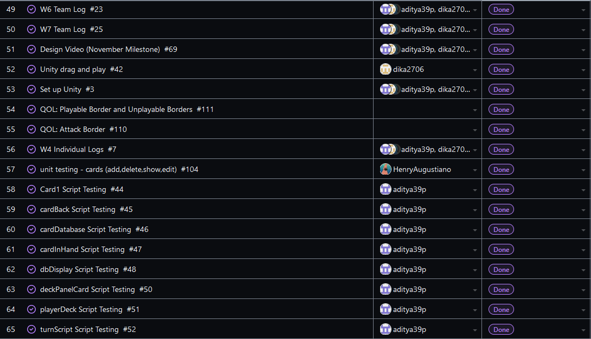
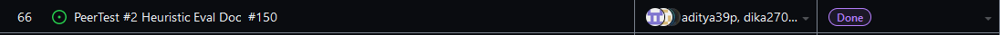
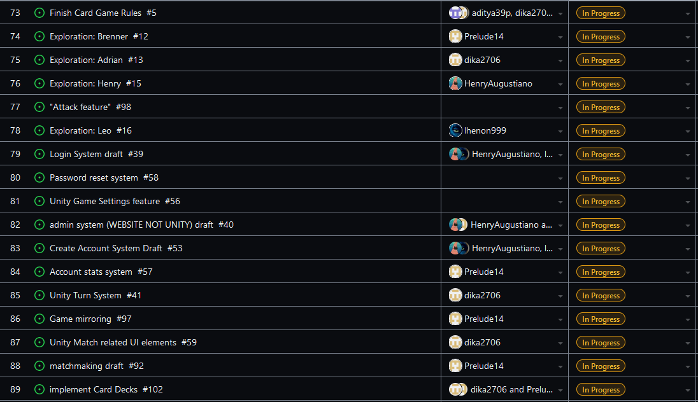
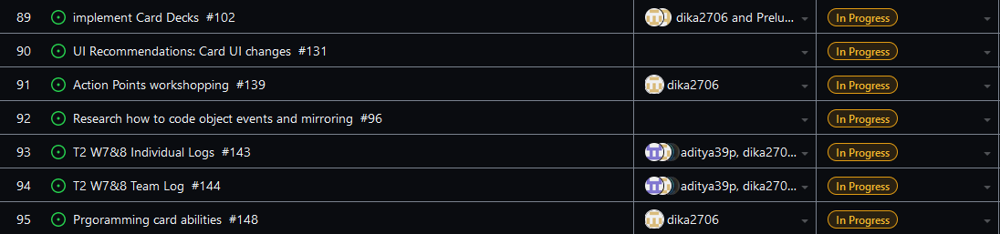
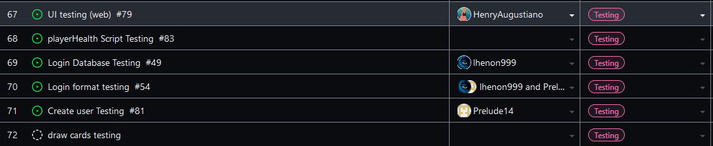

Team 19

Term 2:
Work Period: February 18th to March 3rd (Includes Reading Break)
<ul>
<li>Github Usernames:</li>
<li>Prelude14 --> Brenner De Vos</li>
<li>dika2706 --> Adrian Ardika Kusuma</li>
<li>lhenon999 --> Leo Henon</li>
<li>HenryAugustiano --> Henry Augustianno</li>
<li>aditya39p --> Aditya Tripathi</li>
</ul>

Milestone Goal Recap: 

Which features were in the project plan for this milestone?
<ul>
<li>Finish admin add and delete rule feature on the website</li>
<li>Experiment with UI for the Attack feature (based on results of peer testing)</li>
<li>Solve multiplayer card deal feature issue</li>
<li>Finally get pass reset feature working)</li>
<li>Get Heuristic Eval Doc done for peer testing #2</li>
<li>Continue Flushing out the card game system in game</li>
<li>Testing for Card system system</li>
<li>More Exploration</li>
<li>Work on the Card Game Rules</li>
<li>Continue flushing out UI across all elements</li>
<li>Team and Individual Logs</li>
</ul>

Which tasks from the project board are associated with these features?
<ul>
<li>"admin system (WEBSITE NOT UNITY) draft"</li>
<li>"UI Recommendations: Card Ui changes"</li>
<li>"Attack Feature"</li>
<li>"matchmaking draft"</li>  
<li>"Game Mirroring"</li>
<li>"Implement Card Decks"</li>
<li>"Password reset system"</li>
<li>"PeerTest #2 Heuristic Eval Doc"</li>
<li>"Login System Draft"</li>
<li>"Create Account System Draft"</li>
<li>"Look at Testing portion of the project board (theres a lot to mention)"</li>
<li>"Unity Match related UI elements"</li>
<li>"Finish the Card Game Rules"</li>
<li>"T2 W7&8 Team log"</li>
<li>"T2 W6&8 Individual logs"</li>
<li>"Exploration: Brenner"</li>
<li>"Exploration: Adrian"</li>
<li>"Exploration: Aditya"</li>
<li>"Exploration: Henry"</li>
<li>"Exploration: Leo"</li>
</ul>

 Burnup Chart:  

 Table View of completed tasks on project board  

 Table View of in progress tasks on project board  

 Table View of in progress TESTING tasks on project board  

OPTIONAL: Any context to explain why the log looks the way it does.
 
 This week we were focused on gettin gour build ready for peer test #2. Henry continued working on the "add rule" and "edit rule" features on the admin site. Adrian continued experimenting with changing the UI of the cards to make the cards more readable, as well as changing some of the abilities of the cards and the attack system to try some different balancing. They also added some UI changes to the attack system as a result of some feedback from the first peer testing. With Adrian's help, Brenner was able to get the card dealing working on the multiplayer version of the game (and that version was brought up to date with the last couple weeks of work). Brenner also figured out a sound issue we were having, as well as updated some of the game's art. Aditya continued working the zoom in function for the cards, but it was proving to be more complex than previously thought. Leo finished implementing some error messages in the login and create account menus, and almost finished the reset password feature (it emails a reset token and successfully accepts the token, but we don't know if the user is able to actually update their password once the token is accepted yet (We haven't heard from Leo). We all worked out our Heuristic evaluation document for this week's peer eval as well. There is a link to our other repo below that contains the full project (the version we are going to use for peer testing 2 is
the branch we linked below, and then the most up to date multiplayer branch is linked after)

#### https://github.com/Prelude14/499UnityGameT19/tree/00e0675655bd8ac52894fd4c0fbf93e8d9650dc8/My%20project%20(4)
#### https://github.com/Prelude14/499UnityGameT19/tree/c59802f0a0f35516ff2e184c441da4565c7c7e53/My%20project%20(4)
