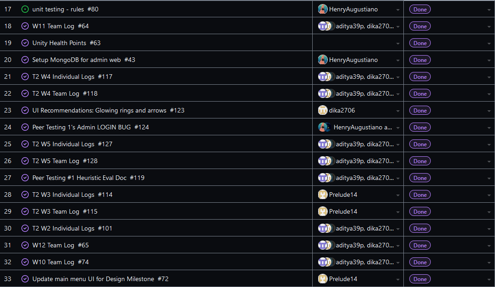

Team 19

Term 2:
Work Period: March 3rd to March 10th
<ul>
<li>Github Usernames:</li>
<li>Prelude14 --> Brenner De Vos</li>
<li>dika2706 --> Adrian Ardika Kusuma</li>
<li>lhenon999 --> Leo Henon</li>
<li>HenryAugustiano --> Henry Augustianno</li>
<li>aditya39p --> Aditya Tripathi</li>
</ul>

Milestone Goal Recap: 

Which features were in the project plan for this milestone?
<ul>
<li>Finally get pass reset feature working in time for peer test #2 build (also really wanted to test it and have it done)</li>
<li>Figure out card zoom feature in time for peer test #2 (really wanted to test it)</li>
<li>Get website ready for peer testing #2 (finish admin's rule system)</li>
<li>Get build ready for peer testing #2 (decide which exact features to test and get them working in one build -- this ended up being a bit of an issue, but it was sorted out in time)</li>
<li>Get multiplayer version of the game back up to date with the newest build of the game (almost there but missing most recent features, still, hard part is over)</li>
<li>Finalize Heuristic Eval Doc done for peer testing #2</li>
<li>Continue Flushing out the card game system in game</li>
<li>Testing for Card system system</li>
<li>Work on the Card Game Rules</li>
<li>Continue flushing out UI across all elements</li>
<li>Team and Individual Logs</li>
</ul>

Which tasks from the project board are associated with these features?
<ul>
<li>"Password reset system"</li>
<li>"Login System Draft"</li>
<li>"Create Account System Draft"</li>
<li>"Card Zoom on Hover Feature"</li>
<li>"admin system (WEBSITE NOT UNITY) draft"</li>
<li>"UI Recommendations: Card Ui changes"</li>
<li>"Attack Feature"</li>
<li>"matchmaking draft"</li>  
<li>"Game Mirroring"</li>
<li>"PeerTest #2 Heuristic Eval Doc"</li>
<li>"Implement Card Decks"</li>
<li>"Look at Testing portion of the project board (theres a lot to mention)"</li>
<li>"Unity Match related UI elements"</li>
<li>"Finish the Card Game Rules"</li>
<li>"T2 W9 Team log"</li>
<li>"T2 W9 Individual logs"</li>
</ul>

 Burnup Chart:  

 Table View of completed tasks on project board  

 Table View of in progress tasks on project board  

 Table View of in progress TESTING tasks on project board  

OPTIONAL: Any context to explain why the log looks the way it does.
 
 This week we were focused on getting our final build ready for peer test #2. We needed to get the card zoom working and the password reset function into the final build by Tuesday, in order to have time 
to get it built and running on two machines for the class on Thursday. Aditya and Brenner got some progress done on the card zoom, but it wasn't until Adrian picked it up on Tuesday that it was working well 
enough to be tested. Henry continued polishing the "add rule" and "edit rule" features on the admin site. Leo did manage to finish up the password reset feature by Tuesday as well, but its merge actually broke
our whole branch that we were going to use for the final build. Adrian was able to salvage his features to a separate branch after reverting a commit, but Leo's Unity was having major issues, so his feature 
required more work to fix. Brenner managed to rebuild the password reset feature with the help of Leo over Discord, but it took most of Wednesday to get it working with Adrian's new branch. The final build was 
ready and published to Simmer.io by 8 that night, and it was tested and run on our site on two different machines by 10. Peer Testing went well the next day, since we didn't find any major bugs and the build 
worked as expected. We had finalized our Heuristic evaluation document by Wednesday night as well, when we tested the builds. Our other Repo that contains the Unity project itself is below;
(the version we ended up using for peer testing #2 is the branch we linked below, and then the most up to date multiplayer branch is linked after)

#### https://github.com/Prelude14/499UnityGameT19/tree/4697f5a310b4f56139af3e6886992a320ba7e786/My%20project%20(4)
#### https://github.com/Prelude14/499UnityGameT19/tree/c59802f0a0f35516ff2e184c441da4565c7c7e53/My%20project%20(4)
