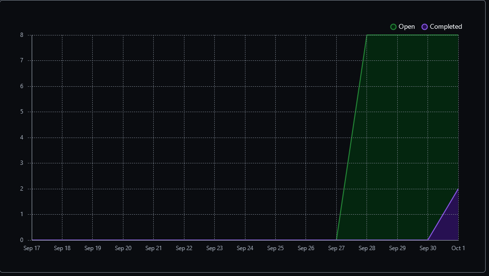
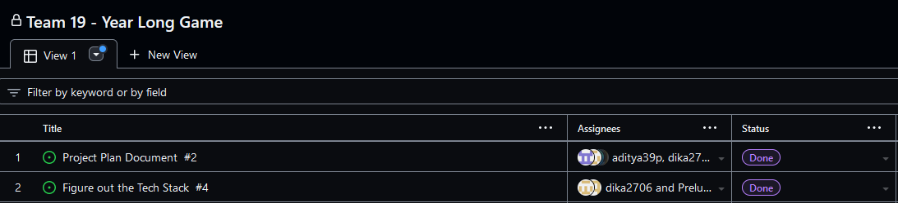
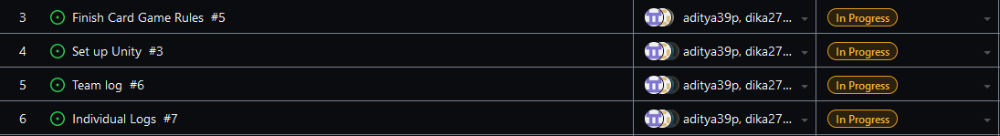

Team 19

Work Period: September 26th to October 1st
<ul>
<li>Github Usernames:</li>
<li>Prelude14 --> Brenner De Vos</li>
<li>dika2706 --> Adrian Ardika Kusuma</li>
<li>lhenon999 --> Leo Henon</li>
<li>HenryAugustiano --> Henry Augustianno</li>
<li>aditya39p --> Aditya Tripathi</li>
</ul>

Milestone Goal Recap: 

Which features were in the project plan for this milestone?
<ul>
<li>Iron out the Teck Stack's details</li>
<li>Get the same version of Unity setup on everyone's system</li>
<li>Finish the Project Plan Document</li>
<li>Work on the Card Game Rules</li>
<li>Team and Individual Logs</li>
</ul>

Which tasks from the project board are associated with these features?
<ul>
<li>"Figure out the Teck Stack"</li>
<li>"Set up Unity"</li>
<li>"Project Plan Document"</li>
<li>"Finish the Card Game Rules"</li>
<li>"Team log"</li>
<li>"Individual logs"</li>
</ul>

 Burnup Chart:  

 Table View of completed tasks on project board  

 Table View of in progress tasks on project board  

 No Screen shot of Test Report, since there are no tests to run.

OPTIONAL: Any context to explain why the log looks the way it does.
 
We didn't do any coding this week, since we were more concerned with finishing the project plan document and building our Teck Stack. This means there was nothing to write tests for, so there is no screenshot above. We did settle on a version of Unity that comes with some tutorials that we have started working through on our own, but they don't feel relevant to write tests for (and we would need serveral screenshots if we all did it ourselves, which would be the best way to actually use the tutorials, and several branches since we wouldn't be collaborating on them). 

