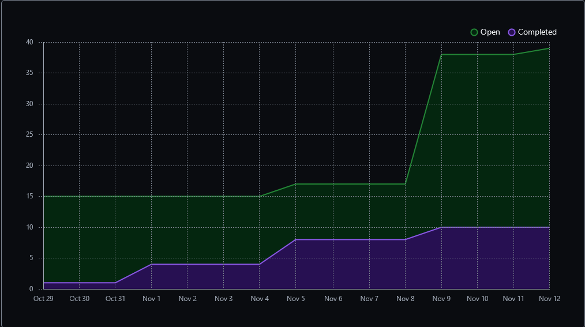
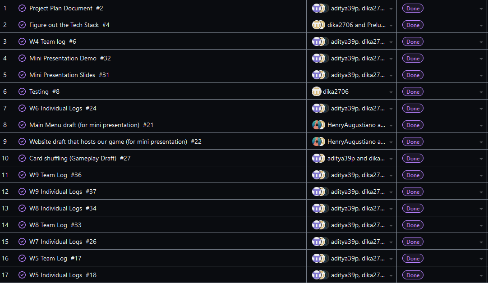
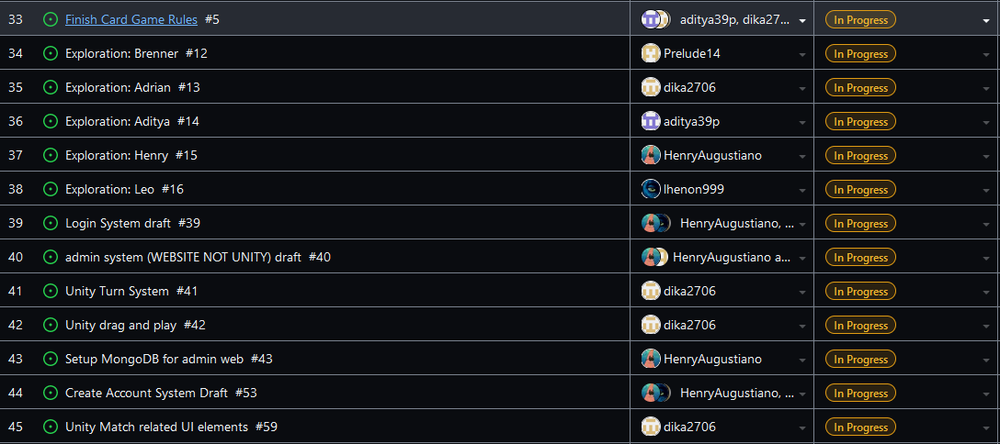
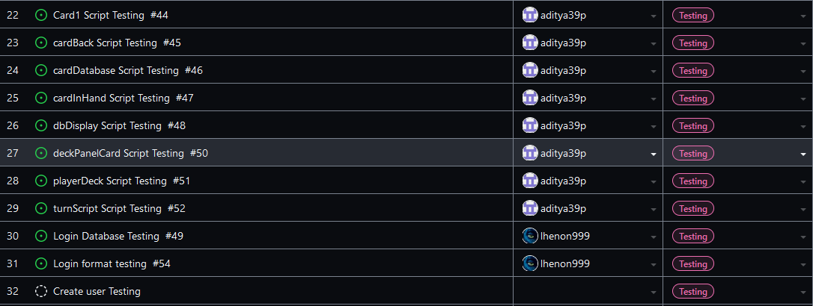

Team 19

Work Period: November 5th to November 12th
<ul>
<li>Github Usernames:</li>
<li>Prelude14 --> Brenner De Vos</li>
<li>dika2706 --> Adrian Ardika Kusuma</li>
<li>lhenon999 --> Leo Henon</li>
<li>HenryAugustiano --> Henry Augustianno</li>
<li>aditya39p --> Aditya Tripathi</li>
</ul>

Milestone Goal Recap: 

Which features were in the project plan for this milestone?
<ul>
<li>Login System Draft</li>
<li>Website admin system draft</li>
<li>Continue Flushing out the card game system in game</li>
<li>Testing for Card system and login system</li>
<li>Make the UI a bit more consistent</li>
<li>More Exploration</li>
<li>Work on the Card Game Rules</li>
<li>Team and Individual Logs</li>
</ul>

Which tasks from the project board are associated with these features?
<ul>
<li>Login System Draft</li>
<li>"admin system (WEBSITE NOT UNITY) draft"</li>
<li>"set up MongoDB for admin web"</li>
<li>"Unity Turn System"</li>
<li>"Unity drag and play"</li>
<li>"Look at Testing portion of the project board(theres a lot to mention)"</li>
<li>"Unity match related UI elements"</li>
<li>"Exploration: Brenner"</li>
<li>"Exploration: Adrian"</li>
<li>"Exploration: Aditya"</li>
<li>"Exploration: Henry"</li>
<li>"Exploration: Leo"</li>
<li>"Finish the Card Game Rules"</li>
<li>"W9 Team log"</li>
<li>"W9 Individual logs"</li>
</ul>

 Burnup Chart:  

 Table View of completed tasks on project board  

 Table View of in progress tasks on project board  

 Table View of in progress TESTING tasks on project board  

 Screenshot of Card Shuffling Test Report.(this is left over from last week)  

OPTIONAL: Any context to explain why the log looks the way it does.
 
So we have started moving on from exploration, and starting to work on actual features, meaning we opened a ton of new tasks this week. Its also the week before reading week, so we plan 
to do a bit of catch up over the break. We also opened a new "Testing" section of our project board to help keep track of all the individual tests that we want to build for each feature, so we added
the screenshot of it's tasks above following the regular in progress tasks section. We still have the mini presentation demo project in a seperate Github repo found here,

#### https://github.com/Prelude14/499UnityGameT19/tree/a260bfb034df2fbbed7a8ab87866c737e8dc1352/My%20project%20(4)

but we are hoping to use the reading week to move everything to this repo, especially since we are admins of the repo now.

