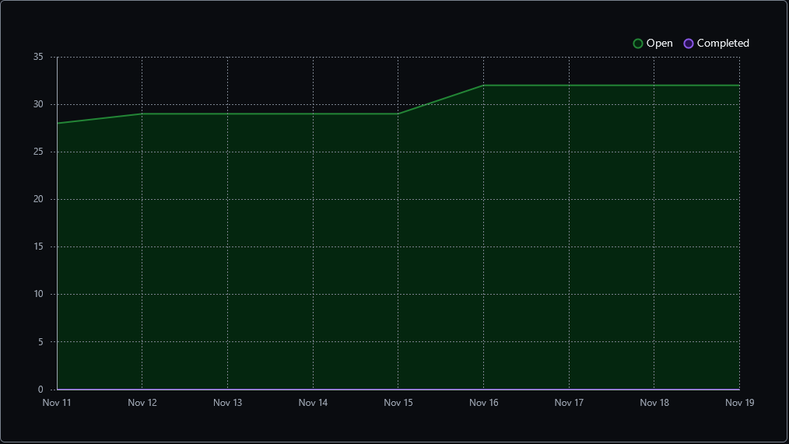
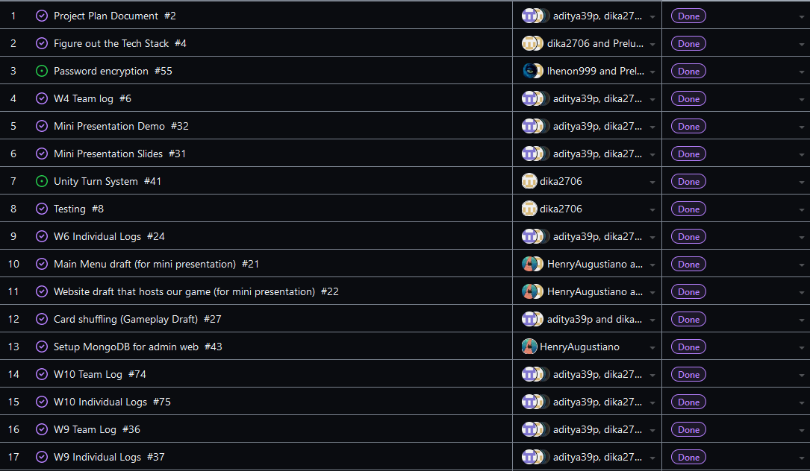
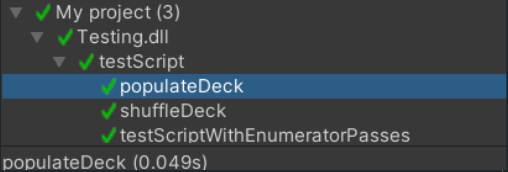

Team 19

Work Period: November 12th to November 19th
<ul>
<li>Github Usernames:</li>
<li>Prelude14 --> Brenner De Vos</li>
<li>dika2706 --> Adrian Ardika Kusuma</li>
<li>lhenon999 --> Leo Henon</li>
<li>HenryAugustiano --> Henry Augustianno</li>
<li>aditya39p --> Aditya Tripathi</li>
</ul>

Milestone Goal Recap: 

Which features were in the project plan for this milestone?
<ul>
<li>Continue Flushing out the Login System</li>
<li>Website admin system draft</li>
<li>Continue Flushing out the card game system in game</li>
<li>Testing for Card system and login system</li>
<li>Make the UI a bit more consistent</li>
<li>More Exploration</li>
<li>Work on the Card Game Rules</li>
<li>Team and Individual Logs</li>
</ul>

Which tasks from the project board are associated with these features?
<ul>
<li>"Login System Draft"</li>
<li>"Create Account System Draft"</li>
<li>"Password Encryption"</li>
<li>"admin system (WEBSITE NOT UNITY) draft"</li>
<li>"Unity Turn System"</li>
<li>"Unity drag and play"</li>
<li>"Look at Testing portion of the project board(theres a lot to mention)"</li>
<li>"Unity match related UI elements"</li>
<li>"Exploration: Brenner"</li>
<li>"Exploration: Adrian"</li>
<li>"Exploration: Aditya"</li>
<li>"Exploration: Henry"</li>
<li>"Exploration: Leo"</li>
<li>"Finish the Card Game Rules"</li>
<li>"W11 Team log"</li>
<li>"W11 Individual logs"</li>
</ul>

 Burnup Chart:  

 Table View of completed tasks on project board  

 Table View of in progress tasks on project board  

 Table View of in progress TESTING tasks on project board  

 Screenshot of Card Shuffling Test Report.(this is left over from W9, nothing to add for reading break week)  

OPTIONAL: Any context to explain why the log looks the way it does.
 
So this week was reading week, so not much has changed since W10. We further flushed out the login system, as well as the card game itself and the website. Trying to just get some features finished enough for the design document and video milestone due in W13.
We still have the mini presentation demo project in a seperate Github repo found at the link below, but we now are uploading the game scripts and scenes to the main repo so that our commits will 
show up on this repo as well.

#### https://github.com/Prelude14/499UnityGameT19/tree/a260bfb034df2fbbed7a8ab87866c737e8dc1352/My%20project%20(4)
