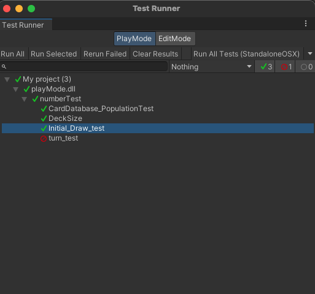

Team 19

Work Period: November 19th to November 26th
<ul>
<li>Github Usernames:</li>
<li>Prelude14 --> Brenner De Vos</li>
<li>dika2706 --> Adrian Ardika Kusuma</li>
<li>lhenon999 --> Leo Henon</li>
<li>HenryAugustiano --> Henry Augustianno</li>
<li>aditya39p --> Aditya Tripathi</li>
</ul>

Milestone Goal Recap: 

Which features were in the project plan for this milestone?
<ul>
<li>Continue Flushing out the Login System</li>
<li>Website admin system draft</li>
<li>Continue Flushing out the card game system in game</li>
<li>Testing for Card system and login system</li>
<li>Make the UI a bit more consistent</li>
<li>More Exploration</li>
<li>Work on the Card Game Rules</li>
<li>Team and Individual Logs</li>
</ul>

Which tasks from the project board are associated with these features?
<ul>
<li>"Login System Draft"</li>
<li>"Create Account System Draft"</li>
<li>"Account stats system"</li>
<li>"admin system (WEBSITE NOT UNITY) draft"</li>
<li>"Unity Turn System"</li>
<li>"Unity drag and play"</li>
<li>"Look at Testing portion of the project board(theres a lot to mention)"</li>
<li>"Unity match related UI elements"</li>
<li>"Exploration: Brenner"</li>
<li>"Exploration: Adrian"</li>
<li>"Exploration: Aditya"</li>
<li>"Exploration: Henry"</li>
<li>"Exploration: Leo"</li>
<li>"Finish the Card Game Rules"</li>
<li>"W12 Team log"</li>
<li>"W12 Individual logs"</li>
</ul>

 Burnup Chart:  

 Table View of completed tasks on project board  

 Table View of in progress tasks on project board  

 Table View of in progress TESTING tasks on project board  

 Screenshot of Card Shuffling Test Report. Left over from W9: 

 Screenshot of the test runner results 

OPTIONAL: Any context to explain why the log looks the way it does.
 
So this week was our last checkpoint before our Design Doc and Design Video milestone is due. We continued to improve the login system, as well as the card game itself and the website. 
We also added the account info and stats system, and continued to build some tests for them. We need to get more tests built however, and the Design doc wants some specific diagrams from our UI, so thats going
to be our focus for the week as well as actually completing the Doc and making our Video. We are now creating a new branch for each feature, and merging them to the development branch and then the development 
branch to master when each milestone is due, to get around the issues we had with merge conflicts in W10 (and the development branch has been rebased). Additionally, we were hoping to upload the Unity project
to this main repo, but we are just uploading the scripts, scenes and assests here instead to track our work better for the TAs, and then still using the other repo when we have to. 
The other repo can be found at the link below:

#### https://github.com/Prelude14/499UnityGameT19/tree/a260bfb034df2fbbed7a8ab87866c737e8dc1352/My%20project%20(4)
