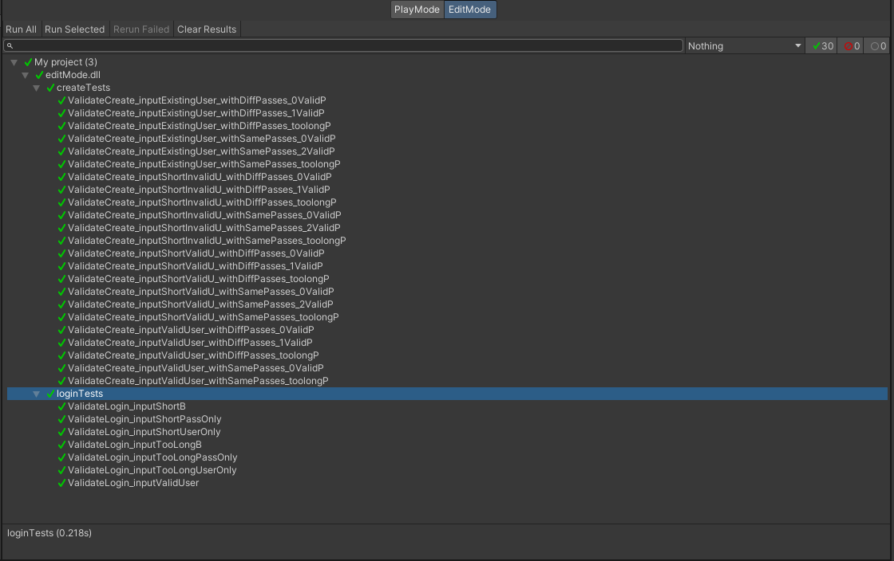

Team 19

Work Period: November 26th to December 3rd
<ul>
<li>Github Usernames:</li>
<li>Prelude14 --> Brenner De Vos</li>
<li>dika2706 --> Adrian Ardika Kusuma</li>
<li>lhenon999 --> Leo Henon</li>
<li>HenryAugustiano --> Henry Augustianno</li>
<li>aditya39p --> Aditya Tripathi</li>
</ul>

Milestone Goal Recap: 

Which features were in the project plan for this milestone?
<ul>
<li>Finish Design Video and Documentation</li>
<li>Write Automated tests for Login System</li>
<li>Continue Flushing out the Login System</li>
<li>Website admin system draft</li>
<li>Continue Flushing out the card game system in game</li>
<li>Testing for Card system system</li>
<li>Make the UI a bit more consistent</li>
<li>More Exploration</li>
<li>Work on the Card Game Rules</li>
<li>Team and Individual Logs</li>
</ul>

Which tasks from the project board are associated with these features?
<ul>
<li>"Design Documentation (November Milestone)"</li>
<li>"Design Video (November Milestone)"</li>
<li>"Login format testing"</li>
<li>"Create user Testing"</li>
<li>"Login System Draft"</li>
<li>"Create Account System Draft"</li>
<li>"Account stats system"</li>
<li>"admin system (WEBSITE NOT UNITY) draft"</li>
<li>"Unity Turn System"</li>
<li>"Unity drag and play"</li>
<li>"Look at Testing portion of the project board(theres a lot to mention)"</li>
<li>"Update main menu UI for Design Milestone"</li>
<li>"Unity match related UI elements"</li>
<li>"Exploration: Brenner"</li>
<li>"Exploration: Adrian"</li>
<li>"Exploration: Aditya"</li>
<li>"Exploration: Henry"</li>
<li>"Exploration: Leo"</li>
<li>"Finish the Card Game Rules"</li>
<li>"W13 Team log"</li>
<li>"W13 Individual logs"</li>
</ul>

 Burnup Chart:  

 Table View of completed tasks on project board  

 Table View of in progress tasks on project board  

 Table View of in progress TESTING tasks on project board  

 Screenshot of Card Shuffling Test Report. Left over from W9: 

 Screenshot of the card game test runner results, and then the create and login to account test results: 

OPTIONAL: Any context to explain why the log looks the way it does.
 
So this week our design video and design document milestone is due, so we were focused on flushing out enough features for said document and video. We got a lot of our back log at least started, and set 
up automated testing for a couple of the big features that really needed them. The theme of the main menu ended up getting a makeover as well as the card game scene itself, after we came up with a title and 
some ideas for the game's theming and we felt inspired. We still have that other repo open, just because its a way better way to collaborate on a Unity Project (You don't have to manually set up the scripts 
and scenes everytime theres a change), but we made a new branch to show off the new theming and figure out some things. It can be found here:

#### https://github.com/Prelude14/499UnityGameT19/tree/07c1423884475e30bf0b521064815c14a5ade605/My%20project%20(4)
