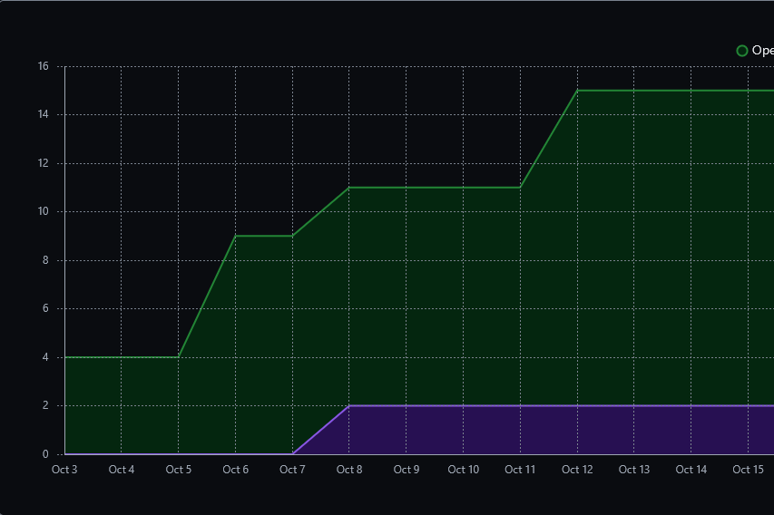
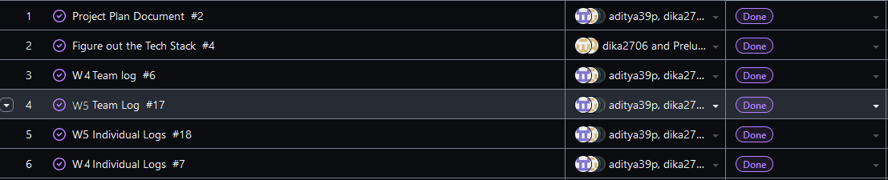
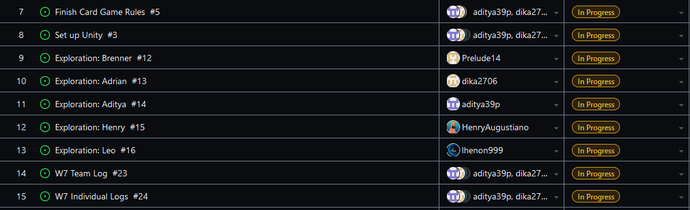

Team 19

Work Period: October 8th to October 15th
<ul>
<li>Github Usernames:</li>
<li>Prelude14 --> Brenner De Vos</li>
<li>dika2706 --> Adrian Ardika Kusuma</li>
<li>lhenon999 --> Leo Henon</li>
<li>HenryAugustiano --> Henry Augustianno</li>
<li>aditya39p --> Aditya Tripathi</li>
</ul>

Milestone Goal Recap: 

Which features were in the project plan for this milestone?
<ul>
<li>Exploration</li>
<li>Get Unity working with GitHub on everyone's system</li>
<li>Work on the Card Game Rules</li>
<li>Team and Individual Logs</li>
</ul>

Which tasks from the project board are associated with these features?
<ul>
<li>"Exploration: Brenner"</li>
<li>"Exploration: Adrian"</li>
<li>"Exploration: Aditya"</li>
<li>"Exploration: Henry"</li>
<li>"Exploration: Leo"</li>
<li>"Set up Unity"</li>
<li>"Finish the Card Game Rules"</li>
<li>"W6 Team log"</li>
<li>"W6 Individual logs"</li>
</ul>

 Burnup Chart:  

 Table View of completed tasks on project board  

 Table View of in progress tasks on project board  

 No Screen shot of Test Report, since there are no tests to run.

OPTIONAL: Any context to explain why the log looks the way it does.
 
We don't have any assingments/documentation to do this week (apart from the logs), so we just did more tutorials as part of our
exploration into Unity. Check the exploration branch to see what we have added. Each of us have our own folder on it, that contains a README going over what we did that week, 
with youtube tutorial links as well as images/videos to show our actual code. We aimed to do tutorials on topics that were more specific to what our game is actually going to use this week, since we need 
a very basic working prototype for our presentations in three weeks. Some of us are still trying to integrate GitHub into Unity to allow us all to work on the same project, but everyone has Unity downloaded set up now at least.

