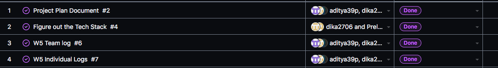
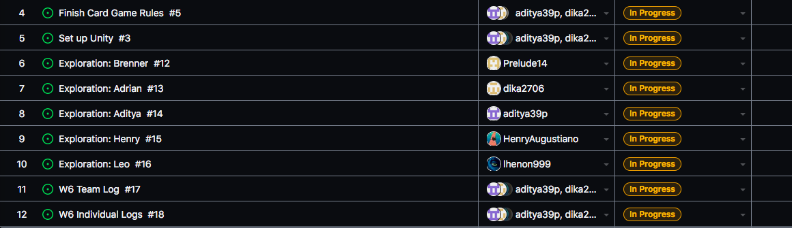

Team 19

Work Period: October 1st to October 8th
<ul>
<li>Github Usernames:</li>
<li>Prelude14 --> Brenner De Vos</li>
<li>dika2706 --> Adrian Ardika Kusuma</li>
<li>lhenon999 --> Leo Henon</li>
<li>HenryAugustiano --> Henry Augustianno</li>
<li>aditya39p --> Aditya Tripathi</li>
</ul>

Milestone Goal Recap: 

Which features were in the project plan for this milestone?
<ul>
<li>Exploration</li>
<li>Get the same version of Unity setup on everyone's system</li>
<li>Work on the Card Game Rules</li>
<li>Team and Individual Logs</li>
</ul>

Which tasks from the project board are associated with these features?
<ul>
<li>"Exploration: Brenner"</li>
<li>"Exploration: Adrian"</li>
<li>"Exploration: Aditya"</li>
<li>"Exploration: Henry"</li>
<li>"Exploration: Leo"</li>
<li>"Set up Unity"</li>
<li>"Project Plan Document"</li>
<li>"Finish the Card Game Rules"</li>
<li>"Team log"</li>
<li>"Individual logs"</li>
</ul>

 Burnup Chart:  

 Table View of completed tasks on project board  

 Table View of in progress tasks on project board  

 No Screen shot of Test Report, since there are no tests to run.

OPTIONAL: Any context to explain why the log looks the way it does.
 
We didn't have any assingments/documentation to do this week (apart from the logs), but we all started tutorials as part of our
exploration into Unity, since none of us have used it before. Check the exploration branch to see what we have done so far. It should be
actual programs and the readme might have lists of videos we have watched on it, and interesting notes we have taken.

