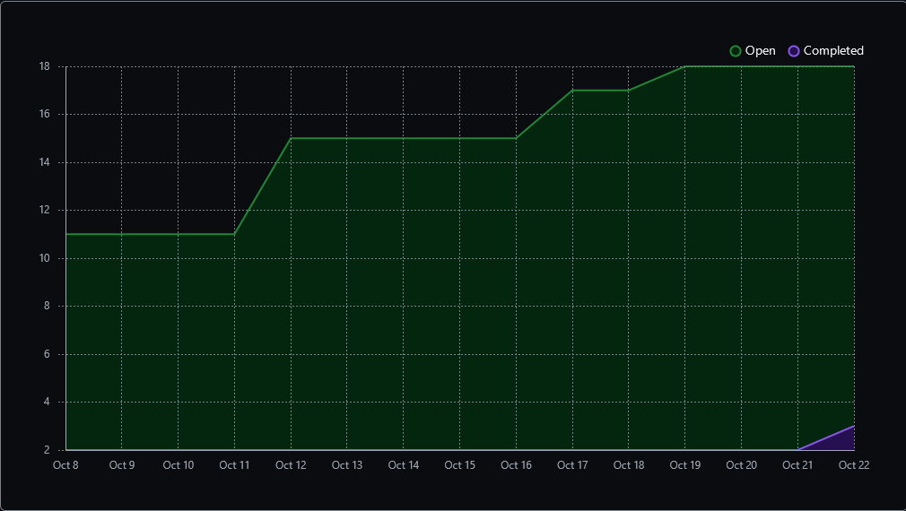

Team 19

Work Period: October 15th to October 22nd
<ul>
<li>Github Usernames:</li>
<li>Prelude14 --> Brenner De Vos</li>
<li>dika2706 --> Adrian Ardika Kusuma</li>
<li>lhenon999 --> Leo Henon</li>
<li>HenryAugustiano --> Henry Augustianno</li>
<li>aditya39p --> Aditya Tripathi</li>
</ul>

Milestone Goal Recap: 

Which features were in the project plan for this milestone?
<ul>
<li>Exploration</li>
<li>Get Unity working with GitHub on everyone's system</li>
<li>Work on the Card Game Rules</li>
<li>Team and Individual Logs</li>
</ul>

Which tasks from the project board are associated with these features?
<ul>
<li>"Exploration: Brenner"</li>
<li>"Exploration: Adrian"</li>
<li>"Exploration: Aditya"</li>
<li>"Exploration: Henry"</li>
<li>"Exploration: Leo"</li>
<li>"Set up Unity"</li>
<li>"Finish the Card Game Rules"</li>
<li>"W7 Team log"</li>
<li>"W7 Individual logs"</li>
</ul>

 Burnup Chart:  

 Table View of completed tasks on project board  

 Table View of in progress tasks on project board  

 No Screen shot of Test Report, since there are no tests to run.

OPTIONAL: Any context to explain why the log looks the way it does.
 
We still don't have any assingments/documentation to do this week (apart from the logs), so we just did more tutorials as part of our
exploration into Unity, and tried to get Unity set up with GitHub on everyone's computers. We now have a separate repo set up that we successfully can all access and import each other's projects from, found at the link below. We have a UI set up, and we can run our games in local web browser. Also, we have a draft of our card shuffling system built.

#### https://github.com/Prelude14/499UnityGameT19
