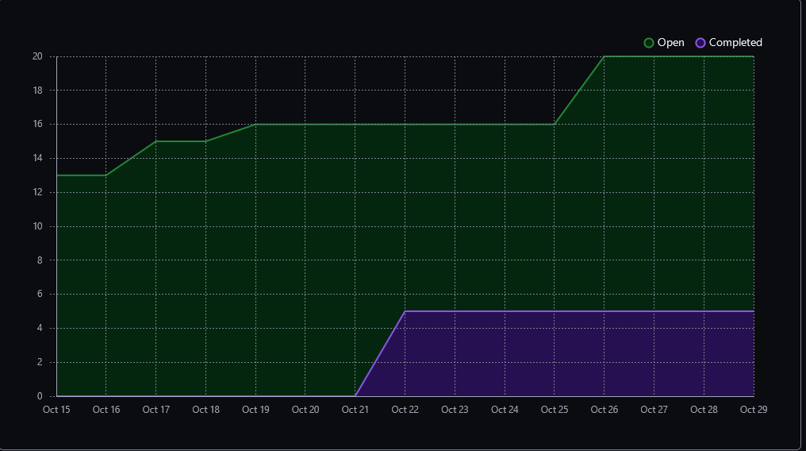
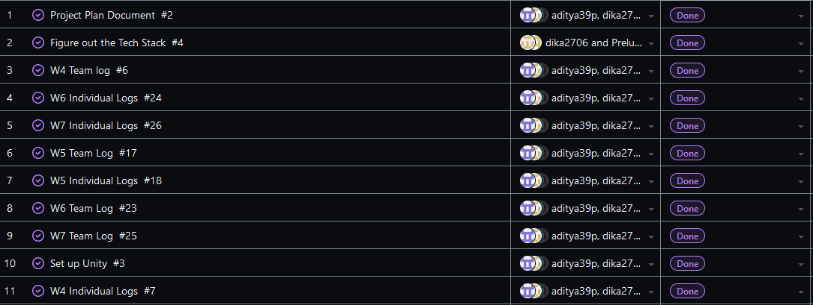
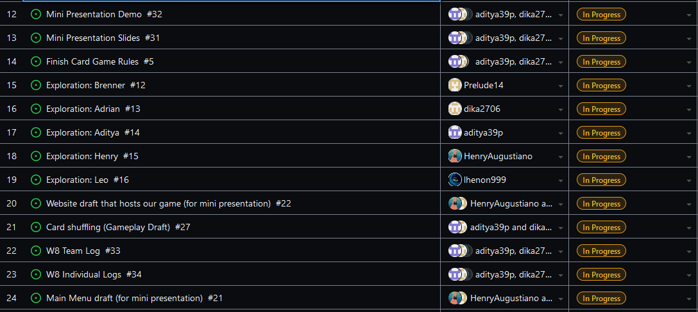

Team 19

Work Period: October 22nd to October 29th
<ul>
<li>Github Usernames:</li>
<li>Prelude14 --> Brenner De Vos</li>
<li>dika2706 --> Adrian Ardika Kusuma</li>
<li>lhenon999 --> Leo Henon</li>
<li>HenryAugustiano --> Henry Augustianno</li>
<li>aditya39p --> Aditya Tripathi</li>
</ul>

Milestone Goal Recap: 

Which features were in the project plan for this milestone?
<ul>
<li>Mini Presenation Draft</li>
<li>Mini Presenation Slides and Demo</li>
<li>More Exploration</li>
<li>Work on the Card Game Rules</li>
<li>Team and Individual Logs</li>
</ul>

Which tasks from the project board are associated with these features?
<ul>
<li>"Website draft that hosts our game (for mini presentation)"</li>
<li>"Main Menu draft (for mini presentation)"</li>
<li>"Mini Presentation Demo"</li>
<li>"Mini Presentation Slides"</li>
<li>"Exploration: Brenner"</li>
<li>"Exploration: Adrian"</li>
<li>"Exploration: Aditya"</li>
<li>"Exploration: Henry"</li>
<li>"Exploration: Leo"</li>
<li>"Finish the Card Game Rules"</li>
<li>"W8 Team log"</li>
<li>"W8 Individual logs"</li>
</ul>

 Burnup Chart:  

 Table View of completed tasks on project board  

 Table View of in progress tasks on project board  

 No Screen shot of Test Report, since there are no tests to run.

OPTIONAL: Any context to explain why the log looks the way it does.
 
So this week we started the presentation slides and started putting the finishing touches on the features that will be in our game's demo. The UI menus got flushed out further, and the card shuffling system is more detailed etc. We didn't actually "finish" the slides or our demo's tasks in the project board because our presentation isn't until Thursday, so we are still going to put some finishings touches on it yet. We have a separate repo set up that we successfully can all access and import each other's projects from, found at the link below.

#### https://github.com/Prelude14/499UnityGameT19
