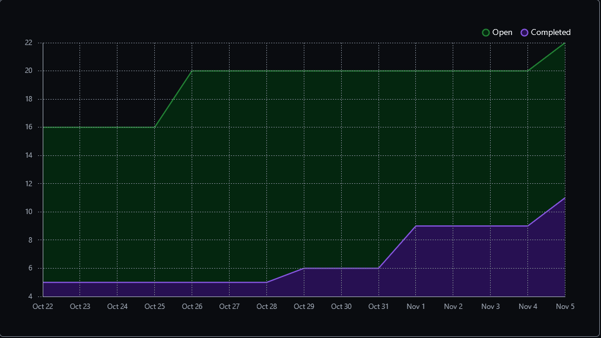
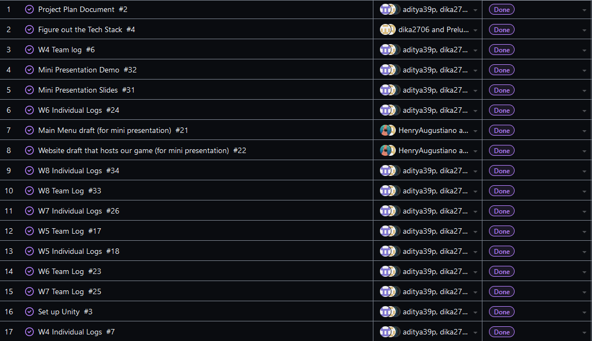
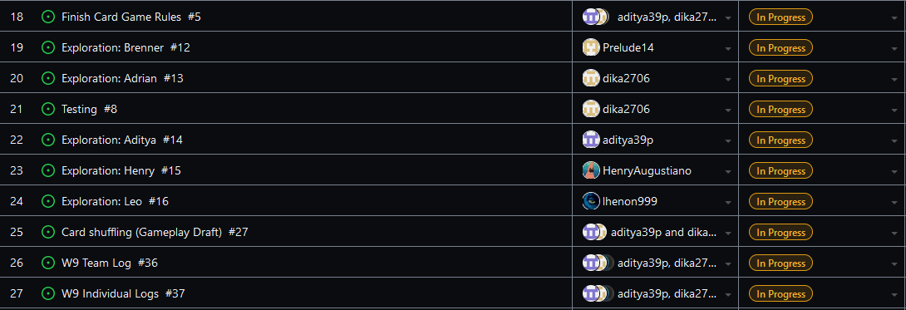

Team 19

Work Period: October 29th to November 5th
<ul>
<li>Github Usernames:</li>
<li>Prelude14 --> Brenner De Vos</li>
<li>dika2706 --> Adrian Ardika Kusuma</li>
<li>lhenon999 --> Leo Henon</li>
<li>HenryAugustiano --> Henry Augustianno</li>
<li>aditya39p --> Aditya Tripathi</li>
</ul>

Milestone Goal Recap: 

Which features were in the project plan for this milestone?
<ul>
<li>Mini Presenation Draft</li>
<li>Mini Presenation Slides and Demo</li>
<li>More Exploration</li>
<li>Work on the Card Game Rules</li>
<li>Team and Individual Logs</li>
</ul>

Which tasks from the project board are associated with these features?
<ul>
<li>"Website draft that hosts our game (for mini presentation)"</li>
<li>"Main Menu draft (for mini presentation)"</li>
<li>"Mini Presentation Demo"</li>
<li>"Mini Presentation Slides"</li>
<li>"Exploration: Brenner"</li>
<li>"Exploration: Adrian"</li>
<li>"Exploration: Aditya"</li>
<li>"Exploration: Henry"</li>
<li>"Exploration: Leo"</li>
<li>"Finish the Card Game Rules"</li>
<li>"W9 Team log"</li>
<li>"W9 Individual logs"</li>
</ul>

 Burnup Chart:  

 Table View of completed tasks on project board  

 Table View of in progress tasks on project board  

 Screenshot of Card Shuffling Test Report.  

OPTIONAL: Any context to explain why the log looks the way it does.
 
So this week we had to finish the presentation slides and put the finishing touches on the features that will be in our game's demo in time for Thursday. The UI menu got mixed with the card shuffling 
system in the My project (4) project folder of our 499UnityGameT19 repo, found at the link below.

#### https://github.com/Prelude14/499UnityGameT19/tree/a260bfb034df2fbbed7a8ab87866c737e8dc1352/My%20project%20(4)

We were also able to get some testing done, thanks to Adrian writing them for his card shuffling code. We didn't have much time for other features this week, since we spent half of it preparing and practising for our presentation. We have finished the general rules of our game, but since we still need to make more cards, and each card could introduce a new rule, we haven't closed the task yet.

